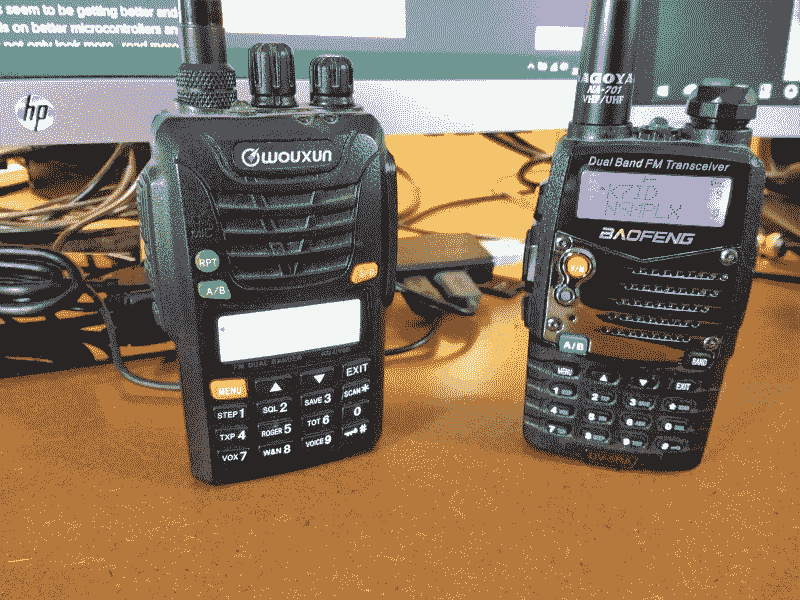

# 50 美元的火腿:面向技术人员的入门级收发器

> 原文：<https://hackaday.com/2019/03/15/the-50-ham-entry-level-transceivers-for-technicians/>

上周，我报道了业余无线电的低得离谱的准入门槛，包括财务支出和学习以及通过 FCC 考试的过程。你有七天时间，所以我假设你已经决定冒险，成为一名新的业余无线电操作员。下一个大问题可能是:*现在该怎么办？*

我们简单提到了一个形象，火腿收音机是有钱老人的爱好，那个名声有些名不虚传。对于火腿装备来说，你可以花费的真的没有上限。光滑的小册子和光滑的网页兜售布满旋钮和开关并装载最新功能的收发器，当下一件大事到来时，所有这些都可能在几年内过时，制造商将推出新的必备型号——看着你， [ICOM IC-7300](https://wa7ewc.wordpress.com/2016/04/20/the-icom-ic-7300-changes-everything/) 。这与任何其他技术市场没有什么不同，足够多的人相信这种营销，使其成为一个持续的关注点。

但值得庆幸的是，虽然你在火腿装备上的花费没有明显的上限，但肯定有下限，而且可以非常非常低。如果你愿意做出一些妥协，可以暂时放弃最新最好的技术，我们 50 美元的预算可以让一个新的技术人员走很长的路。

## 聊胜于无

就像几乎所有其他类别的电子设备一样，最近有大量廉价的业余无线电收发机瞄准了新获得执照的技术人员。就像电视、电脑和其他东西一样，这些廉价进口商品有好的一面，也有不好的一面。好的一面是消费者的利益，否则他们买不起这样的设备。这种廉价设备也倾向于推动高端设备制造商调整他们的定价策略，以免他们的午餐被吃掉；竞争对消费者总是有好处的，尤其是在像业余无线电设备这样制造商相对较少的利基市场。

廉价进口电子产品的不好的方面已经被讨论过很多次了，我们在这里不再赘述，只是想说在很多情况下，物有所值。你不能指望你花 25 美元买的收音机和花几百美元买的一样多。由消费者来评估购买的价值主张；有些人需要昂贵设备提供的质量和功能，有些人可以用便宜的设备。

The first “shack” for many hams: Baofeng UV-5RA on the right, Wouxun KG-UV6D on the left. Personally, I keep the Baofeng for experiments and for places where I might lose it.

也就是说，只要有人建议买一台廉价的中国收音机作为他们的第一台火腿钻机，就会引起一片喧哗和哭喊。老火腿们嘲笑这些收音机，不仅嘲笑这项技术，还嘲笑那些会屈尊使用这种东西的人。一些特别顽固的火腿会断然拒绝与任何使用廉价的中国对讲机的人交谈。

他们说得有道理——宝丰尤其以其[杂散带外辐射](https://hackaday.com/2016/12/14/measuring-spurious-emissions-of-cheap-handheld-transceivers/)而闻名——但就我个人而言，我认为这是一种粗野和排外的行为。我认为任何对培养这种爱好感兴趣的人都会把这种 qso(联系方式)作为受教育的时刻，而不是让一个新手对自己选择的装备感到糟糕。

但是，如果你认为你可以忍受吊索和箭，你的第一台收音机只需要 25 美元。[宝丰 UV-5R](https://baofengradio.us/uv-5r-v2-2nd-gen/baofeng-radio-us-uv5rv2-black.html) 双频 HT 是新技术人员在 2 米 VHF 波段和 70 厘米 UHF 波段行使其特权的一种方式。这种收音机体积小，重量轻，电池续航时间长，最大发射功率为 4 瓦。它可以通过前面的键盘进行编程，尽管这已经够乏味了，弄一根编程电缆和[一个开源编程应用](https://chirp.danplanet.com/projects/chirp/wiki/Home)也不是一个坏主意。它允许技术人员以单工模式(短距离，相同频率上的无线电对无线电)或双工模式(使用两个不同频率和一个远程中继器的较长距离接触)进行接触；我们将在下一篇文章中更深入地讨论中继器)。

## 升级

显然，一台 25 美元的收音机有很多妥协，其中最主要的是天线。股票橡胶 ducky 天线，简单地说，可悲的。拆开后，发现里面除了一圈电线和一个简单的匹配网络外，什么都没有。幸运的是，现在有更好的天线，而且价格也很便宜。[名古屋天线](https://baofengtech.com/accessories#nagoya-handheld-antennas)是个不错的选择，只会让你花费 15 美元左右。没有什么可以阻止您构建更复杂的天线，比如四分之一波长接地平面天线或八木天线，这两者我们将在本系列的后续文章中讨论。

即使有了更好的天线，你的整个第一个“装备”也可以在我们神奇的 50 美元限制之下。但是，如果你有办法，多投资一点可能是明智的。我的第一台 HT 是一台 wou Xun KG-UV6G(T1)，这是另一台双频 HT，价格大约是宝丰的四倍。感觉也很像——更重，更结实，塑料感更少，有更好的库存天线。有些人仍然会抨击它是廉价的进口货，但这些年来我在使用它时没有遇到任何麻烦。不过，来自八重洲和 ICOM 这样的制造商的“真正的”双频 HTs 不需要花太多的钱，而且如果你有耐心，可以找到二手高质量设备的交易。

关于“宝峰”和它们廉价的同类产品，[FCC 最近发布了一条建议](https://hackaday.com/2018/09/25/buy-a-baofeng-while-you-still-can-fcc-scowls-at-unauthorized-frequency-transmitters/)，禁止进口或销售不符合其规定的设备。这些无线电的症结在于它们在业余无线电频段之外进行传输的能力，尤其是在公共服务频段。通过适当的(im)编程，这些 HTs 不仅可以接收警察和消防呼叫，还可以用于在这些信道上进行传输。倾听蓝衣红衫的乡亲们的声音可能很有趣，而且完全合法，但即使不小心阻碍了公共安全服务，也是一个严重的问题。然而，在我看来，联邦通信委员会的做法是错误的。当有可能刷新这些无线电的固件以防止在除了业余无线电波段之外的任何波段上传输时，彻底禁止这些无线电似乎有些极端。

很难说联邦通信委员会将如何处理他们的建议，或者他们计划如何执行。他们会禁止今后进口这些收音机吗？他们会对使用它们的人进行罚款吗？或者更糟，他们会没收你的新装备吗？如果你是合法传播，我非常怀疑会发生什么，但即使你的新宝丰最终被取缔，你也只会损失 25 美元。在我看来，花几块钱买一部进口的 HTs 可能是一笔不错的投资，如果它能让你上电视并启动学习过程的话。

有没有其他方法让新来的技术员上电视？绝对的！自制始终是一种选择；我想为这个系列从头开始建造一个 2 米长的钻机。那里有 UHF 和 VHF 套件，一些人甚至找到了修改旧 CB 无线电的方法，这些无线电在过去的 11 米 ham 波段上工作，用作 10 米波段中狭窄部分的单边带(SSB)无线电，技术人员拥有电话特权。如今，CB 收音机基本上是电子垃圾，所以这可能会成为一个便宜而有趣的项目。

但对于刚刚获得的空气和至少听发生了什么，你不能击败廉价的 HTs。

## 下次

在下一部分中，我们将讨论一旦你有了一台收音机该做什么:检查本地中继器，寻找你所在地区的其他火腿，以及加入网络。