# 十个 3D 打印的小玩意，不能静止不动

> 原文：<https://hackaday.com/2019/02/27/ten-3d-printed-gadgets-that-just-cant-stay-still/>

曾几何时，就在不久前，简单地让一台 3D 打印机喷出一个物体，大致是用户在电脑屏幕上看到的预期形状和大小，这是一项成就。但是像其他技术一样，技术水平也在进步。今天的打印机更好，驱动它们的软件更强大、更直观。正是桌面 3D 打印的这种演变激发了最近结束的 [3D 打印齿轮、滑轮和凸轮竞赛](https://hackaday.io/contest/163334-3d-printed-gears-pulleys-and-cams-contest)。我们想看看黑客和制造商可以用今天的 3D 打印工具实现什么，社区接受了挑战。

让我们来看看震撼我们的十大旋转、行走、拍打和转动 3D 打印设计:

## 经典的机械零件

 [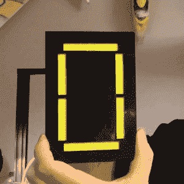](https://hackaday.com/2019/01/26/7-segment-display-is-3d-printed-and-hand-cranked/03-mechanical-seven-segment/)  [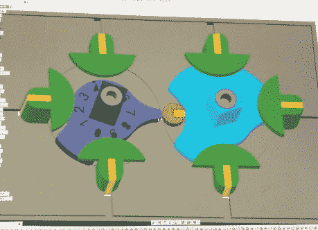](https://hackaday.com/2019/02/27/ten-3d-printed-gadgets-that-just-cant-stay-still/mechanical-seven-segment-render/) 

自从我们第一次将电子碰撞在一起以来，七段 LED 显示屏就一直是黑客武器库的一部分，但是 [Peter Lehnér 对这种典型电路组件的机械再造](https://hackaday.io/project/163473-peters-7-seg-all-mechanical-display-prototype-2)表明，即使是经典产品也可以不时地从新的角度受益。这些巨大的数字可能会保留其电子对应物的外观，但相似之处仅此而已。在幕后，只有 3D 打印的齿轮和轮子驱动着各个部分。它们也不仅仅是一些新奇的东西，因为 Peter 提出了一个令人信服的案例，说明这些大型高可视性显示器如何在记分牌或其他实际 led 可能不理想的外部显示器中投入实际使用。

一个令人印象深刻的机械设计，不仅看起来华丽，甚至可能有实际应用，这个项目是所有评委的早期最爱，也是我们第一个 275 美元现金奖的轻松选择。

## 疯狂科学家的音乐盒

   [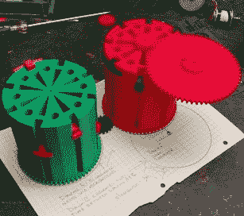](https://hackaday.com/2019/02/27/ten-3d-printed-gadgets-that-just-cant-stay-still/printed-sequencer-drums/) 

如果你必须将声音与 3D 打印的机械装置联系起来，那很可能是步进电机的嗡嗡声或塑料片相互撞击的中空噼啪声。但是迪恩·塞戈维斯创造的不可思议的[自动机音乐音序器证明了，就连解放军心里也有一首歌。受经典音乐盒设计的启发，他的作品使用带有可移动凸耳的印刷鼓来触发一排微型开关；给你一个基本的音序器。当搭配上最经典的 ic，555 定时器，电子音乐就诞生了。](https://hackaday.io/project/163514-automata-music-sequencer)

迪安不仅创造了一个打印的装置，为我们的比赛勾选了所有的盒子，而且我们对他的文件印象深刻，让读者深入了解他的这个项目的创作过程。这个项目在哔哔声中一路发展到了第二名，并获得了 275 美元的现金奖励。

## 随着这个印刷时钟，时间过得飞快

   [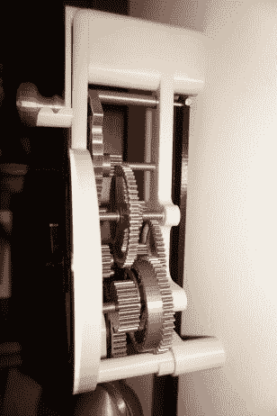](https://hackaday.com/2019/02/27/ten-3d-printed-gadgets-that-just-cant-stay-still/printed_clock2/) 

如果你心中有一个移动 3D 打印作品的精神声音，你肯定也有一个 T2 的样子。如果你期待所有的作品都是粗糙的彩虹色，[史蒂夫的 3D 打印摆钟在这里向你展示，即使是塑料也可以很漂亮](https://hackaday.io/project/163814-3d-printed-pendulum-clock)，如果你知道如何使用它。他的机械摆钟也不仅仅是一张漂亮的脸，它可以在单次上弦的情况下运行长达八天，同时保持两分钟内的准确性。但坦率地说，即使这种美丽只能持续一天，我们仍然很高兴把它挂在我们的墙上。

作为六个月工作的高潮，这款印刷时计是一件真正的机械艺术作品，值得 275 美元的现金奖励。

## 亚军:

 [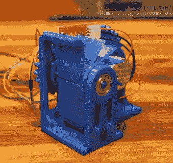](https://hackaday.com/2019/02/27/ten-3d-printed-gadgets-that-just-cant-stay-still/printed_flaps/) Split-Flap Display  Happy Gear Table [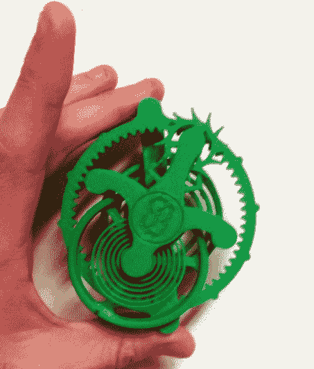](https://hackaday.com/2019/02/27/ten-3d-printed-gadgets-that-just-cant-stay-still/printed_flyer/) Flying Tourbillon [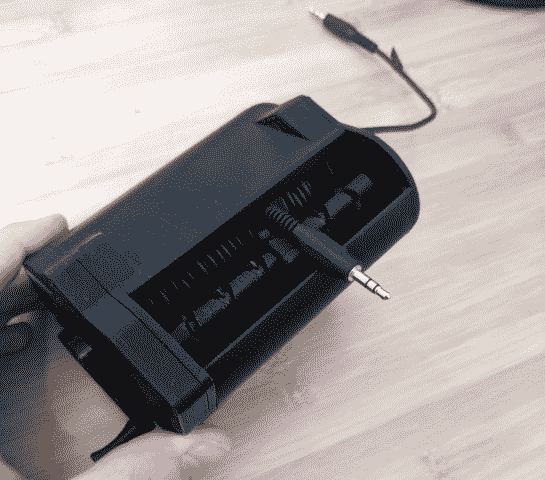](https://hackaday.com/2019/02/27/ten-3d-printed-gadgets-that-just-cant-stay-still/printed_winder/) Vive Cable Reel [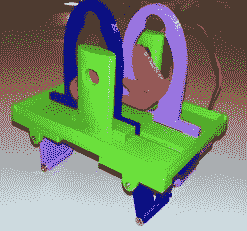](https://hackaday.com/2019/02/27/ten-3d-printed-gadgets-that-just-cant-stay-still/printed_walker/) LandBeast Walker [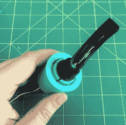](https://hackaday.com/2019/02/27/ten-3d-printed-gadgets-that-just-cant-stay-still/printed_lampgear/) Coaxial Gearbox Lamp [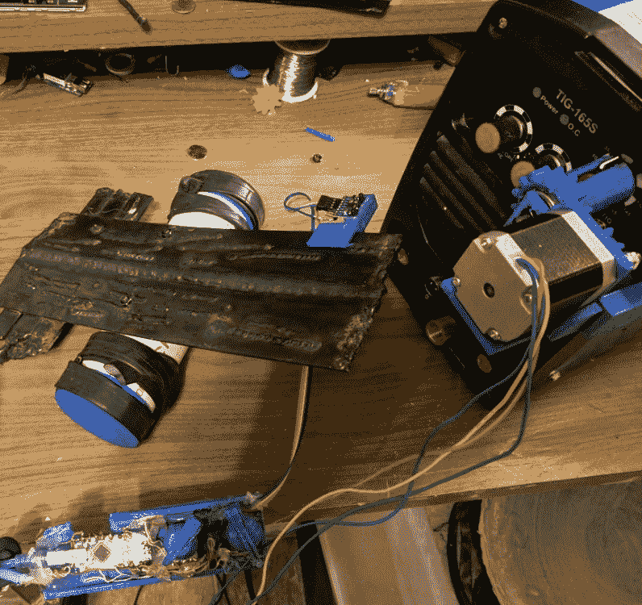](https://hackaday.com/2019/02/27/ten-3d-printed-gadgets-that-just-cant-stay-still/printed_knobturn/) Remote Knob Turner

说实话，这是一个很难判断的比赛，因为我们完全被这么多参赛作品中表现出的创造力所折服。这些创造中的一些真的超出了我们对这次比赛的预期，并成为了对这项技术的可能性的迷人审视。虽然他们不可能都拔得头筹，但我们认为这些亚军中的任何一个都证明了 3D 打印革命正在蓬勃发展:

*   [陆兽步行机器人](https://hackaday.io/project/163654-landbeest-walking-robot)
*   [分割翻盖显示](https://hackaday.io/project/163725-split-flap-display)
*   [飞行陀飞轮模型](https://hackaday.io/project/163466-3d-printed-flying-tourbillon-models)
*   [Vive Lighthouse 同步电缆卷轴](https://hackaday.io/project/163470-vive-lighthouse-sync-cable-reel)
*   [同轴变速箱灯](https://hackaday.io/project/163722-making-a-coaxial-gearbox-for-a-rotating-lamp)
*   [快乐档位表](https://hackaday.io/project/163495-happy-gear-table)
*   [遥控旋钮转动器](https://hackaday.io/project/163973-3d-printed-knob-turner-remote-tig-amp-control)

即使把范围缩小到这七个条目也是一个不小的挑战。[如果你正在寻找下一个 3D 打印项目的灵感，请查看竞赛参赛作品的完整列表](https://hackaday.io/submissions/3d-printed-gears-pulleys-and-cams-contest/list)。

## 荣誉奖

 [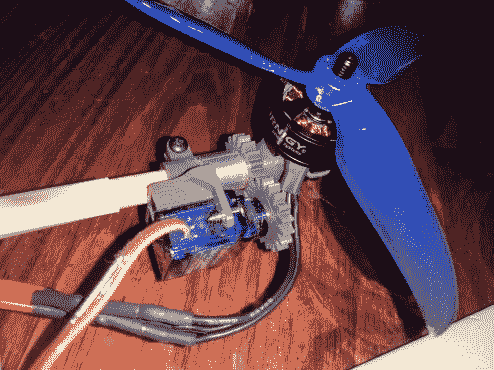](https://hackaday.com/2019/02/27/ten-3d-printed-gadgets-that-just-cant-stay-still/3d-printed-tilt-rotor/) Tilt rotor [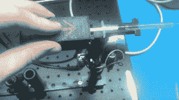](https://hackaday.com/2019/02/27/ten-3d-printed-gadgets-that-just-cant-stay-still/3d-printed-syringe-actuator/) Syringe actuator  Designing crossed helical gears

我们想展示三个未能进入上述奖池，但都非常值得庆祝的参赛作品。固定翼飞机的垂直着陆和起飞意味着旋转推力，这正是这个倾斜旋翼项目所要完成的。 [3D 打印注射器致动器](https://hackaday.io/project/163965-3d-printed-syringe-driver)通过将液体注入声悬浮器进行演示；进行科学实验时要记住的一个大窍门。最后，[交叉斜齿轮设计工具](https://hackaday.io/project/163953-crossed-helical-gears-in-openscad)是当轴不在同一平面时，利用 OpenSCAD 为您的项目打印齿轮的好方法。

我们对这些齿轮项目进行了深入的研究，这种兴奋并没有随着这次比赛而结束。继续攻击！