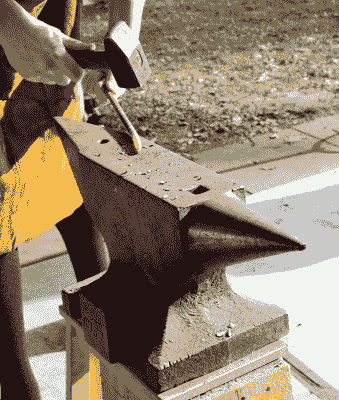
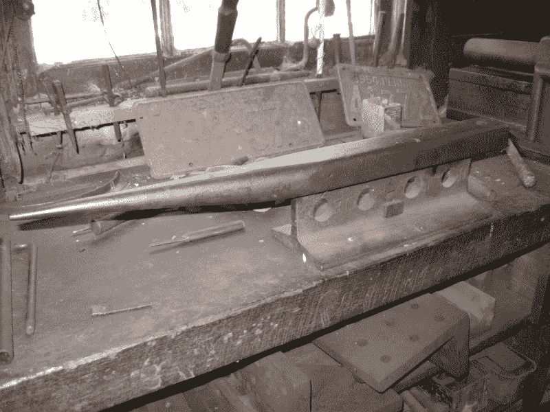

# 外行人的锻造:让我们来谈谈铁砧

> 原文：<https://hackaday.com/2019/04/10/blacksmithing-for-the-uninitiated-lets-talk-about-anvils/>

当你在某件事作为你生活的持续背景下成长时，作为一个成年人，很容易忘记不是每个人都和你一样对这个问题有本能的了解。我爸爸是个铁匠，他现在已经退休了，但是在我成长的过程中，他非常活跃的铁匠铺就在我们家旁边的一个车间里。这是基于这一经历的系列文章的第二部分，为那些可能一直想尝试铁砧但不知道从哪里开始的人探索锻造。

## 最明显的锻造工具:铁砧

在我们之前的旅行中已经考虑了炉膛，现在是时候将我们的注意力转向锻造设备的标志性部件:铁砧。这具有提供高质量硬化工作表面的功能，金属可以在该工作表面上锻造，并且它具有独特的形状，具有用于特定金属加工任务的各种部件。根据你的铁砧来自世界的哪个地方，铁砧的设计有许多小的和大的变化，但是因为我的经验来自英国，我将描述的铁砧是你将在不列颠群岛找到的模式。

The various parts of an anvil. Gerald G ([CC0 1.0](https://commons.wikimedia.org/wiki/File:Anvil,_labelled_en.svg)).

铁匠的铁砧是一大块铁，也就是说锻钢，或者在一些更古老的铁砧中是熟铁，但有时和通常在更便宜的铁砧中是铸铁。它有一个平坦的矩形顶面，用于加工金属，称为表面，由淬火钢制成，在许多砧座上，它可以是焊接到砧座主体顶部的独立部件。在表面的一端是一个锥形尖端，称为角，用于形成曲线，而在另一端是方形边缘，称为跟部，在下面朝向砧座的底部逐渐变细。在朝向跟部的面上通常有两个孔，一个大的方形开口称为 hardie 孔，用于容纳工具，一个小的圆形开口称为 pritchel 孔，用于在工件上使用冲头或类似工具，而不会损坏砧面。你有时会看到不同形状的铁砧，可能侧面有突起或两端有角，这些铁砧要么是国外的样式，要么是为特定任务设计的，如给马钉蹄铁。

## 你的锤子会知道区别

如果你用锤子敲击，高质量的铁砧会有一种“感觉”。一旦你尝试过，你就会从经验中明白这一点，但是在理想的铁砧上，会有铃声，锤子会反弹，就像弹跳一样。这是作为铁砧使用的表面质量的一个很好的指标，如果你测试一些表面，你可以很容易地欣赏它。将锤子敲击一个好的铁砧的音符和感觉与敲击一块铸铁(如废弃的发动机缸体)或敲击一块钢进行比较，你将学到的东西将帮助你判断你所考虑的任何铁砧的质量。

The RevSpace anvil is significantly different in shape to the British anvils I am used to, I was told that it follows the German pattern.

作为一个在铁匠铺周围长大的年轻人，我学到的第一件事是，铁砧的表面必须小心对待，并且只能用于锤打热金属，决不能用于钻孔或使用冲头，除非是在普里切尔孔上方。使用比它所能承受的力更大的力可能会过度磨损甚至损坏砧座，因此使用合适尺寸的砧座来进行锤击是很重要的。你会看到许多小的工作台顶砧，这些对所有人来说都太小了，除了最轻的这种工作。理想情况下，你应该有一个大一点的东西，也许是像我父亲用于便携式工作的 50 公斤(110 磅)的铁砧。

你在哪里能找到铁砧？显然，铁匠用品公司会很乐意以合适的价格卖给你一个高质量的新品。例如，你可能会很容易从大众工具零售商那里买到更便宜的替代品。任何铁砧都比没有铁砧好，但我总是建议买家考虑为什么一个新铁砧可能会很便宜，以及它是否可能是一个非常低质量的铸铁件和一个糟糕的购买决定。如果你在考虑任何铁砧，总是去买你能买得起的最好的，因为它很可能会为你的余生服务，也为你的后代服务，如果你足够幸运能够将它传递下去的话。我们的社区很少考虑几百英镑的示波器或笔记本电脑的可接受价格，铁砧应该以同样的方式考虑，但具有更少折旧的额外好处。

## 旧砧不能保留其前任主人的技能

当然，找到被忽视的二手砧也不是不可能。问题总是在于感知价值，所以你可能会发现一些磨损甚至无法修复的东西需要高价。质量好的老式铁砧本质上并不比现代质量的铁砧更好，这仅仅是因为它们的年代，虽然拥有已经工作了几个世纪的东西很酷，但你不会以某种方式继承在你之前使用它的人的技能。小心不要被拥有一个旧铁砧的浪漫所吸引，如果你被要求支付比一个相同或更好质量的全新铁砧更多的钱，尤其是如果提供的铁砧损坏或磨损了。在月球旅行的费用中，找到一个表面类似月球表面的东西并不罕见，所以准备好说不。如果砧面不平坦，如果表面破裂，破裂，或远离身体，或者如果鞋跟或牛角破裂，请离开，除非砧非常便宜甚至免费。如果你知道自己在做什么，就有可能买到便宜的修理费，但你要小心时间和金钱的陷阱。在许多这样的情况下，你最好买一台新的。

当然，你可能只是运气好，找到一个简单地把一大块铁视为巨大的移除问题的人，但更有可能的是，你将不得不寻找一个价格合理而不是令人垂涎的人。我建议你先四处打听一下，希望能有幸运的发现，然后去找当地的机械拍卖商。

A home-made anvil crafted from a piece of rail. Relvax ([CC BY-SA 2.0](https://www.flickr.com/photos/reivax/9766953364/in/photostream/)).

幸运的是，如果你有一个设备相当好的金工车间，自己制作铁砧并非不可能。你可能无法制造出质量和商业铁砧一样大的东西，但是如果你已经开始了，你肯定能想出一些东西。传统的自制小铁砧是由一段铁轨切割而成，在一端形成一个角，通常用一块硬化钢形成焊接在火车车轮运行曲面上的表面。必要时，你甚至可以在几乎任何大块钢材或非常厚的钢板上工作，只要它质量很大，就应该能够被压入使用。如果你向工程商店询问一些最重的边角料，你可能会发现一个投资低得惊人的即兴铁砧。但是不要用铸铁，因为铸铁很脆，被锤打时很容易破碎。

如果你期待这一页的权利，并开始与伪造工作，那么很遗憾，我们必须让你失望。相反，在我们带你去找金属之前，继续浏览你应该在铁匠铺里找到的基本知识是有意义的。这绝不是铁匠设备的总和，我们将在下一期继续讨论铁匠武器库中的其他一些工具，并讨论安全设备。然后我们会带你去铁匠铺给你看一些作品。