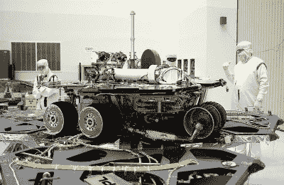
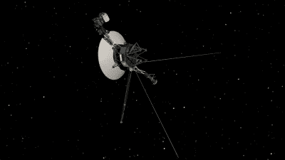

# 长期工程，美国宇航局的方式

> 原文：<https://hackaday.com/2019/03/11/engineering-for-the-long-haul-the-nasa-way/>

大众媒体最近充斥着来自火星的令人悲伤的消息:*机遇号*，这个小火星车已经无能为力了。令人惊讶的是，它花了 15 年时间才摆脱幽灵，并经历了一场覆盖整个星球的沙尘暴，这场沙尘暴遮住了太阳，使火星车陷入了灾难性的黑暗和寒冷的环境中，最终杀死了机器。它的寿命是其 90-sol 设计寿命的 37 倍，产生了大量数据，需要另外 15 年或更长时间才能完全消化。

整个职业生涯出人意料地围绕着机遇号建立起来——官方但不流血地称之为“火星探测漫游者-B”，或 MER-B——因为它顽固地延长了它的使命，并克服了象征性和字面上的障碍。但是“Oppy”远不是 NASA 唯一可以夸耀的长期成功。现在*机遇号*已经发送了它的最后数据，看起来唯一合适的庆祝成就就是看看机器和任务是如何在最恶劣的条件下生存和发展这么久的。

## 早点失败，然后停止失败

失败永远是一种选择，认识到这一事实是在太空做生意的代价之一。太空探索的早期被多次灾难打断，大多发生在发射的最初几分钟内。这只是反映了努力的难度；驯服成吨的挥发性推进剂，并在正确的时间将所有东西放在正确的地方，是一项具有挑战性的工作。犯了错误，许多任务失败了。

 [https://www.youtube.com/embed/zVeFkakURXM?version=3&rel=1&showsearch=0&showinfo=1&iv_load_policy=1&fs=1&hl=en-US&autohide=2&wmode=transparent](https://www.youtube.com/embed/zVeFkakURXM?version=3&rel=1&showsearch=0&showinfo=1&iv_load_policy=1&fs=1&hl=en-US&autohide=2&wmode=transparent)

但是失败，特别是高调和昂贵的失败，给了我们宝贵的教训，NASA 真的很擅长在发生任何事情时找出哪里出了问题。NASA 有整个实验室致力于故障分析，从结构和材料故障到电气问题和软件。他们非常认真地对待失败分析，甚至编写自己的软件，即[根本原因分析工具](https://nsc.nasa.gov/RCAT)，或 RCAT，来跟踪和评估不希望的结果。

多年来，从他们的错误中吸取教训稳步提高了任务的成功率。与早期相比，由于发射问题造成的任务损失现在已经很少了。当然，一旦有效载荷在运输途中或在空间站上，NASA 仍然会遭受失败。例如，*伽利略*在部署其高增益天线时遭遇严重故障，几乎结束了其研究木星系统的任务。故障分析使美国宇航局的工程师得出结论，让伞状天线存放四年半，并且在发射前不重新润滑系统不是一个好主意。

*Galileo* had a wonky main antenna and still delivered amazing science. Source: [Jet Propulsion Lab](https://www.jpl.nasa.gov/news/news.php?feature=5116)

故障分析不只是看硬件的问题；美国宇航局也非常认真地寻找他们过程中的问题。当飞船进入轨道时与火星气候轨道器失去联系，它加入了红色星球拒绝的一长串任务。美国宇航局发现，根本原因是在用于计算轨道插入燃烧推力的地面软件中使用了非国际单位制单位，而不是预期的国际单位制单位。它还发现，两个独立的导航员发出的宇宙飞船位置不对的警告被忽视了，因为他们没有按照政策报告。

## 经久耐用

太空探索是一项昂贵的事业，主要是因为从我们称之为家的重力深井中获取有用数量的硬件的成本。但是宇宙飞船本身相当昂贵，部分原因是它们的工程设计。当某样东西要在数百万英里的想象不到的最恶劣条件下运行几十年时，足够近是不够的。

Workmanship counts: *Spirit* lasted for 8 years. Click to see the lacing in detail. Source: [JPL](https://photojournal.jpl.nasa.gov/catalog/PIA04849)

为了确保星际探测器、行星探索者，甚至支持它们的地面系统不会失败，或者至少最大限度地延长失败前的时间，美国国家航空航天局制定了一系列非常具体和非常严格的工艺标准。正如 [Gerrit Coetzee 几年前指出的那样](https://hackaday.com/2016/11/03/specifications-you-should-read-the-nasa-workmanship-standards/#more-228559)，工艺标准文件本身就是非常美的作品。它们涵盖了每一种可以想象的机电装配，展示了正确操作的“NASA 方式”。如何正确焊接，何时改为压接，如何防止 PCB 损坏，如何防止静电放电损坏，甚至如何正确拉紧扎带都包括在内。不过，在我看来,*是关于束紧线束的部分。纯工程美。*

除了美学之外，美国宇航局的工艺标准和它遵循的一般工程原则是有利于航天器长期超过“最佳”日期的一个重要因素。机遇号的惊人成功只是美国国家航空航天局在长期工程中取得的最新胜利，这在很大程度上要归功于在设计的每个层面都建立冗余的原则。这多次拯救了漫游者的培根，包括 2014 年车辆非易失性存储器的“失忆事件”导致几次系统重置。控制人员能够重新配置火星车，只使用它的内存，并继续执行另一整年的任务。

坚持看似过时的技术是 NASA 从机器中获得如此多生命的另一种方式。我们之前已经报道过一些这方面的例子，比如使用[轨道照片实验室](http://hackaday.com/2018/08/02/the-photo-lab-that-flew-to-the-moon/)进行月球侦察，或者在*旅行者*和*伽利略*上使用的 [8 轨磁带机](http://hackaday.com/2018/11/29/interstellar-8-track-the-low-tech-data-recorders-of-voyager/)。这两种方法都经过了检验，是真实的，并且提供了远远超过其他方法所能达到的可靠性。

与飞行器制造时市场上可买到的计算机相比，美国国家航空航天局选择飞往太空的计算机也明显落后于时代。例如，伽利略号带着六个 RCA COSMAC 1802 8 位微处理器飞往木星，这些微处理器是在蓝宝石衬底上制造的，用于抗辐射。即使是 2006 年建造的*新视野*，最近参观了 Ultima Thule，也配备了 MIPS R3000 CPU 的抗辐射版本，这是一种 RISC 芯片，于 1988 年首次进入市场。一周中的任何一天，陈旧、缓慢、工作的生活都胜过花哨、快速、充满故障的生活。

## 移动球门柱

NASA 长期任务的成功还有另一个方面，这更像是一种社会工程方法，而不是物理工程。美国国家航空航天局非常仔细地设计它的任务，在科学完成什么，什么时候完成，以及航天器上的资源如何分配方面。对于机遇号来说，美国国家航空航天局从经常重复的“它只应该持续 90 天”的数字中得到了很多好处。我不会对此吹毛求疵，但这对 NASA 有点不公平。显然，这辆车的设计寿命远远超过了 90 sols(火星日)，如果那场沙尘暴没有那么深那么长，这辆车可能今天还在运行。相反，美国宇航局计划在 90 天内完成所有的科学研究，希望它能持续更长时间。每一个超过科学计划预定结束时间的 sol 都是肉汁。

The Voyager probes are 14 billion miles away now and still working. Source: [JPL](https://voyager.jpl.nasa.gov/news/details.php?article_id=88)

这项任务的延长是美国宇航局非常计划的事情——将数百万纳税人的钱送入太空，而没有一个最大化投资回报的计划是行不通的。旅行者计划就是一个很好的例子。从技术上来说，旅行者 1 号的任务在它飞过土星时就已经结束了，而 T2 旅行者 2 号的主要科学研究在它与海王星相遇后就完成了。但是由于航天器仍然处于良好状态，并且继续与它们通信所需的预算很少，美国宇航局开始了旅行者星际任务(VIM ),该任务一直持续到今天，从星际空间收集数据。

对我来说，机遇号的成就令人印象深刻，当沙尘暴来袭，我们失去了漫游者号的消息时，我感到悲伤，太空工程的真正基准是 T2 号旅行者号双胞胎。他们的 [RTG 动力系统](http://hackaday.com/2019/02/08/the-deep-space-energy-crisis-could-soon-be-over/)应该能提供足够的能量让 VIM 再运行五年左右。对我来说，那将是一个真正悲伤的时刻，当我从 1977 年发射以来一直关注的任务最终结束的时候。但我会感到欣慰的是，也许有一天，一个外星文明会发现这些精致的机器，看看它们的制造者到底有什么样的工程能力。