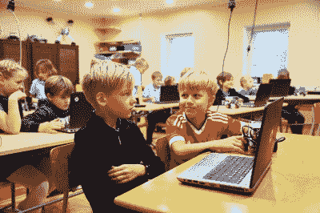
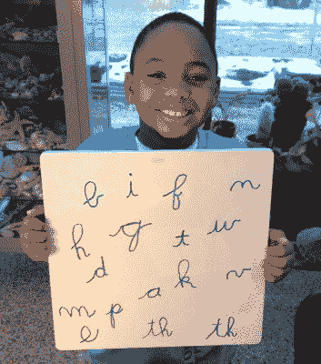

# 专家说不要教孩子编程

> 原文：<https://hackaday.com/2019/03/14/expert-says-dont-teach-kids-to-code/>

看到一篇关于经济合作与发展组织(OECD)教育与技能主任安德里亚斯·施莱歇尔的新闻报道，我有点惊讶。在巴黎举行的世界教育创新峰会上，Schleicher 认为教孩子编程是浪费时间。特别是，他似乎认为当今天的孩子长大时，编码将会过时。

我不禁想到，他可能有点糊涂了。编码不会很快消失。当然，它可以成为一个更深层次的专业，因此不那么普遍适用。但是他所做的评论似乎暗示着，很快我们就会告诉智能计算机我们想要什么，它们就会这么做。有点像《星际迷航》里的电脑。

更有可能的是，大多数人将能够找到特定的应用程序，无需传统的编码就可以做他们想做的事情。但在可预见的未来，还是要有人写点什么。更重要的是，如果你曾经试图从一个最终用户那里梳理出需求，你知道你不能对着一台计算机脱口而出你想要的任何东西，然后期望它有意义。这不是电脑的错。人们——尤其是未经训练的人——并不总是有意义的或明确的交流。

但是现在有一个更大的问题。当你教一个孩子编码时，他们实际上得到了什么好处？我的意思是，我们都同意，教一个孩子 Python 不一定能帮助他们在 10 年内找到工作，因为 Python 可能不会在 10 年内成为热门语言。但是如果我们只是教 Python，那才是真正的问题。Python 课程应该教授概念，培养对计算机如何解决问题的直觉。那是一项持久的技能。

Schleicher 几乎同意。他说:

> 例如，我更倾向于教授数据科学或计算思维，而不是教授当今非常具体的技术。

 我不确定什么是计算思维，但我希望是计算机如何工作以及如何设计基于计算机的解决方案。这很好，但是你会想把它简化为实践，现在这意味着 JavaScript、Java、Python、C 或其他一些实用的语言。不是说你要懂语言，你要懂概念。我给孩子们做了一个讲座，我们[“编码”，但不是为一台真正的计算机](https://hackaday.com/2015/09/10/kids-and-hacking-blind-robotics/)，它阐明了一些关键的想法，但我仍然会把它归类为“编码”

这不是一个新问题。天才的数学老师或天才的数学学生通过理解数学的含义来建立对宇宙的直觉。迟钝的老师和学生只是学习死记硬背的公式和应用模式来解决问题，而没有真正的理解。很多编程类变成了关于某种编程语言语法的类。但是真正的价值是理解你何时以及为什么想要，比方说，一个链表，一个散列表，一个二叉树数据结构。似乎用 UML 图和手势来抽象地教授这些概念不会非常有效。

 你也不得不担心意想不到的后果。许多学校没有教孩子们用草书写字，但这对精细运动技能的发展真的很好。虽然计算尺比计算器更难使用，但它迫使你思考刻度和估算。

如果你听听 Schleicher 的其他演讲和他的 TED 演讲，他有很多关于教育的伟大想法。也许他并没有像我理解的那样强烈地表示“过时”这个词，而只是表示大多数人不需要知道特定的编码技术。也许这是媒体断章取义了。奇怪的是，在上次峰会上，Schleicher 的一位同事似乎不同意他的立场，正如你在下面的视频中看到的那样。

我认为，随着越来越多的人试图用计算机做更多的事情，他们需要越来越能够逻辑地思考计算机如何解决问题。我们今天要做的最好的方法是通过教编码，但是要用正确的方法教。

你怎么想呢?你教过孩子编程吗？你如何越过细节，发展出制定基于计算机的现实世界问题解决方案所需的一般理解？你想让孩子们在学校学习编码吗？为什么或为什么不？请在评论中告诉我们。

 [https://www.youtube.com/embed/xN3xHE4iGyU?version=3&rel=1&showsearch=0&showinfo=1&iv_load_policy=1&fs=1&hl=en-US&autohide=2&wmode=transparent](https://www.youtube.com/embed/xN3xHE4iGyU?version=3&rel=1&showsearch=0&showinfo=1&iv_load_policy=1&fs=1&hl=en-US&autohide=2&wmode=transparent)

#### 照片致谢:

*   男孩在计算机(塔林数字峰会)由[阿诺米克尔] [CC 由 2.0](https://creativecommons.org/licenses/by/2.0/deed.en)
*   学生用草书按[OakleyOriginals] [CC 按 2.0](https://creativecommons.org/licenses/by/2.0/deed.en)