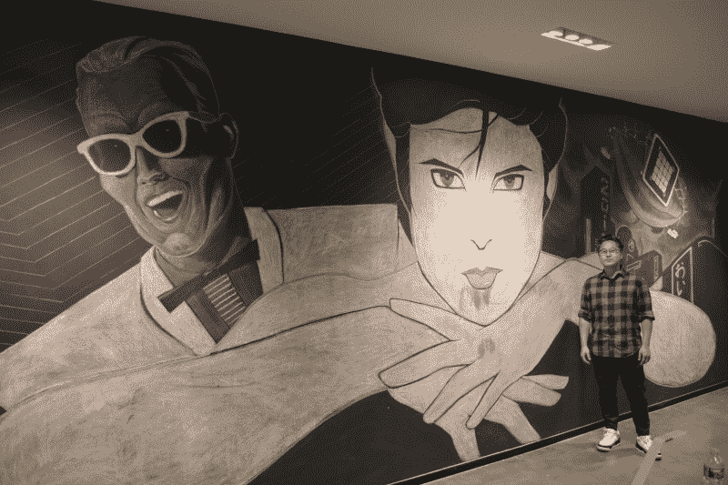
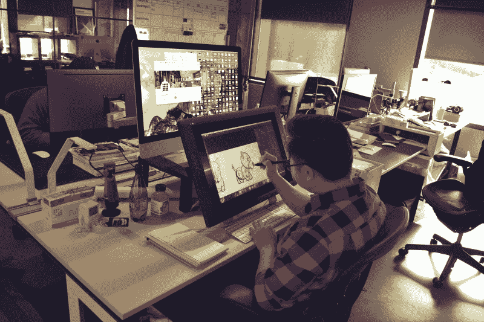

# 黑客日播客 008:艺术插曲:乔金，弦乐和阴极射线管，氢双向完成

> 原文：<https://hackaday.com/2019/03/01/hackaday-podcast-008-the-art-episode-joe-kim-strings-and-crts-hydrogen-done-2-ways/>

我们知道你喜欢 Hackaday 上的原创艺术。这些奇妙的插图是乔·金的作品，他作为嘉宾加入了我们本周的节目，来谈谈他的背景，是什么激励了他，以及他是如何实现这一切的。

这一集仍然挤满了黑客。编辑迈克·什奇斯和埃利奥特·威廉姆斯不知何故偶然发现了两个最终产生氢气的项目(尽管这不是他们的目的)。但这个艺术角度本周超越了乔的客串，因为我们看到了一个在黑白 CRT 上添加绿色曲线跟踪功能的黑客，以及一个令人难以置信的字符串艺术构建机器。我们看到了落在清理架上的有趣的硬件，用柔性 PCB 致动器移动的超轻机器人，机械计算的回归，以及放弃对家庭供暖和制冷的控制而使用树莓 Pi。

节目中所有讨论的链接如下。一如既往，加入下面的评论，因为我们将在下周的节目中关注这些评论！

[//html5-player.libsyn.com/embed/episode/id/16571567/height/90/theme/custom/thumbnail/yes/direction/backward/render-playlist/no/custom-color/000000/](//html5-player.libsyn.com/embed/episode/id/16571567/height/90/theme/custom/thumbnail/yes/direction/backward/render-playlist/no/custom-color/000000/)

如果你想继续，看看下面的链接，一如既往，在评论中告诉我们你对这一集的看法！

[直接下载](https://traffic.libsyn.com/secure/hackaday/583282878-hackaday-episode-8-the-art-episode-joe-kim-strings-and-crts-hydrogen-done-2-ways.mp3) (60 MB 左右。)

Where to Follow Hackaday Podcast

### 关注 Hackaday 播客的地方:

*   [谷歌播客](https://podcasts.google.com/feed/aHR0cDovL2ZlZWRzLnNvdW5kY2xvdWQuY29tL3VzZXJzL3NvdW5kY2xvdWQ6dXNlcnM6OTM5MTM0NzIvc291bmRzLnJzcw)
*   [iTunes](https://itunes.apple.com/us/podcast/hackaday-podcast/id1447409683)
*   [Spotify](https://open.spotify.com/show/3NRV0mhZa8xeRT0EyLPaIp)
*   [装订机](https://www.stitcher.com/podcast/hackaday-podcast)
*   [RSS](http://hackaday.libsyn.com/rss)

## 第 008 集节目笔记:

Joe Kim in front of a mural he created at Supplyframe HQ

#### 本周新消息:

*   一连串的会议:
    *   本周末，埃利奥特·威廉姆斯将参加 3 月 2 日至 3 日在德国慕尼黑举行的慕尼黑电影节
    *   本周末，汤姆·纳尔迪将参加 3 月 1 日至 3 日在新泽西州大西洋城举行的 WOPR 峰会
    *   [SCALE 17x](https://www.socallinuxexpo.org/scale/17x) (南加州 Linux 博览会)于 3 月 7 日至 10 日在加州帕斯迪纳举行。你会在那里找到郑健国
        *   有一个[展示活动](https://www.socallinuxexpo.org/scale/17x/presentations/tindiehackaday-bof-bring-hack)，罗杰正在[展示他临时搭建的火星车](https://www.socallinuxexpo.org/scale/17x/presentations/trouble-rovers)！
    *   VCF:太平洋西北于 3 月 23 日至 24 日在华盛顿州西雅图举行。Hackaday 是一个自豪的赞助商
    *   Cyphercon 4.0 将于 4 月 11 日至 12 日在威斯康星州密尔沃基举行。你会在那里找到迈克·什奇斯
    *   4 月 26 日至 27 日在伊利诺伊州芝加哥举行。你会发现那里有很多人，包括 Anool Mahidharia 和 Kerry Scharfglass，他们都在演讲。
*   音频设备:
    *   迈克不知道 TRRS 和 TRS 的区别，你知道吗？

#### 本周有趣的黑客:

*   [用一个像素穿过一块砖会发生什么？](https://hackaday.com/2019/02/22/what-happens-when-you-cross-a-brick-with-a-pixel/)
    *   【6400 像素彩色显示器的线轴
*   [喷涂阴极射线管上的曲线描绘](https://hackaday.com/2019/02/24/curve-tracing-on-spray-painted-crts/)
    *   [铝易于阳极氧化](https://hackaday.com/2019/02/28/anodize-aluminum-easily/)
    *   [CRT Art 摆动器](https://hackaday.com/2010/11/17/crt-art-wobbulator/)
    *   [实验电视中心](http://www.experimentaltvcenter.org/)
*   [极地平台生产出复杂的弦乐艺术肖像](https://hackaday.com/2019/02/23/polar-platform-spins-out-intricate-string-art-portraits/)
    *   [字符串艺术机器人是一个反向自动路由器](https://hackaday.com/2018/09/15/string-art-robot-is-an-autorouter-in-reverse/)
    *   [亲笔签名:一台字符串艺术打印机](https://hackaday.com/2016/04/28/autograph-a-string-art-printer/)
*   [用 DigiComp II 教授传统的计算方法](https://hackaday.com/2019/02/25/teach-computing-the-old-school-way-with-a-digi-comp-ii/)
    *   [令人惊叹的尼姆博士比例模型](https://www.instructables.com/id/The-Amazing-Dr-Nim-Scale-Model/)
    *   [贾普的拼图页面](https://www.jaapsch.net/puzzles/thinkadot.htm)
*   [柔性 PCB 机器人翻来翻去](https://hackaday.com/2019/02/27/flexible-pcb-robot-flops-around-to-get-around/)
    *   [在机器人的电路板上设计微型马达](http://hackaday.com/2019/01/01/designing-tiny-motors-right-into-the-robots-circuit-board/)
    *   [弹出蜻蜓机器人可能是未来的名片](https://hackaday.com/2012/03/05/pop-up-dragonfly-robot-could-be-the-future-of-business-cards/)
    *   [太空中的壁虎脚](https://hackaday.com/2017/07/05/gecko-feet-in-space/)
*   [十个不能静止的 3D 打印小玩意](https://hackaday.com/2019/02/27/ten-3d-printed-gadgets-that-just-cant-stay-still/)
    *   我们宣布了 10 个竞赛获胜者，但还有其他值得一看的参赛作品:
        *   [3D 打印滑轮](https://hackaday.io/project/163857-3d-printed-pulleys)
        *   [3D 打印电动冰钻](https://hackaday.io/project/163909-3d-printed-electric-ice-auger)
        *   [P1 佛带式给料机](https://hackaday.io/project/159792-p1-buddha-tape-feeder)
        *   [全景头 v3](https://hackaday.io/project/163921-panorama-head-v3)
        *   [天文摄影相机支架](https://hackaday.io/project/163689-astrophotography-camera-mount)
        *   [全 3D 打印的发条汽车礼品卡](https://hackaday.io/project/162942-fully-3d-printable-wind-up-car-gift-card)

#### 快速链接:

*   迈克的选择:
    *   [保护良好的 USB 电源板便于插入](https://hackaday.com/2019/02/24/well-protected-usb-power-strip-makes-it-easy-to-plug-in/)
    *   [逆向工程让凯克望远镜继续前进](https://hackaday.com/2019/02/26/reverse-engineering-keeps-keck-telescopes-on-track/)
    *   [多个 OLEDs 通过共享 I2C 时钟节省引脚](https://hackaday.com/2019/02/27/multiple-oleds-save-pins-by-sharing-the-i2c-clock/)
*   埃利奥特的选择:
    *   [了解你的配合和公差](https://hackaday.com/2019/02/25/know-your-fits-and-tolerances/)
    *   【Arduino 中的无零件温度传感器
    *   [E-Ink 的价格标签从商店货架上掉落到你的工作台上](https://hackaday.com/2019/02/25/e-ink-price-tags-fall-off-store-shelves-onto-your-workbench/)
    *   [普通的化学物质合成金属钠](https://hackaday.com/2019/02/26/common-chemicals-combine-to-make-metallic-sodium/)
    *   [轮子上有 Reprap 的无限构建体积](https://hackaday.com/2019/02/24/infinite-build-volume-with-reprap-on-wheels/)

#### 不能错过的文章:

*   [拆卸:Applights 个性化投影](https://hackaday.com/2019/02/27/teardown-applights-personalized-projection/)
    *   拆卸:圣诞激光投影仪里有什么？
*   [黑我的房子:树莓派作为触摸屏恒温器](https://hackaday.com/2019/02/27/hack-my-house-raspberry-pi-as-a-touchscreen-thermostat/)
*   [用物理学刹住高频交易](https://hackaday.com/2019/02/26/putting-the-brakes-on-high-frequency-trading-with-physics/)

#### 乔·金访谈

Joe Kim at work on an illustration

*   [浏览乔原创的 Hackaday 文章](https://hackaday.com/category/curated/original-art)
*   就读于帕萨迪纳的艺术中心设计学院
*   迈克专注于乔如何说明手。查看下面的爱迪生 v 特斯拉插图。
*   乔·金:技术和艺术碰撞的地方
*   海报插画师:
    *   [鲍勃峰](https://bobpeakgallery.com/)
    *   [德鲁·斯特赞](http://www.drewstruzan.com/)
    *   [Saul Bass](http://www.saulbassposterarchive.com/gallery/film-posters/)
*   丝网印刷电影海报亚文化
    *   [母亲](https://www.indiewire.com/2017/08/mother-posters-teaser-secrets-darren-aronofsky-jennifer-lawrence-javier-bardem-1201863458/)
    *   [水的形状](https://www.nytimes.com/2017/11/03/movies/the-shape-of-water-poster-guillermo-del-toro-james-jean.html)
*   在线查找 Joe Kim:
    *   [乔金艺术](https://joekimart.com/)(点 com)
    *   Tumblr 上的短暂困扰

