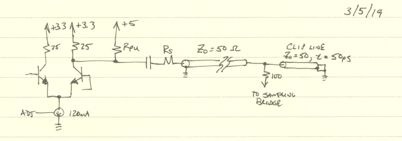
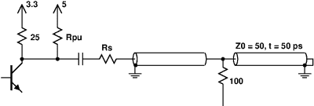
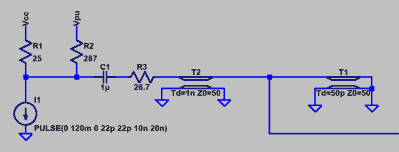
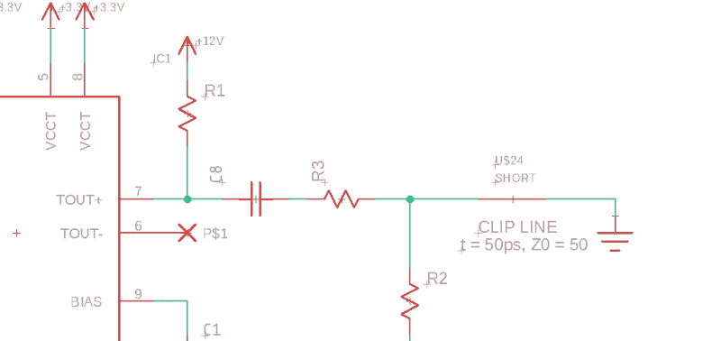

# 问 Hackaday:怎么画原理图？

> 原文：<https://hackaday.com/2019/03/19/ask-hackaday-how-do-you-draw-schematics/>

电子设计的通用语言是原理图。我可以拿起用中文(一种我看不懂也不会说的语言)写的数据手册，通常从图纸上就能大致了解该器件的内容。不幸的是，尽管多年来我的设计经验有所增长，但我还没有完全学会用原理图来思考——我需要在纸上(或屏幕上)看到它来分析电路。无论是写在信封背面还是画在淋浴间的冷凝物上，真正画出一个设计或想法对理解它有很大的影响。如果你曾经试图在没有原理图的情况下解释一个电路——比如在网上论坛或电话上——你就会知道这有多难。

因此，考虑到原理图对于设计和交流的重要性，你会认为选择一个工具来绘制它们是一件容易的事情。并非如此。有几十种选择，从专用原理图绘制程序到使用仿真原理图捕捉工具或 PCB 设计工具，甚至是老式的纸笔及其现代等价物。每一种都有其优点和缺点，并且可能更适合于某一特定的应用程序，但是您必须做出选择。

那么，Hackaday 的读者们，你们用什么来向世界传达你们的电子设计理念呢？

## 老派:起草

Pen-and-paper schematic

最简单的方法就是拿起笔和纸去做。电子领域显然早于现代计算机用户界面，所以有丰富的手绘原理图的历史；只要翻开集成电路时代之前的任何一本书看一些。这种方法提供了最大的灵活性——你通常可以使用手边的任何东西来绘制电路，从你的古董橡木制图桌和 Rapidograph 笔到沙上的木棒。不利的一面是，如果你不是艺术家(或熟练的制图技术人员)，你的示意图肯定会反映这一点，就像我的一样。但是，它简单、快捷且便于携带。

Schematic drawn in xfig

下一步是虚拟纸笔:一个通用绘图程序。虽然我承认几十年前在 Windows 下用画笔绘制了一些示意图，但你最好的选择可能是矢量绘图程序。我知道这显示了我的老态龙钟，但我的首选绘图程序是 [xfig](http://mcj.sourceforge.net/) 。还有很多更现代的替代品，包括 [Dia](https://gitlab.gnome.org/GNOME/dia/) 和 [Inkscape](https://inkscape.org/) ，而读者当然可以推荐针对其他平台的工具。使用这样一个包的一个方便的方法是构建一个您经常使用的符号库。这给了你画它们的灵活性:你可以自由地把你的电阻画成小方框，而我会保留我的曲线。缺点是你基本上是从零开始，尽管有些包可能有你可以利用的电子符号库(xfig 有，但我不喜欢它们的外观)。

这两种方法都有一个缺点，那就是无法生成网表导入仿真或 PCB 布局工具，但如果您不打算使用其中任何一种工具，也没关系。

## 专用原理图捕获程序

从通用绘图工具升级到专用于原理图绘制的软件包。我遇到的第一个是 [XCircuit](http://opencircuitdesign.com/xcircuit/) ，这是 UNIX 时代的另一个遗迹。该计划的既定目标是为出版提供高质量的输出，而不是为了进一步处理而捕获原理图。稍微搜索一下也能找到 [TinyCAD](https://sourceforge.net/projects/tinycad/) ，它确实输出网表，但也声称输出适合出版的高质量产品。学习这些工具似乎从来都不值得投资，因为它们是针对这样一个特定的利基目的。我考虑过的所有其他工具类别都有第二用途——例如，花在学习 Inkscape 绘制示意图上的时间可以用于任何目的。也许这些工具对我的用例来说是完美的，但是我还没有尝试过？

## 模拟器

Schematic from LTspice. Square junction dots are weird.

现代电路模拟器有相对不错的用户界面，尽管每一个都有它的怪癖。传统观点认为，就像 PCB 布局程序一样，你要仔细选择一个最符合你需求的程序，然后大声抱怨。在我使用过的几个仿真工具中，我使用线性技术公司(现在是 ADI 公司的一部分)的免费(免费，非免费)仿真工具 [LTspice](https://www.analog.com/en/design-center/design-tools-and-calculators/ltspice-simulator.html) 的时间最长。如果您无论如何都需要模拟您的电路，您有时可以通过使用您的仿真器中的原理图来发布，从而一举两得。当然，出于仿真目的，您可能会包括一些不会在 BOM 中列出的部件(例如寄生元件)，并用电压或电流源替代设计的整个子部分。这些更改会导致仿真原理图与发布的原理图有所不同，因此您最终可能会绘制两次。

我发现这种方法的一个优点是所有的组件都被认为是“兼容的”——以相同的样式和比例。

## PCB 布局编辑器

Autodesk Eagle schematic

用于 PCB 设计的 CAD 程序还具有原理图捕获功能，您可以利用它来生成用于发布的原理图。我碰巧使用 Eagle，尽管我知道有很多 KiCAD 类型。任何一个或任何数量的备选方案都将提供相同的功能。虽然有时显示比设计 PCB 所需更多的信息(例如，IC 内部的简化图)是有用的，但 PCB 布局和发布所捕获的原理图通常比仿真所用的原理图更匹配。我发现的最大缺点是，来自不同库的符号可能以不同的风格或不同的比例绘制，从而导致难看的原理图输出。因此，我最终重新创建了自己的符号库，这也消除了任何许可问题(我更关心我所创建的设计的许可，而不是我所使用的工具)。

去云还是不去云？

我上面提到的所有工具都是传统的桌面应用程序，这是我更喜欢的。当然，现在每个类别中都有基于云的工具。我还没有很好地探索过这个领域，尽管我当然知道 [circuitlab](https://www.circuitlab.com/) ，它是[电子电路原理图的首选工具。StackExchange](https://electronics.stackexchange.com/) ，以及[法尔斯塔德电路模拟器](https://www.falstad.com/circuit/)，在 [hackaday.io](https://hackaday.io) 上偶尔会用到。我肯定还有其他工具，但是我不愿意采用基于云的工作流，这让我无法充分研究这些选项。也许我错过了我要找的东西？

## 轮到你了

好吧，黑客日，你用什么工具来制作图表？有什么技巧可以让某个特定的工具更容易实现这个目的吗？是不是每个人都像我一样拥有一堆杂乱的工具，或者人们已经想出如何从一个工具中获得他们需要的所有功能？请在下面的评论中告诉我们。