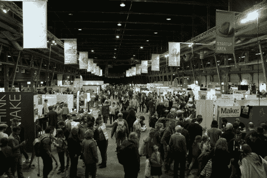
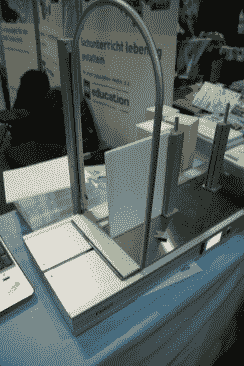
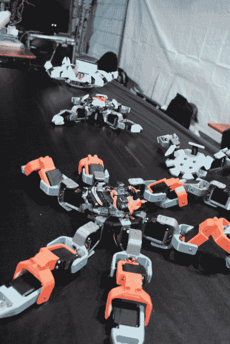
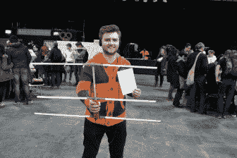
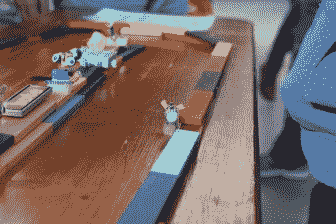
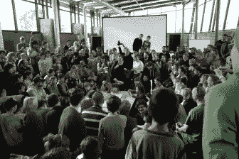

# 黑客日播客 009:在人工智能的边缘，评论你的代码，大轮子和慕尼黑的制造者

> 原文：<https://hackaday.com/2019/03/08/hackaday-podcast-009-on-the-edge-of-ai-comment-your-code-big-big-wheels-and-makers-of-munich/>

与 Hackaday 的编辑埃利奥特·威廉姆斯和迈克·斯奇斯一起了解过去一周的黑客活动。“边缘的人工智能”是最近的热门词汇，BeagleBone 和 Google 的硬件产品可以满足你的需求。我们接受来自特斯拉的不稳定数据，开着四个充气屋到处跑，对一个 keytar 进行逆向工程，挖掘出一个恐龙电脑的宝石，以及 MIPI DSI 显示器黑客。有一些技巧可以让你更好地注释代码，让你的计算机做你的代数作业。

节目中所有讨论的链接如下。一如既往，加入评论，因为我们将在下周的节目中关注这些评论！

[//html5-player.libsyn.com/embed/episode/id/16571564/height/90/theme/custom/thumbnail/yes/direction/backward/render-playlist/no/custom-color/000000/](//html5-player.libsyn.com/embed/episode/id/16571564/height/90/theme/custom/thumbnail/yes/direction/backward/render-playlist/no/custom-color/000000/)

如果你想继续，看看下面的链接，一如既往，在评论中告诉我们你对这一集的看法！

[直接下载](https://traffic.libsyn.com/secure/hackaday/586880808-hackaday-episode-9-on-the-edge-of-ai-comment-your-code-big-big-wheels-and-makers-of-munich.mp3) (60 MB 左右。)

Where to Follow Hackaday Podcast

### 关注 Hackaday 播客的地方:

*   [谷歌播客](https://podcasts.google.com/feed/aHR0cDovL2ZlZWRzLnNvdW5kY2xvdWQuY29tL3VzZXJzL3NvdW5kY2xvdWQ6dXNlcnM6OTM5MTM0NzIvc291bmRzLnJzcw)
*   [iTunes](https://itunes.apple.com/us/podcast/hackaday-podcast/id1447409683)
*   [Spotify](https://open.spotify.com/show/3NRV0mhZa8xeRT0EyLPaIp)
*   [装订机](https://www.stitcher.com/podcast/hackaday-podcast)
*   [RSS](http://hackaday.libsyn.com/rss)

## 第 009 集节目笔记:

#### 本周新消息:

*   艾在边上很有周的味道:
    *   [这只小猎犬有人工智能](https://hackaday.com/2019/03/06/this-beaglebones-got-ai)
    *   [谷歌推出人工智能平台，看起来非常像树莓派](https://hackaday.com/2019/03/05/google-launches-ai-platform-that-looks-remarkably-like-a-raspberry-pi/)
    *   [带有 Smarts 云或本地的 Raspberry Pi 摄像头](https://hackaday.com/2019/03/07/raspberry-pi-camera-with-smarts-cloud-or-local/)
    *   [Leigh Johnsons 树莓派机器视觉指南](https://hackaday.com/2019/03/01/leigh-johnsons-guide-to-machine-vision-on-raspberry-pi/)
*   [新竞赛柔性 PCB](https://hackaday.com/2019/03/06/new-contest-flexible-pcbs/)
    *   60 名获奖者将获得优惠券，以制造他们的柔性 PCB(最多 2 平方英寸)。

#### 本周有趣的黑客:

*   [现场黑客和 MIDI 键盘手](https://hackaday.com/2019/03/02/live-hacking-and-a-midi-keytar/)
*   受嫉妒的驱使，这款智能灯大放异彩
*   [一个巨大的充气机器](https://hackaday.com/2019/03/01/a-big-mean-inflated-machine/)
*   [载人多旋翼再飞电动式](https://hackaday.com/2017/07/01/manned-multirotor-flies-again-electric-style/)
*   原始的辛克莱·ZX 光谱从橱柜中出现
*   [黑掉 iPod Nano 显示屏漂亮](https://hackaday.com/2019/03/06/hacking-the-ipod-nano-display-beautiful/)
    *   [使用 ESP32 VGA 显示器回到视频基础知识](https://hackaday.com/2019/02/05/back-to-video-basics-with-an-esp32-vga-display/)
    *   [充分利用不工作的 iPod 显示屏](https://hackaday.com/2019/02/12/putting-an-out-of-work-ipod-display-to-good-use/)

#### 快速链接:

*   埃利奥特的选择:
    *   [发现这个 DIY 电子负载优雅地隐藏黑客](https://hackaday.com/2019/02/28/spot-this-diy-electronic-loads-gracefully-hidden-hacks/)
    *   [你见过的最简单的热感相机](https://hackaday.com/2019/03/01/the-easiest-thermal-camera-build-youll-ever-see/)
    *   [纸杯话筒既有趣又实用](https://hackaday.com/2019/03/02/paper-cup-mic-is-fun-and-functional/)
    *   [与你的示波器对话，它会服从](https://hackaday.com/2019/03/03/talk-to-your-scope-and-it-will-obey/)
*   迈克的选择:
    *   [3D 打印逻辑门](https://hackaday.com/2019/03/02/3d-printing-logic-gates/)
        *   [棒状逻辑和石墨烯难以捉摸的分子尺度计算机](https://hackaday.com/2015/10/19/rod-logic-and-graphene-elusive-molecule-scale-computers/)
        *   尼尔·斯蒂芬森的 [*钻石时代的*](https://en.wikipedia.org/wiki/The_Diamond_Age)
    *   科技模仿生活萤火虫制造更好的灯泡
    *   简单的破解完全改变了这架钢琴的声音

#### 不能错过的文章:

*   [“好的代码文档本身”和其他你不应该告诉自己的搞笑笑话](https://hackaday.com/2019/03/05/good-code-documents-itself-and-other-hilarious-jokes-you-shouldnt-tell-yourself/)
*   [Teslas Autosteer 是否让汽车变得更不安全？](https://hackaday.com/2019/03/04/does-teslas-autosteer-make-cars-less-safe/)
*   [用于电子设计的计算机代数](https://hackaday.com/2019/02/28/computer-algebra-for-electronic-design/)

#### 埃利奥特制作慕尼黑的音频之旅

*   [TonLichtStudio](http://tonlicht.studio)
*   Fab Lab Freising 的 max grning 非常喜欢他的 [Noztech](http://www.noztek.com/) 长丝挤出机
*   亚历克斯·佩勒的[x 射线绘图仪机器人](https://www.youtube.com/watch?v=3b-KJyGCmCo)
*   通过聚苯乙烯泡沫球扩散的 led:[space lights . cz](http://spacelights.cz/)
*   [LibreSolar](https://libre.solar/)
*   诺贝特·海因茨(Homo Faciens)在 [Hackaday.io](https://hackaday.io/HomoFaciens) 和 [YouTube](https://www.youtube.com/user/HomoFaciens) 上

  Tonlicht instrument, from behind  Kids Soldering Workshop  MuCCC Represent!  The Main Hall  2D hot-wire CNC: FiloCut  Robots chilling  Foxhunters aplenty!  Fuzzy Racetrack for Vibrobots  Hebocon!  Glowy Styrofoam Diffusers: spacelights.cz