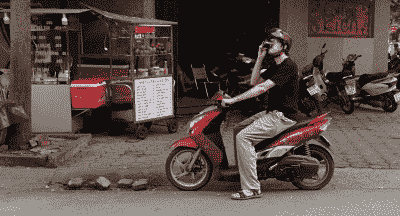

# 黑客日聚会:越南

> 原文：<https://hackaday.com/2019/03/12/hackaday-meetup-vietnam/>

Hackaday 将于 3 月 24 日(T1)周日在越南胡志明市举办一场会议。我们很想在那里见到你！

Sean Boyce 住在 HCMC——你可能喜欢他的几篇文章，这些文章详细描述了一些文化，比如[在繁忙的地区停车时跟踪你的摩托车](https://hackaday.com/2018/01/05/finding-your-motorbike-using-wi-fi/)，以及[粉碎关于咖啡质量的神话](https://hackaday.com/2017/11/06/how-pure-is-this-cup-of-joe-coffee-conspiracy-and-citizen-science/)。不到两周，Mike Szczys 将拜访 Sean，这是举办 Hackaday meetup 的绝佳理由！

Sean enjoying a coffee on his scooter.

[3 月 24 日(周日)晚上 7-10 点，在](https://hackaday.io/event/164309-hackaday-meetup-vietnam) [Trung Nguyên Legend Café与 Sean 和 Mike 一起参加一个非正式的聚会。如果你有一个正在做的硬件项目，来展示一下吧，作为一个很好的话题引子。如果没有，那也可以。我们还安排了三个简短的演讲，话题从机器人到模拟电子。当然，如果你对发表演讲感到兴奋，请在下面的评论中告诉我们，我们会努力让你挤进来。](https://hackaday.io/event/164309-hackaday-meetup-vietnam)

Hackaday 试图在世界各个角落举办现场活动，将越南加入其中令人兴奋。前往[活动页面](https://hackaday.io/event/164309-hackaday-meetup-vietnam)了解更多信息，我们期待在那里见到您！当然，如果这个周末你碰巧在世界的另一边，在英国剑桥会有一个[黑客日小型会议](https://hackaday.com/?p=348913)！