# 实际操作:新的 Nvidia Jetson Nano 以更小的尺寸提供更强的性能

> 原文：<https://hackaday.com/2019/03/18/hands-on-new-nvidia-jetson-nano-is-more-power-in-a-smaller-form-factor/>

今天，Nvidia 发布了他们下一代小型但功能强大的嵌入式 AI 模块。这是 Nvidia Jetson Nano ，它比他们以前推出的任何产品都更小、更便宜、更便于制造商使用。

Jetson Nano 紧随 Jetson TX1、TX2 和 Jetson AGX Xavier 之后，都是非常强大的平台，但在物理尺寸、价格和实施成本方面都超出了许多产品设计师和几乎所有业余嵌入式爱好者的能力。

Nvidia Jetson Nano 开发者套件目前售价为 99 美元，而生产就绪模块将于 6 月份上市，售价为 129 美元。它的大小相当于一根笔记本电脑内存，并且只需要 5 瓦。让我们通过对硬件的实际回顾来更深入地了解一下。

 [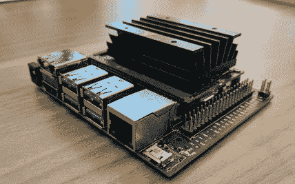](https://i0.wp.com/hackaday.com/wp-content/uploads/2019/03/img_20190315_122429.jpg?ssl=1)  [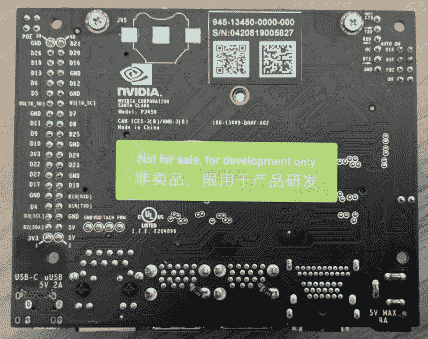](https://i0.wp.com/hackaday.com/wp-content/uploads/2019/03/img_20190315_122447.jpg?ssl=1)  [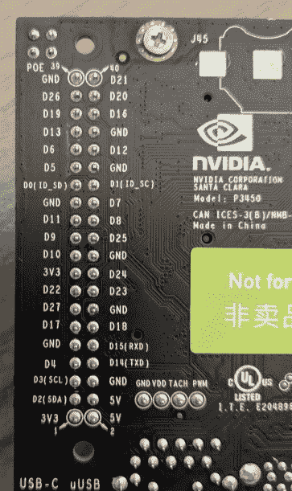](https://i0.wp.com/hackaday.com/wp-content/uploads/2019/03/img_20190315_122456.jpg?ssl=1)  [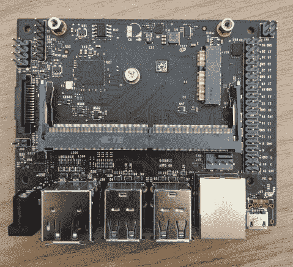](https://i0.wp.com/hackaday.com/wp-content/uploads/2019/03/img_20190315_122814.jpg?ssl=1)  [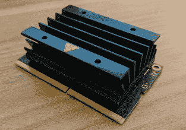](https://i0.wp.com/hackaday.com/wp-content/uploads/2019/03/img_20190315_122826.jpg?ssl=1)  [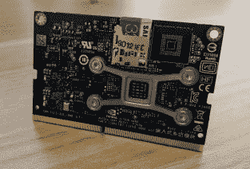](https://i0.wp.com/hackaday.com/wp-content/uploads/2019/03/img_20190315_122849.jpg?ssl=1) 

Nvidia Jetson 是我们以前见过的东西，首先在 2015 年[作为 Jetson TX1](https://hackaday.com/2015/11/24/the-nvidia-jetson-tx1-its-not-for-everybody-but-it-is-very-cool/) ，再次在 2017 年[作为 Jetson TX2](https://hackaday.com/2017/03/14/hands-on-nvidia-jetson-tx2-fast-processing-for-embedded-devices/) 。这两个模块都是为“AI at the edge”设计的平台，这是一个充满时髦词汇的想法，但从嵌入式开发的角度来看确实有意义。这种“优势”背后的想法是在 GPU 的机架上构建和训练所有的模型，然后将该模型带到一台小型计算机上进行推理。这台小电脑不需要联网，电力预算也不需要庞大。

这种“人工智能在边缘”的模式并不新鲜——我们在 20 世纪 80 年代就有专用的人工智能芯片，即使物联网尚未发明出来——谷歌最近发布了 Coral，[一种装载了边缘 TPU 平台和定制 ASIC](https://hackaday.com/2019/03/05/google-launches-ai-platform-that-looks-remarkably-like-a-raspberry-pi/) 的主板，其外形和功耗预算与树莓 Pi 相同。[英特尔有一个神经计算棒](https://hackaday.com/2019/01/31/ai-on-raspberry-pi-with-the-intel-neural-compute-stick/)，它被设计成可以插入单板计算机。再一次，这是一个证明，用硅片渲染，我们正处于第二次人工智能复兴。Jetson Nano 是适合这个市场的最新主板，它的主要特点是便携性，并且可以作为一个模块安装到你的*产品中。*

以下是随此次发布一同发布的 Nvidia 规格表:

[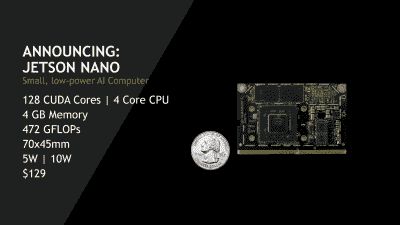](https://hackaday.com/2019/03/18/hands-on-new-nvidia-jetson-nano-is-more-power-in-a-smaller-form-factor/jetson1/)[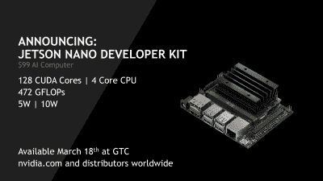](https://hackaday.com/2019/03/18/hands-on-new-nvidia-jetson-nano-is-more-power-in-a-smaller-form-factor/jetson4/)[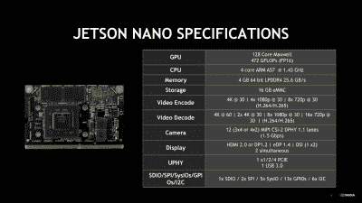](https://hackaday.com/2019/03/18/hands-on-new-nvidia-jetson-nano-is-more-power-in-a-smaller-form-factor/jetson2/)

## 规格和实践

[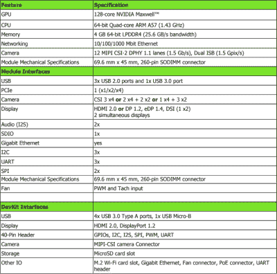](https://hackaday.com/wp-content/uploads/2019/03/jetsonnanospecs.png) 杰特森 Nano 配备了一个运行速度为 1.4GHz 的四核 ARM A57 CPU，由于这是英伟达，所以你也有一个带有 128 个 CUDA 核心的麦克斯韦 GPU。内存为 4 GB 的 LPDDR4，支持以太网和 MIPI CSI 摄像机。

Jetson Nano 有两个版本，有两种存储选项。开发者的套件包括一个带有 DisplayPort 的载板、HDMI、四个 USB 端口、CSI 摄像头连接器、以太网、一个 M.2 WiFi 卡插槽和一堆 GPIOs，使用的是 SD 卡。开发者工具包售价 99 美元。Jetson Nano——不是开发者的工具包——没有载板(并且需要构建自己的载板),但包括 16 GB 的 eMMC 闪存。是的，他们本可以让这个命名方案更简单。

这些规格使 Jetson Nano 比 Raspberry Pi 3 略高一个档次，这是意料之中的，因为它的价格更高。我收到的评测单元运行着一个标准的 Ubuntu 桌面，速度很快，有了互联网，这台电脑的表现就像你预期的那样。

但是 Jetson 不是为运行 GameCube 模拟器而设计的，尽管它可能可以运行(有人应该这么做)。杰特森纳米的全部意义在于做推论。你在一台大型计算机上训练你的模型，或者使用许多免费模型中的一个，然后在 Jetson 上运行它们。在这里，Jetson Nano 比最近推出的 Google/Coral dev board(T1)或一个带英特尔计算棒的 Pi 要强大得多。你还拥有 CUDA GPU，并支持深度学习软件的“所有流行框架”。

[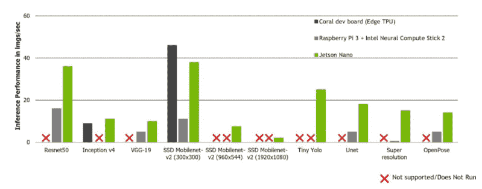](https://hackaday.com/wp-content/uploads/2019/03/jetsoninference.png)

## 一个机器人，给制造者

随着 Jetson Nano 的发布，Nvidia 正在专注于制造商市场，*不管那可能是什么*，他们正在发布教程、示例、文档和所有单板计算机的杀手级应用程序，一个 3D 打印机器人。[喷气机器人](https://github.com/NVIDIA-AI-IOT-private/jetbot)的材料清单包括 3D 打印机器人底盘、树莓 Pi 相机、WiFi 卡(英特尔 Wireless-AC 8265)、齿轮电机、电机驱动器和 10000 mAh USB 电源组。加上几个螺丝，你就有了一个功能正常的 Linux 3D 打印机器人。

 [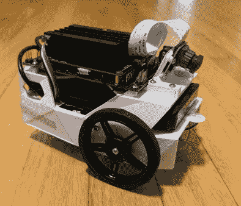](https://i0.wp.com/hackaday.com/wp-content/uploads/2019/03/jetbot1.jpg?ssl=1)  [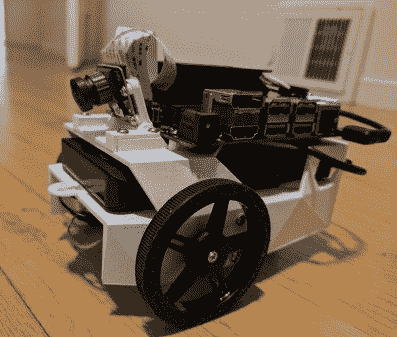](https://i0.wp.com/hackaday.com/wp-content/uploads/2019/03/jetbot2.jpg?ssl=1) 

[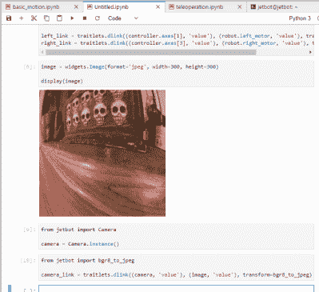](https://hackaday.com/wp-content/uploads/2019/03/jupyterlab.png) 为 Jetbot 编写代码首先需要将其连接到本地 WiFi 网络，但之后就像将 Chrome 指向一个 IP 地址并打开 Jupyter 记事本一样简单。例子中的所有代码都是用 Python 编写的，几分钟后，一个孩子就可以用 Xbox 控制器开着车到处跑，同时实时视频返回到浏览器。这就是机器人教育。

Jetson Nano 的教程和示例包括基本的遥控操作，通过训练神经网络来跟随物体来避免碰撞。这是一个给你一个有能力的机器学习平台和两轮机器人底盘的设置。你能用这个解一个魔方吗？是的，如果你开发软件的话。你可以造一辆自动驾驶汽车，它让孩子们对 STEM 感兴趣。

这里有一个经验教训。提供可以让用户快速启动和运行的例子是[注定英特尔创客运动努力](https://hackaday.com/2017/07/25/the-end-of-arduino-101-intel-leaves-maker-market/)的缺失元素，也是 Raspberry Pi 和 Arduino 成功的关键。如果你不提供文档和例子，产品就会失败。在这方面，Nvidia 已经做了出色的工作，为教育工作者和学生带来了基于小型 Linux 模块的 GPU。

## 杰特森平台的未来

这并不是 Nvidia 的第一款 Jetson 产品。2015 年， [Nvidia 发布了 Jetson TX1](https://hackaday.com/2015/11/24/the-nvidia-jetson-tx1-its-not-for-everybody-but-it-is-very-cool/) ，这是一个信用卡大小的模块，旨在成为人工智能“在边缘”的未来。尽管有这些时髦的词语，这对于非常快的嵌入式处理器来说是一个可行的用例；你可以在亚马逊拥有的所有 GPU 上训练你的模型，然后将你的模型放在一个小型嵌入式设备上。它是没有云或互联网连接的人工智能。Jetson TX2 于 2017 年推出，同样是一个信用卡大小的模块，连接到 MiniITX 主板上。这就是你想要的自拍无人机模块，或者无人驾驶汽车的机器学习模块。

Nvidia Jetson Nano 打破了以往的外形。Nano 与 Raspberry Pi 计算模块一样，完全适合标准笔记本电脑 SO-DIMM 连接器。这是为与 Pi 计算模块相同的应用程序设计的模块；你需要建立一个载板来处理你所有的输入输出，这个小小的模块将会处理你所有的数据。这是一个可行的工程策略，即使它不适合那些想把现代电子产品塞进旧游戏机外壳并运行模拟器的人。你知道，人们用电子设备做真正的工作。

虽然 Jetson Nano 是其外形中的第一款，但有一些迹象表明 Nvidia 将长期开发该平台。这种规模的项目最大的工程限制之一是电力预算，Jetson Nano 配备了一个载板，包括一个微型 USB 电源输入(还有一个额外的筒式插孔适配器，额定电压为 5V，4A)。这个微型 USB 电源输入限于 5V，2A 或 10 瓦。每瓦特你只能做这么多的计算，如果你想要更多，你有两个选择:对你的芯片使用更小的工艺或者使用更多的能量。Nvidia 想出了一个巧妙的方法来节省下一版本载板的工程时间。他们在为 USB 连接器堆积足迹。载板还支持 USB-C 连接器:

[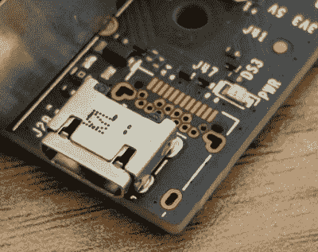](https://hackaday.com/wp-content/uploads/2019/03/jetsonusb.jpg)[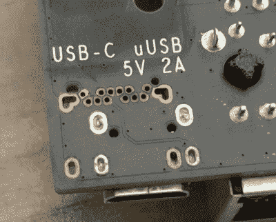](https://hackaday.com/wp-content/uploads/2019/03/jetsonusb-2.jpg)

当然，这只是一个很小的细节，大多数人都不会注意到，但载板已经为 USB-C 连接器和可以提供的更大功率而设计。Nvidia 显然正在为 Jetson 的未来做规划，它可能会有一个更方便的外形。