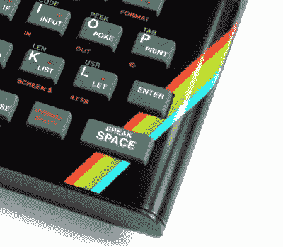
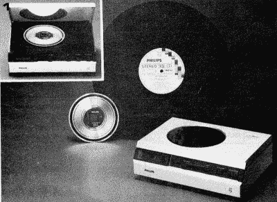
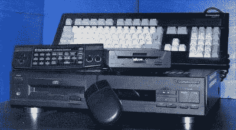

# CD 是 40，CD 是死的

> 原文：<https://hackaday.com/2019/03/19/the-cd-is-40-the-cd-is-dead/>

光盘已经有 40 年的历史了，对于我们这些还记得它问世的人来说，它仍然闪耀着高科技的光芒，尽管它已经被流媒体音乐服务遗忘了。

There was a time when a rainbow motif was extremely futuristic. Bill Bertram ([CC BY-SA 2.5](https://commons.wikimedia.org/wiki/File:ZXSpectrum48k.jpg))

如果我们可以定义一个消费者从模拟技术转向数字技术的时刻，CD 的发布将是一个很好的开始。公众在 20 世纪 70 年代拥有的最酷的技术可能是模拟录像机或 CB 收音机，但几乎在一夜之间，他们在 80 年代初就转向了 CD 播放器和家用电脑。CD 播放器是大多数消费者第一次接触到自己的激光的地方，这给了它一种不可能的未来感，CD 上凹坑的彩虹效果成为了一个主题，融入了那个时代的设计语言。从那以后，很少有新技术能让他们一看到就兴奋到这种程度，相反，今天的消费者认为新的发展仅仅是他们已经拥有的技术的增加，同时并不期望它们有更长的寿命。

## 格式的起源

It isn’t only audio that’s improved in quality in the digital age, a magazine-quality promotional shot of the Philips prototype from Elektuur magazine, from Elektuur 188, June 1979\. ([Public domain mark 1.0](https://archive.org/details/Elektuur18819796/page/n43?q=compact+disc))

这种格式源于当代消费视频技术，索尼和飞利浦都在利用这种技术开发下一代音频产品。索尼在 20 世纪 70 年代初展示了一种使用其录像带格式的数字音频系统，而飞利浦则研究了一种类似于激光视盘的模拟系统。到 20 世纪 50 年代中期，两家公司都生产出了不兼容的原型机音频光盘，但它们非常相似，足以让它们进行合作研究。1979 年的原型播放器及其 120 毫米的聚碳酸酯光盘包含超过一小时的 44.1 kHz 16 位立体声音频，这就是结果，具有未来主义前景的书籍和杂志将原型播放器以及不可避免的 CD 彩虹镜头作为未来的*方式*。

像英国广播公司的《明日世界》这样的电视节目对这种新格式与黑胶唱片相比的耐用性做了过分的宣传，导致了一种专业营销的狂热预期，即飞利浦银顶装播放器可能看起来不错，但消费者不得不再等几年，直到 1982 年第一批商业型号上市。

## 激光唱机是如何工作的？

在 1980 年，CD 唱机的操作模式对普通大众来说似乎是不可思议的高科技，但是当它被展示到它的基本原理时，它是令人耳目一新地可以理解的，并且比模拟 VCR 要简单得多，所以在 80 年代，许多人会坐在模拟 VCR 旁边。在 20 世纪 80 年代末，它是用来在我的大学里向电子工程学生教授各种电子控制主题的例子，当时我们都熟悉这种格式，但可能我们大多数人都没有现金拥有自己的格式。

[![An annotated picture of the CD player laser assembly. Zim 256 [CC BY-SA 3.0]](img/ebd4578290df593405dae9e18e3800c8.png)](https://hackaday.com/wp-content/uploads/2019/03/philips_1_beam_tracking_laser_optical_assembly.jpg)

CD 播放器激光组件的标注图。zim 256[[CC BY-SA 3.0](https://commons.wikimedia.org/wiki/File:Philips_1_beam_tracking_Laser_Optical_Assembly.jpg)]

激光唱机的商务端活动部件出奇的少。它包含在一个组合的激光器和传感器模块中，该模块安装在一个滑动致动器上，该致动器通常由一个小电机通过蜗杆驱动。一个红外线激光二极管照射到一个棱镜上，棱镜通过一个透镜将其光线以直角向下射向一张旋转的 CD。镜头有一个聚焦机制，通常是一组线圈和一块磁铁，使它能够在磁场中漂浮。光从 CD 反射回来，直接向上穿过棱镜，落在由四个光电二极管组成的阵列上。在理想的跟踪和聚焦情况下，反射光应集中在阵列的中心，因此通过监控每个光电二极管产生的电流，玩家可以调整聚焦、光盘速度和激光模块的线性位置，以保持一切都在轨道上，并以正确的数据速率检索干净的数据流。

来自二极管阵列的模拟信号包含光束穿过光盘上的凹坑和平台时产生的数据流，一位前端只是将这些数据流数字化成位..这些位被组装到数据帧中，这些数据帧以一种设计为最大化数据流可恢复性的形式进行编码，通过[将每个字节的数据编码成一个 14 位字](https://en.wikipedia.org/wiki/Eight-to-fourteen_modulation)，旨在通过避免单个逻辑 1 和 0 来减少数据流的瞬时带宽。使用查找表进行解码，产生应用了 [Reed-Solomon](https://en.wikipedia.org/wiki/Reed%E2%80%93Solomon_error_correction) 纠错的 16 位数据流。执行纠错步骤，并将结果馈送到 DAC 以产生音频信号。多年来，不同的制造商对该系统进行了许多改进和增强，但是 CD 播放器的核心仍然是一个非常简单的设备。

## CD 到底怎么了？

The Commodore CDTV. Patric Klöter ( [CC BY-SA 3.0](https://commons.wikimedia.org/wiki/File:CDTV.jpg)).

CD 的全盛时期可能出现在 20 世纪 90 年代，当时播放器已经走出了富有的音响发烧友的领域，进入了廉价的消费电子产品商店。一个便携式 CD 播放器可以用很低的价格买到，他们开始取代随身听式的卡带播放器，成为移动音乐的选择。与此同时，CD-ROM 也走上了一条相似的廉价之路，没有一台 90 年代中期的米色盒子 PC 是不完整的，没有 CD-ROM 驱动器[和多媒体百科全书](https://hackaday.com/2016/11/15/medium-over-message-a-cd-rom-multimedia-bubble-survivors-tale/)。还有其他基于 CD 的设备，多媒体设备，如[飞利浦的 CD-i](https://en.wikipedia.org/wiki/Philips_CD-i) 和 [CDTV 的](https://en.wikipedia.org/wiki/Commodore_CDTV)装在黑盒子里的 Amiga，[视频 CD](https://en.wikipedia.org/wiki/Video_CD)，当然还有一批基于 CD 的游戏机。CD 在很大程度上是索尼第一代 PlayStation 的巨大成功的原因，而基于盒式磁带的游戏机要求开发者预先支付大量盒式磁带库存，如果产品失败，PlayStation 开发者只需为生产的 CD 付费。

当游戏玩家为他们的 PlayStations 疯狂，在他们的 Discmans 上听着鼓和贝斯的时候，CD 格式的前景已经明朗。1998 年, [MPMan](https://en.wikipedia.org/wiki/MPMan) MP3 播放器首次亮相，紧接着是第一款 [Diamond Rio](https://en.wikipedia.org/wiki/Rio_(digital_audio_players)) ，然后是一大批其他播放器。伴随而来的文件共享服务的增长，如 [Napster](https://en.wikipedia.org/wiki/Napster) 促使唱片公司和乐队自我毁灭的法律崩溃，他们为了保护他们的 CD 销售而背叛他们自己的顾客和粉丝，立即使来自互联网的 MP3 文件成为比来自公司法律恶霸的 CD 更酷的选择。苹果 iPod 的到来带来了简单合法的在线音乐商店和作为理想生活配件的 MP3 播放器，CD 开始走下坡路。具有讽刺意味的是，在 2019 年，独立的 MP3 播放器在流媒体服务面前经历了比 CD 更急剧的暴跌，而黑胶唱片不知何故总是保持着死忠的追随者，而[却在新一代人重新发现它时成功复兴了](http://www.riaa.com/wp-content/uploads/2019/02/RIAA-2018-Year-End-Music-Industry-Revenue-Report.pdf) (PDF)。