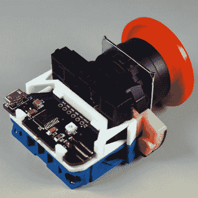

# 优雅地给出一个工业按钮 USB

> 原文：<https://hackaday.com/2019/04/03/giving-an-industrial-push-button-usb-elegantly/>

[Glen]的项目听起来非常简单:让一个大的工业风格按钮充当一键 USB 键盘。他可以用多种方式拼凑出一些东西，但他决定创造一个真正优雅的解决方案。他的定制 PCB 与工厂零件完美匹配，按钮和电脑之间的 USB 电缆甚至可以穿过按钮外壳的引线孔。

事实证明，工业按钮具有标准化的组件，这些组件可以以类似乐高积木的方式进行组装，通过混合和匹配组件来提供不同的开关动作、指示灯以及类似的功能。[Glen]决定利用这一特性使他的定制 PCB(与他的[单键键盘项目](https://hackaday.com/2018/05/19/one-key-keyboard-is-exercise-in-sub-millimeter-design/)中使用的设计相同)就像工厂组件一样。有了 3D 打印适配器，PCB 就像任何其他组件一样锁定，甚至与按钮外壳中的引线孔对齐，便于连接 USB 电缆。

[格伦]用大按钮做什么？目前他有两个应用程序:一个是在他工作的地方运行虚拟机的 Linux 机器上提供简单的一键屏幕锁定。它首先解除虚拟机的键盘捕获，然后在主机上启用屏幕锁定。另一个是在微软文档中插入便便表情符号。在 GitHub 上可以找到【Glen】小键盘的代码和 PCB 设计文件[。](https://github.com/bikerglen/small-keyboards)