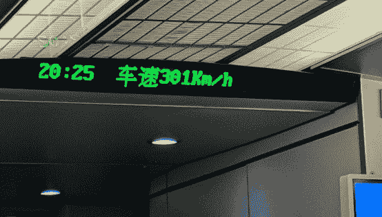
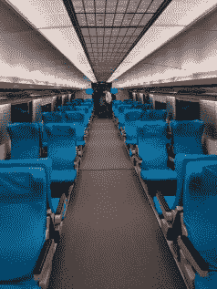
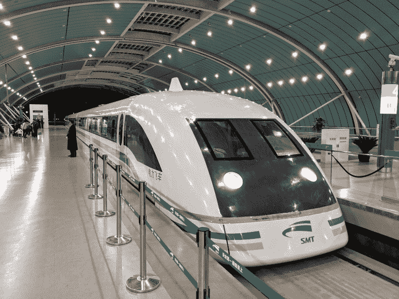
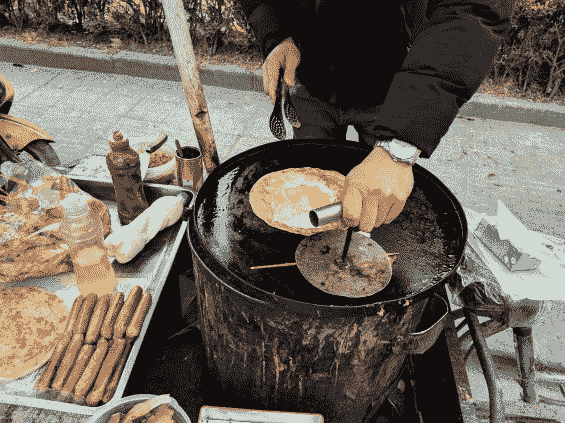
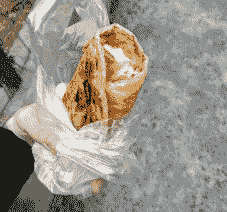
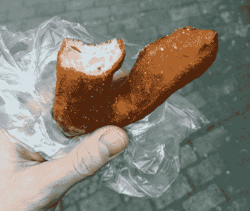

# 海外黑客:中国路漫漫其修远兮

> 原文：<https://hackaday.com/2019/03/20/hacker-abroad-a-very-long-way-to-china/>

原来上海离我威斯康星州的家很远。我来这里参加中国电子展，虽然这是一个令人难以置信的漫长的旅行“一天”，但事实证明这是非常令人愉快的。我在飞机上黑了一些硬件，坐磁悬浮列车去了我的酒店，和 Sophi 喝了点东西，在附近吃了点上海早餐。

## 两架飞机覆盖了世界的三分之一

我们的星球周长大约 24000 英里，我飞了 8000 多英里才到这里。难以置信从一个地方到另一个地方是多么容易。

我的第一次飞行是从麦迪逊到亚特兰大轻松的几个小时。我担心只需要 55 分钟就能转机，但那个机场的人员流动系统意味着，从我的第一次航班停在停机坪的那一刻起，只需要 15 分钟就可以到达我的下一个登机口，远远早于登机时间。我只带着一个背包旅行，这很快就会变得更有意义。

互联网对整个飞行都有好处——我猜卫星无处不在。我花 28 美元买了一张 24 小时国际通票，考虑到我在从亚特兰大到上海的 16 小时飞行中做了大量的工作，这是一个很棒的价格。当然，我也玩得很开心。

在美美地睡了大约 3 个小时后，我拿出了一直在玩的 STM32，并把它连接到我几天前刚刚得到的 ePaper 显示器上。我能够通过 Arduino IDE 启动并运行示例代码，并计划在这次旅行中花一些时间让它与 c 语言中的普通 Makefile 一起工作。

## 磁悬浮列车到酒店

我真的很喜欢有良好的公共交通往返机场，这是迄今为止最酷的。上海有磁悬浮列车——一种漂浮在空中，由磁力排斥推动的列车。它在大约 8 分钟内行驶 30 公里！

座位又好又宽敞，火车每 15-20 分钟一趟。单程票价为 50 元人民币，约合 7.5 美元。乘坐非常平稳，转弯是倾斜的，非常整齐。车厢里有速度读数器。这次旅行的最高时速为 301 公里/小时(187 英里/小时)，但在高峰时间，它的最高时速为 430 公里/小时(267 英里/小时)。

      Maglev train at Longyang Station

我走了大约 25 分钟到了酒店，从自动取款机里取了一些人民币，然后和索菲·克拉维茨在睡觉前喝了一杯。我的头在午夜撞到了枕头上，我在早上 5:00 再次醒来，但是考虑到 13 个小时的时差，我认为我做得很好。

## 上海早餐

我的酒店在附近。我听说街上的早餐棒极了，早起成了我的使命。就在酒店附近的街区，我遇到了我的前三个街头小贩和我迄今为止最喜欢的食物。

这是加了熟鸡蛋的烤面包，还有一些美味的火鸡、生菜和调味汁。他们把它放在纸套和塑料袋里，这样你就可以在路上吃了。这些手推车正忙着让当地人开始他们的一天。

          I was amused by the bathroom light and fan switches

我继续走着，在我发现的不同手推车上品尝食物。似乎每隔一个街区，你就会看到前面有烤架、油炸锅和蒸锅的店面。猪肉馅的饺子很好吃。油炸面包有点甜，令人愉快。我看到了用来做蛋卷的又大又平的煎锅，里面装满了沙司和蔬菜。我明天会尝尝这个，也会留意猪肉米饭。

就在下雨之前，我回到酒店，早上 7:20 到达，开始写这篇文章。。今天下午我要去亚洲电子展，看看有什么有趣的事情在等着我。我会在明天的《海外黑客》中写下我的发现。