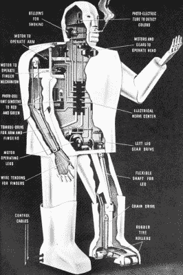

# Televox:过去的未来机器人

> 原文：<https://hackaday.com/2019/04/12/televox-the-pasts-robot-of-the-future/>

当我读旧书时，我喜欢寻找对未来的预言。因为我们生活在未来，所以看看他们是怎么做的很有趣。例证:我有一本 1941 年的选集《知识的新奇迹》。在有维基百科供你闲暇时阅读之前，这就是你想要的那种书。有些文章是关于煤是如何开采的，留声机是如何工作的，以及蜂窝的内部工作原理。不是那种你会随便找些具体的东西看的书，但如果你只是想学些有趣的东西，这是一本很好的书。里面有几篇关于技术的文章，似乎准备带我们去未来。其中之一是 Televox——一个来自西屋公司的机器人，它准备开创一个家庭和工业机械仆人的时代。1941 年的机器人？实际上，Televox 是在 1927 年出现的。

如果你写的是 2001 年的未来，你可能会想象城市人行道上挤满了骑赛格威的通勤者。毕竟，在 2001 年，我们被告知某种东西即将冲击市场，这将“改变一切”。它有一个著名的发明家迪安·卡门，还有一个重要的风险投资家在背后支持它。虽然它已经找到了一些利基市场，但它并不是人们预测的十亿美元的个人交通工具。

但是技术就是这样。有时候，事情似乎准备好了，然后就消失了——泡沫记忆浮现在脑海中。有时候，事情有几年的成功，并得到更好的东西取代。例如传真机或软驱。Televox 是对未来的一瞥，但绝不是人们在 1941 年想象的那样。

## 一个名字(或一幅画)里有什么？

Televox 的展示包括一个扁平的卡通式机器人身体。然而，在旅行时，他们有时不会运送尸体，而是在到达时用纸板剪出一个新的。Televox 的照片看起来像一个坏的共和国系列的机器人的想法是非常媒体炒作。

当你看名字的时候，一个更有趣的画面形成了。这个想法是“机器人”是我们所说的嵌入式系统，你可以通过电话操作，可能是用你的声音。我说可能是因为控制粗糙。通常，输入来自调谐到特定频率的振动簧片。输出也是一系列你可以通过电话听到的音调。

出于演示的目的，可以找到一些短语来振动正确的簧片，这样就好像你在发出语音命令。这让我想起了 20 年后的一个儿童玩具，它通过感知你呼出的空气来接受语音指令。簧片稍微复杂一点，但只是一点点。在实践中，你更有可能吹一个音高管来命令 Televox，而不是试图用语音来做。

## 真正的技术

Televox 背后的真正秘密不是纸板人形，而是西屋公司的一种新型电子管，叫做诺尔斯电子管。这些后来被称为栅极辉光管，类似于后来取代它们的闸流管。

以下是《奇迹书》对诺尔斯电子管的评价:

> 诺尔斯电子管是 televox 的心脏，有点类似于无线电中使用的气体整流器，除了阳极和阴极之外，还有一个控制栅极。交流电势施加在阳极和阴极的端子之间。当不受外界影响时，控制栅极由于管中的空间电荷而获得电势，并阻止阳极和阴极之间的电流通过。然而，当[外部]簧片振动时，与电网连接，使簧片放电，电子管起半波整流器的作用，允许脉动直流电通过，驱动与电子管电路连接的继电器。

简而言之，诺尔斯管被允许接地来启动继电器，继电器可以做任何事情，比如驱动马达或开灯。一些 Televox 甚至可以通过仅用于声音的电影胶片的无限循环来说话。

## 几乎是谷歌的一击

你玩过 Googlewhack 吗？这是一个游戏，你试图找到一个两个词的谷歌查询，产生一个单一的结果。“Televox Knowles”并不完全是 Google what——它返回了一堆结果，但只有前两个是相关的，它们指向同一个网站:[控制论动物园](http://cyberneticzoo.com/robots/1927-televox-wensley-american/)。

尽管西屋公司显然在公共关系方面做了充分的宣传，但互联网上关于这些的信息并不多。然而，cyberzoo 网站有许多杂志文章扫描和图片，包括 1928 年《大众科学月刊》的一篇文章。从那篇文章中:

> 你通常给家里打电话。当你的电话铃响时，Televox 拿起听筒，发出一连串的蜂鸣声，告诉你你要的号码是对的。
> 
> 现在你从第一个管乐器中发出一个高音，意思是“你好，准备好行动。”Televox 停止嗡嗡声，发出一连串的咔哒声，表示“一切就绪；你想要什么？”
> 
> 接下来，你从同一根管子中吹出两个短音符。这些告诉 Telvox 用电烤箱上的开关连接你。

这是 1928 年版的亚马逊 Echo 或者 Google Home！

## 栅极辉光管

不过，还有更多关于栅极辉光管的技术细节，它并不总是与神奇书中的文字完全匹配(诚然，这不是技术参考)。阴极有涂层以改善发射。从阴极到阳极的电压使电流流动，气体电离，发出粉绿色的光。如果电流没有流动，电网上的电压可以阻止电流流动。然而，一旦电流流过，你就必须降低电压以将电子管复位到关闭状态。

栅极辉光管没有持续下去，因为类似的[闸流管](http://www.vias.org/kimberlyee/ee_29_35.html)做得更好。它可以处理更多的电流。他们还采用灯丝发射，因此启动速度不快，即使关闭也耗电。

## 在文化中

 Televox 的孙子在 1939 年纽约世界博览会上。 [Elektro](https://www.wikiwand.com/en/Elektro) 像许多西屋机器人一样，能够抽雪茄或香烟，他出现在电影《纽约世界博览会上的米德尔顿一家》中，你可以在下面看到。Elektro 将近 7 英尺高，260 磅重。视频中的名言:“如果他不是那么高大，我会把他当成工程师。”我们必须思考这到底意味着什么。Elektro 甚至有一只机器狗 Sparko，和他一起出现在 1940 年的博览会上。奇怪的是，Elektro 在另一部电影中——你不能编造这种东西——“性感小猫上大学。”

观看视频，很难判断 Elektro 是否拾取了特定的频率或只是一行中的话语数量。换句话说，一个三个字的命令必须是“Elektro 到这里来”，即使它听起来像“卖猫粮”。该效果还包括操作员在不使用麦克风的情况下与 Elektro 交谈。Elektro 没有听，只是通过一个预先录制的暂停运行。

Elektro 取代了他的前任，在 1932 年博览会工作的 Willie Vocalite。你不得不怀疑西屋电气公司是否真的认为这些会导致一些实际的东西，或者只是在灯泡上展示一个机器人更令人难忘？

 [https://www.youtube.com/embed/AuyTRbj8QSA?version=3&rel=1&showsearch=0&showinfo=1&iv_load_policy=1&fs=1&hl=en-US&autohide=2&wmode=transparent](https://www.youtube.com/embed/AuyTRbj8QSA?version=3&rel=1&showsearch=0&showinfo=1&iv_load_policy=1&fs=1&hl=en-US&autohide=2&wmode=transparent)

 [https://www.youtube.com/embed/6HiRz-c3vBE?version=3&rel=1&showsearch=0&showinfo=1&iv_load_policy=1&fs=1&hl=en-US&autohide=2&wmode=transparent](https://www.youtube.com/embed/6HiRz-c3vBE?version=3&rel=1&showsearch=0&showinfo=1&iv_load_policy=1&fs=1&hl=en-US&autohide=2&wmode=transparent)

## 机器人在哪里？

如果你减去拟人化，威斯汀豪斯的预测还不错。我们大多数人现在都有机器人来接电话、吸尘、开灯关灯，虽然我们的机器人通常没有腿和头，但它们有耳朵，并对口头命令做出反应——通常是正确的。

也许 Televox 终究不是一个如此糟糕的预测。最根本的想法——自动化系统的语音控制——在过去十年里已经变得非常实用。当我们谈论量子计算机、纳米技术和 DNA 操纵时，你不得不怀疑 100 年后什么会显得过时，什么核心思想会以某种形式继续存在。