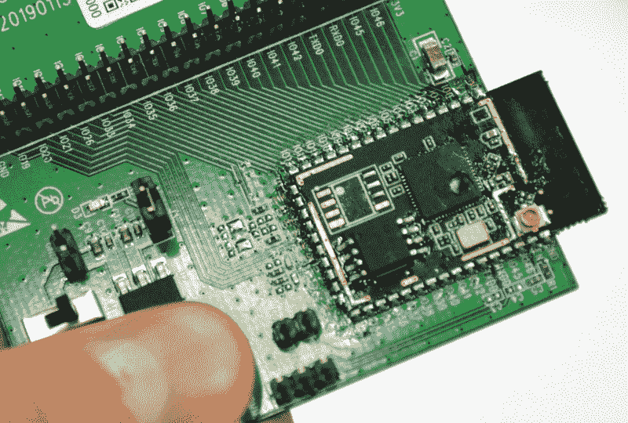
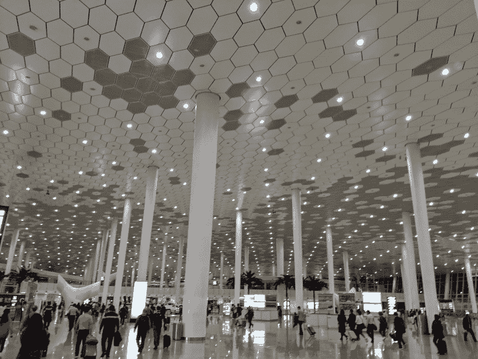
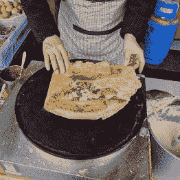

# 国外黑客:访问 Espressif 和令人惊讶的地铁广告

> 原文：<https://hackaday.com/2019/03/22/hacker-abroad-visiting-espressif-and-surprising-subway-ads/>

周四是我在上海的最后一天。在亚洲电子展上呆了一整个星期三后，我前往 Espressif 总部，那里离我只有一站地铁的距离。这当然是著名的 ESP8266 和它的弟弟 ESP32 背后的公司。我的主人是 Ivan Grotkothov，软件平台总监。关于他如何找到这家公司的背景故事非常有趣，他分享的关于该公司制造的 WiFi 芯片的一些传说和知识的故事也非常有趣——还有本周刚刚泄露的新芯片。

下面和我一起分享我在这个 2600 万人口的城市的最后一天的一些趣事。

## 为什么 8266 GPIO 这么少？

众所周知，Espressif 现在正在疯狂发展。ESP32 芯片家喻户晓(在硬件黑客家庭中)，并通过执行片内关键字识别等技巧进入智能设备。今天我甚至听到有人提到基本的面部识别。

自早期的 AT 命令和最初的 ESP8266 产品上非常有限的 GPIO 以来，它们已经走过了漫长的道路。也就是说，在任何项目中加入 WiFi 的低成本使得芯片具有革命性。Ivan 为这些早期的故事增添了一些色彩——最初的意图不是让芯片本身充当主控制器，而是作为一种添加无线连接的简单方式。这解释了模块最初附带的 AT 命令固件。但该公司意识到，许多设备，如智能灯泡，不需要太多的引脚或太多的计算能力，所以该芯片开始被用作独立的控制器。这导致了对更多 GPIO 的渴望，我们在 ESP32 的发布中看到了这一点。但是看看这个，有一种新的 Espressif 芯片即将问世。

## 一瞥新事物:芯片-7

本周早些时候，一张没有规格的新芯片的照片在推特上引发了谣言。包装上刻有“芯片 7”。Ivan 让我拍了一张板子的照片，他确认上面有工程样品。我无法从他那里得到太多关于时间表的信息，但是在我们为今天的[黑客日播客](http://hackaday.com/podcast)录制采访时，他给了我一些暗示。新器件沿袭了 ESP32 的传统，但将拥有更多 GPIO，并且在功耗预算和速度方面可能相似。在硬件上听听 Ivan 自己的话，点击完整分辨率的图像，在下面的评论中开始你的疯狂猜测。

我对伊凡如何来到 Espressif 的故事很感兴趣。他第一次了解 ESP8266 是在俄罗斯圣彼得堡，当时他正在为一家汽车共享创业公司工作。他需要一种使用智能手机解锁共享车辆的方法，WiFi 是他正在研究的一种方法。非技术问题，如如何为司机和共享车辆投保，意味着这个想法没有实现。但与此同时，他在享受芯片带来的乐趣，探索 AT 命令之外的东西，开始编写自己的代码。

他知道多线程行为的真正潜力。在采用了一种 [protothreads](http://dunkels.com/adam/pt/) 方法并实现了一些其他模块之后，他想到了将 Arduino 生态系统的一部分移植到芯片上。他的爱好项目是当时对 ESP8266 的 WiFi 堆栈的最佳处理，其他人也加入了努力，以充实其余的外围支持。这引起了 Espressif 首席执行官的注意，他主动向 Ivan 提供了一份工作。似乎该公司正在雇用硬件黑客用他们的芯片做有趣的事情(耶鲁安·多姆伯格——Sprite _ TM——与该公司有类似的道路)，我喜欢这种哲学！

## 为您的通勤提供 POV LED 广告牌

 [https://www.youtube.com/embed/eg7-hH8G__I?version=3&rel=1&showsearch=0&showinfo=1&iv_load_policy=1&fs=1&hl=en-US&autohide=2&wmode=transparent](https://www.youtube.com/embed/eg7-hH8G__I?version=3&rel=1&showsearch=0&showinfo=1&iv_load_policy=1&fs=1&hl=en-US&autohide=2&wmode=transparent)

参观结束后，我乘地铁返回机场，偶然发现了一些独特的广告。在张江高科技园区站和龙阳路站之间的地铁上，当列车全速行驶时，车外有一个 LED 广告牌。这种显示器利用视觉暂留效应，所以对你来说，视频广告是随着火车移动的，而不是呼啸而过。

众所周知，POV 显示很难在相机上很好地捕捉，这一个也不例外。当亲自观看时，滚动的黑条并不存在，但我认为这个装置足够有趣，可以分享这个视频。事实上，我认为它足够整洁，以至于错过了第一次的表演，我骑回来一站，这样我就可以再次看到它(并拍摄它)。

## 去深圳

Huge open pavilion greets you at Shenzhen airport

我从地铁再次换乘磁悬浮列车，快速前往机场。我周四飞往深圳的航班晚点了，但这意味着我有整整一个周五的时间去见我们的朋友斯科特·艾伦(Scotty Allen)，参加周五晚上在 X.Factory 举行的 Hackaday 聚会，并在周六的电子市场逛一天。我会在以后的文章中让您知道这一点。

  Very thin layer of batter, followed by an egg.  Onion, cilantro, sauces and some unknown crunchy wafter go into the roll  Delicious and portable

现在，这是我在上海的最后一个早上抓拍的两张美味的街头小吃早餐的照片。