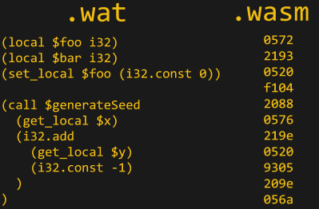
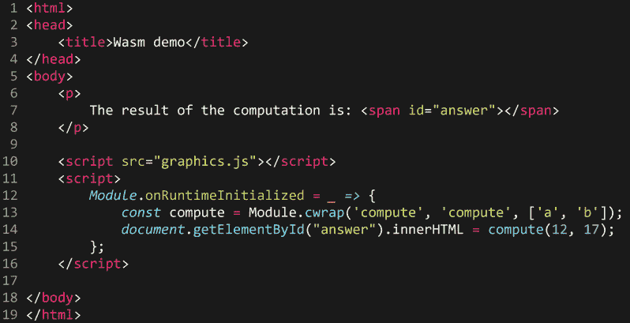
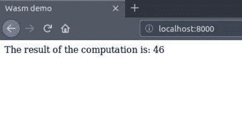

# WebAssembly:它是什么，为什么要关注它？

> 原文：<https://hackaday.com/2019/04/04/webassembly-what-is-it-and-why-should-you-care/>

如果您关注 web 开发领域，您可能听说过 WebAssembly。它是一个相对较新的产品，于 2015 年发布，并于 2017 年获得了所有主流浏览器的标准化支持——这是一个令人印象深刻的壮举。然而，直到最近，开发人员社区才开始跟上采用和支持的步伐。

那是什么？什么样的使用案例如此引人注目，导致浏览器如此迅速地被采用？这篇文章旨在解释 WebAssembly 的必要性，技术方面的概念性概述，以及一个小的实际操作示例。

## 什么是 WebAssembly？

Javascript 从 90 年代就已经出现了。老实说，它做得相当不错；虽然它肯定有缺点，但它成功地创建了一个交互式的现代网络，甚至在最近逃离了浏览器。

但是，不可避免的是，今天在 web 上提供的应用程序类型比最初创建 Javascript 时所能想象的要求要高得多。计算密集型应用和任务，如 3D 图形、视频/音乐编辑和 VR/AR，传统上只能在本地运行，因为 Javascript 天生没有支持它们的性能。

但是如果不一样呢？如果有一种方法可以在浏览器中运行低级的优化代码，并且具有接近本机的性能，那会怎么样？这正是 WebAssembly 旨在实现的使命声明，而且非常令人信服。

所有这些言论可能会引起那些认为密集型应用程序最好还是在本地运行的人的不满。但是最终，没有人能否认 web 应用程序为最终用户提供的便利——没有安装意味着没有磁盘空间被占用，没有本地安全担忧，也没有安装过程。它还为开发人员提供了大量的吸引力，他们只需要处理一个平台。代码只需要编写一次，并且更容易支持和维护。

WebAssembly 是根据这些[高级目标](https://webassembly.org/docs/high-level-goals/)创建的:

*   利用通用硬件功能，具有便携性和高效性
*   以类似于 Javascript 对象的方式生成使用导入和导出的模块化二进制文件
*   支持[非浏览器嵌入](https://webassembly.org/docs/non-web/)
*   集成到现有的 web 平台中(实施相同的安全策略，通过 Javascript 等可用的相同 API 访问浏览器功能)

注意:如果你有兴趣阅读更多关于 WebAssembly 安全性的内容，[官方文档](https://webassembly.org/docs/security/)提供了一个很好的概述，【Lin Clark】[对内存访问](https://hacks.mozilla.org/2017/07/memory-in-webassembly-and-why-its-safer-than-you-think/)进行了深入的探讨。

## 它是如何工作的？

WebAssembly 设计为在尽可能低的级别运行，无需针对特定平台进行编译，直接在浏览器中运行，是第二种可被浏览器直接理解的语言。这意味着虽然它不产生机器码，但它的级别足够低，浏览器只需做很少的工作就能执行它。

 WebAssembly 有两种风格，`.wat`文本文件和`.wasm`原始二进制文件。两者完全等价，纯粹是为了方便而存在；二进制代码被传送到浏览器，但是文本文件是可读的。请注意，将二进制代码而不是 Javascript 源文件发送到浏览器对于页面下载大小也有好处。

虽然完全有可能自己编写 WebAssembly，但是您可能不需要这样做，就像您不总是用您最喜欢的 CPU 汇编语言编写一样。WebAssembly 旨在成为 C/C++和 Rust 等语言的编译目标。

最终结果是，WebAssembly 的执行速度与本地应用程序非常相似，通常只慢 10-20%。当然，很难确定它比 Javascript 快多少，因为它很大程度上取决于用例及平台。

因为现有的 C/C++代码库可以编译成 WebAssembly，所以在从本地应用程序移植到 web 时，很容易重用程序逻辑。这就是欧特克公司对 web.autocad.com 做的事情。他们能够从现有的桌面应用程序中使用相同的 C++核心，并将 WebAssembled 版本插入 Javascript UI，这意味着 AutoCad 编辑器现在可以在浏览器中使用。它的美妙之处在于，C++开发人员不需要了解 Javascript 或 web UI，就可以继续改进和调试 C++核心。

## 和 asm.js 相比如何？

你可能正在阅读这篇文章，并认为有些部分听起来很熟悉。你可能是对的: [asm.js](http://asmjs.org/) 已经存在一段时间了，它也允许浏览器交叉编译 C。Asm.js 只是 Javascript 的一个优化子集，浏览器只需做更少的解释/执行工作。这种方法确实有效，但本质上是对 Javascript 局限性的一种破解。它还遭遇了从未标准化的问题，因此不同平台之间的性能提升不一致。

WebAssembly 自动取代 asm.js，仅仅是因为它是浏览器直接理解的标准。它更快，更一致，下载更快，更容易缓存。

[Figma](https://www.figma.com/) 将他们的在线编辑器从 asm.js 转移到 WebAssembly，[在这篇文章中谈论了它的好处](https://www.figma.com/blog/webassembly-cut-figmas-load-time-by-3x/)，如果你对它们如何不同的细节感兴趣，这是值得一读的。

## 我如何使用它？

现在我们将通过一个使用 WebAssembly 的超级简单的例子来说明这个过程的机制。假设我们有一些用 C 语言编写的计算密集型图形代码，我们希望能够在浏览器中使用。

```

#include &lt;emscripten.h&gt;

EMSCRIPTEN_KEEPALIVE
int compute(int a, int b) {
    // Loads of maths
	return a + 2 * b;
}

```

对于这个简单的例子，我们需要做的就是包含`emscripten`并让它知道我们想要导出`compute`函数。 [Emscripten](https://emscripten.org/) 是我们将用来编译 WebAssembly 的源代码。这是一个强大的工具，它在幕后做了很多工作，使事情顺利运行-从简单的事情，如生成 helper HTML 和 JS 文件，到自动将 OpenGL 调用转换为 WebGL，并提供不同级别的构建优化。我们可以用它来编译我们的例子，如下所示:

```
emcc graphics.c -o graphics.js -O3 -s WASM=1 -s EXTRA_EXPORTED_RUNTIME_METHODS='["cwrap"]' 

```

有几个标志表明我们正在用积极的优化来编译 WebAssembly，并希望让 Emscripten 知道我们需要访问`cwrap`函数(稍后会详细介绍)。

这个编译过程产生了一个二进制的`graphics.wasm`文件和一个方便的`graphics.js` Javascript“粘合”文件，其中包含一些方便生成的帮助器代码，用于快速启动我们新的 WebAssembly 模块。

现在让我们继续创建一个使用这个新编译的模块的页面。



如您所见，助手文件`graphics.js`使得使用我们的模块变得很简单。在包含了`graphics.js`之后，我们简单地使用`cwrap`将我们编译的`compute`函数绑定到 Javascript 名称空间中的`compute`函数。然后我们可以像使用普通的 Javascript 函数一样自由地使用它——在这种情况下，我们只需用调用函数的结果更新一个 HTML 元素。你可以在下面看到，结果正如我们所料。



很明显，对于这样一个简单的例子，导入一个编译好的 WebAssembly 模块很容易，这个模块包含了在很多情况下可以与 Javascript 等价函数互换使用的函数。这是 WebAssembly 概念吸引力的一部分；随着它的成熟和更广泛的使用，很容易找到和使用实现优化代码的库，而对开发人员来说几乎没有额外的开销。你甚至可能会在没有意识到的情况下使用基于 WebAssembly 构建的库。

## 结论

在不久的将来，我们肯定会看到更多的 WebAssembly。对于大多数站点来说，这不是必需的，甚至也不是有用的，但是如果需要更高的性能或者可以重用现有的 C/C++代码，知道这些功能是很好的。WebAssembly 只是浏览器的自然演变，以跟上开发人员希望在网络上提供的体验——这只能是一件好事。