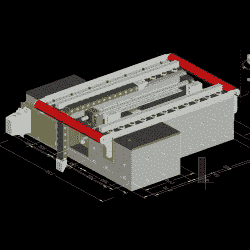

# 如何用环氧树脂建造磨坊

> 原文：<https://hackaday.com/2019/03/26/how-to-build-a-mill-with-epoxy/>

你在车间里会发现典型的机床有铸铁或钢制成的底座和框架。选择这些材料是因为它们的强度、坚固性和重量，这有助于抑制振动。然而，这不是制造机床的唯一方法。[[约翰·麦克纳马拉]一直在从事环氧树脂底座的数控铣床的研究，并取得了令人印象深刻的成果。](https://www.model-engineer.co.uk/forums/postings.asp?th=139042)

The molds were designed in CAD prior to casting, ensuring there was room for all required components.

这种建筑在任何一个装备良好的制造场所都可以很容易地实现。[John]使用激光切割钢零件构建环氧树脂底座的模具，以及一些定制的车削零件。精密切割的零件非常精确地装配在一起，并且通过对铸造过程的适当控制，最终铸件所需的后处理最少。该模具采用零拔模斜度制造，设计用于拆卸成品。通过使用钢材，同一个模具可以多次使用，尽管[John]指出 MDF 可以用于一次性建造。

底座由环氧树脂浇铸而成，与花岗岩骨料和沙子混合在一起，形成一种坚固、厚重的减振材料。还有现场浇铸的钢筋，包括螺杆和用于各种电气连接的导管。铸造后，[约翰]花了很多时间测量和修整轧机，以确保从一开始就尽可能最好的结果。

这是一个令人印象深刻的构建，表明使用正确的工具和知识来构建自己的精确机床是完全可以实现的。我们以前也见过类似的工作——[环氧树脂确实是在家铸造的绝佳材料](https://hackaday.com/2019/02/25/casting-the-bed-of-a-cnc-machine-in-granite/)。