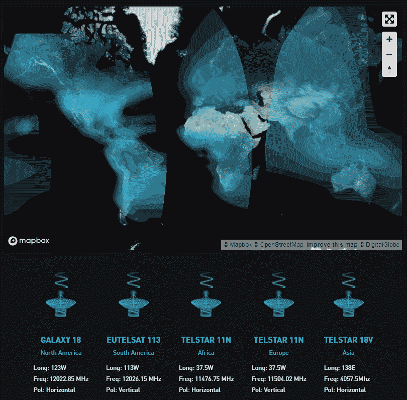

# 无线电自由区块链:来自太空的比特币

> 原文：<https://hackaday.com/2019/04/02/radio-free-blockchain-bitcoin-from-space/>

加密货币:爱它们，恨它们，或者被它们难倒，但不要认为你能逃脱它们。至少目前看来是这样，新闻媒体充斥着关于比特币和其他加密货币的令人窒息的故事，从亚马逊到 YouTube 上的内容创作者，每个人现在都接受数字货币进行支付。现在，几乎这个星球上的每个人都沐浴在比特币中，或者至少是让它工作的分布式账本中，这要归功于一个新的网络，该网络通过地球同步卫星星座传输比特币区块链。

## 区块链无处不在

比特币的狂热支持者经常将底层网络的稳健性吹捧为加密货币的众多优势之一:它们建立在互联网上，互联网本身是一个分散的网络，最初是为了在危机时期提供连通性，它们提供了一种独立于中央当局的交易手段，可以抵御中央当局可能实施的任何资本管制。

但这些观点的回归是显而易见的:由于比特币依赖于互联网，一个意图压制加密货币使用的政府可以简单地关闭互联网，至少在理论上是如此。即使没有专制的反乌托邦局面，互联网接入仍然远远没有普及。世界上有许多地方的访问是有限的，充其量也是昂贵的，特别是挖掘比特币所需的工作证明(PoW)交易。这必然将比特币网络主要限制在发达国家。

Blockstream 是一家由加密黑客 Adam Back 于 2014 年成立的公司，旨在改变这种状况。他们在 2017 年宣布发射 Blockstream 卫星，这是一种通过四颗商业地球同步卫星单向广播区块链数据的卫星。在该系统发射时，地球上大约三分之二的陆地被区块链的高空广播覆盖。截至 2019 年初，[第五颗卫星使亚太地区上线](https://www.newsbtc.com/2018/12/18/blockstream-satellite-expansion-bitcoin/)，几乎覆盖全球。2019 年版本中还添加了一个 API，允许用户向整个网络发送文件。

需要注意的是，Blockstream 卫星是一个单向系统，至少目前是这样。它只允许用户接收区块链广播；如果用户想要参与比特币交易，仍然需要某种形式的互联网连接。这似乎将我们带回了比特币普遍性方面的原始问题，在某些方面确实如此，但 Blockstream 指出，有一些低影响的方法可以访问比特币网络。例如，智能手机上的比特币钱包可以连接到一个卫星节点，然后卫星节点可以加入当地的网状网络，将比特币带到一个小村庄或孤立的社区。

## 卷你自己的

建立一个 Blockstream 卫星节点所需的硬件出奇的简单，任何 SDR 黑客都很熟悉。[一个详细的 GitHub 页面](https://github.com/Blockstream/satellite)记录了整个设置，其中心是一个小型卫星天线和用于直接访问卫星电视类型的低噪声块下变频器(LNB)。因为卫星是地球同步的，所以不需要复杂的跟踪机制；一旦使用常用工具瞄准了盘子，乐趣就开始了。LNB 连接到一个廉价的 SDR 加密狗，软件栈包括 GNURadio 和 GrOsmoSDR 等应用程序。一旦节点运行并正确对齐，BitcoinFIBER 就会处理区块链传输。几位黑客[也记录了他们的 Blockstream 卫星设置](https://hackernoon.com/building-your-own-bitcoin-satellite-node-6061d3c93e7)。

 [https://www.youtube.com/embed/hbcu1HYL6F4?version=3&rel=1&showsearch=0&showinfo=1&iv_load_policy=1&fs=1&hl=en-US&autohide=2&wmode=transparent](https://www.youtube.com/embed/hbcu1HYL6F4?version=3&rel=1&showsearch=0&showinfo=1&iv_load_policy=1&fs=1&hl=en-US&autohide=2&wmode=transparent)

同样，这种设置只是为了接收区块链广播，需要某种互联网连接来交换比特币。但它仍然为比特币在目前没有其他途径进入互联网的领域的使用提供了一条途径。它还使那些拥有昂贵互联网连接的人能够进行比特币挖矿操作，因为区块链信息流是免费无线接收的。

也许这一切都意味着我们有一天会看到太阳能供电的比特币采矿作业在某个偏远的地方悄悄进行，只需要一个小型卫星天线将它们连接到网络上。但对于 Blockstream 和加密货币爱好者来说，这不是重点。对他们来说，这是为了加强加密的核心特征:不受任何中央权力机构对货币的控制。