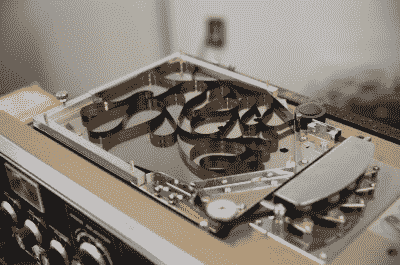
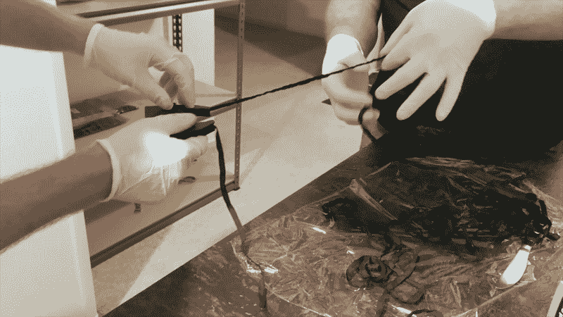
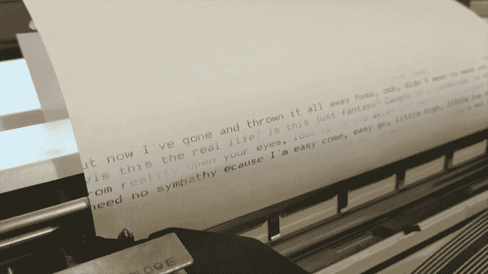
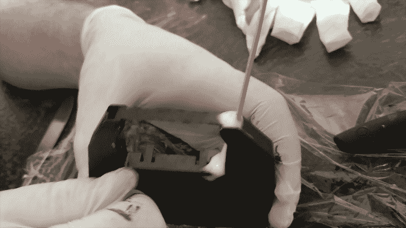
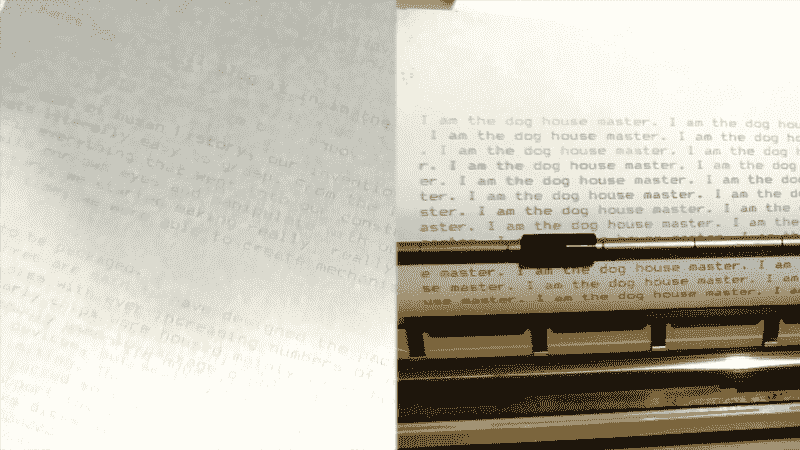
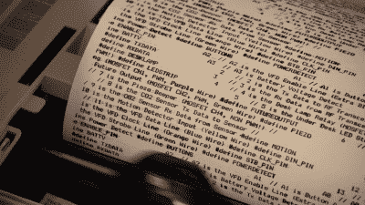

# 因为好玩，所以重新控制点阵打印机色带，好吗

> 原文：<https://hackaday.com/2019/04/03/reinking-dot-matrix-printer-ribbons-because-its-fun-okay/>

墨水！不管你有什么打印机，不管是喷墨打印机、激光打印机还是其他打印机，这些耗材都会让你破产。有时，惠普黑墨水的成本已经超过了每体积人血的价格，全世界的股东都为此欢欣鼓舞。

作为一个反传统的被唾弃者，我个人偏爱老式的打印机。我以前的风流韵事包括完全成熟的办公室复印机，但最近我发现自己在摆弄上世纪 80 年代的点阵。这些老黄牛现在已经到了中年，正如你所料，经过这么长时间，他们的丝带有点磨损了。

对于最普通的打印机来说，替换品足够便宜，但是运输需要几周时间，黑客们也是一群没有耐心的人。此外，如果你有一个更模糊的模型，你不太可能会发现一个新的购物车就在货架上。正是这些因素促使我和我的好朋友[Cosmos2000]行动起来。

## 焉得虎子

上辈子，我有幸在当地一家五金店做广告撰稿人。这包括用浸在大墨水桶里的大矩形刷子手写大 A4 和 A3 价格的票。几个月后，桶里的墨水开始变得粘稠，使我的工作变得困难。这可以通过使用甲基化酒精作为溶剂来使墨水变得新鲜而有所补救。它从来没有用一个刚从盒子里拿出来的新罐子好，但它让我想到了墨水和它们是如何工作的。

The structure of the ribbon inside a GX-80 cartridge is remarkably similar to the tape loop in a Roland Space Echo.

我的第一次尝试是基于之前的经验，但是我们需要一个墨水来源。永久性记号笔的主体中含有液体墨水，浸泡在织物载体中以将其输送到笔尖。这似乎是黑客攻击的主要目标。我们劈开一支记号笔，把墨水挤到碗里。然后，我们将它与甲基化酒精混合，希望它可以作为一种溶剂，稍微稀释墨水，并重新润湿色带上剩余的墨水。

简而言之，将墨水涂在色带上的过程非常有趣。我们用的是爱普生 GX-80 的色带，大约 2 米长，以一种颇具卡夫卡风格的方式盘绕在墨盒内。我们拆开外壳，小心不要弄坏任何定位凸耳，并将整个色带浸泡在我们的墨水和溶剂混合物中。

重新组装充满了危险，因为我们慢慢地使用手动绕线机来重新装载色带，并试图避免让墨水沾到厨房和休息室的每一个表面。

Refeeding the ribbon is actually easier than it looks, but is best achieved with two pairs of hands.

结果很糟糕。由于使用了太多的溶剂，我们过度稀释了新鲜的墨水，同时基本上把色带洗干净了。当然，桌子上有一台旧打印机，冰箱里还有啤酒，我们还不准备放弃。

## 如果一开始你没有成功…

我们开始了第二次尝试，决心从错误中吸取教训。最重要的是避免再次拆卸墨盒，因为我们第一次已经破坏了一半的定位凸耳。我们还想确保在色带上涂上新的墨水，而不是再次洗掉。

另一个记号笔找到了砧板，它柔软的聚酯容器被拿走了。这一次，我们将墨水直接挤压在色带上，观察墨水从一个色带转移到另一个色带。当我们将丝带缠绕覆盖整个长度时，我们可以很容易地看到丝带变黑。

The first hint of impending glory. Note the inconsistency – some lines are clear, others barely readabale.

经过许多分钟的缠绕，我们将推车重新装入打印机。当我们屏息注视时，印刷工作开始了。当第一行出现时，我们感到沮丧，因为它模糊不清，无法阅读……然后，当文档下面出现丰富的黑色文本时，我们感到欢欣鼓舞。当一台点阵打印机在郊区的一个家庭里尖叫着投入使用时，人们发出了很多欢呼和叫喊声。我们越来越接近了，但我们还需要一点点。

## 成功的滋味

Spraying the carts is an art, not a science.

我们现在很清楚色带的某些部分是新上的墨，但是没有一致性。在这一点上，先前的研究脱颖而出。[Cosmos2000]熟悉其他爱好者的实验，他们在 21 世纪初通过应用 WD40 使旧丝带焕然一新获得了成功。这似乎是一个奇怪的选择，但我们决定坚持下去。

Before (left) and after (right). Quality continued to improve as the excess WD40 was absorbed by the paper after a few prints.

我们翻出一个旧的蓝色好东西罐，向丝带腔里使劲喷了几口。这个想法是，WD40 将作为一种溶剂，沿着色带更均匀地传播墨水。这是一个混乱的行业，而乳胶手套正好派上用场。

随着一声令人满意的咔哒声，我们再次重新加载了爱普生。大头针轰鸣着活了，纸出来了。在一些模糊的线条之后，我们被吹走了。我们有黑色的墨水一行一行地流畅流动。对图像的进一步测试也同样成功。这是一场精彩的胜利，尽管它确实让我们在周日早上熬夜到凌晨 2 点。

## 最终注释

It’s possible to have too much of a good thing. It took a few pages for the smearing to clear up on the MPS-1230.

我们最初对我们的成功持保留态度，怀疑它不会随着时间的推移而持续下去。然而，令人高兴的是，事实证明我们错了。四个月过去了，GX-80 继续漂亮地打印。替换色带最终发货，但仍留在包装中，仍在等待它发光的时间。在其他打印机上的进一步实验也证明卓有成效。我们的 Commodore MPS-1230 现在正在大量生产其中最好的页面，在我们对 WD40 过于兴奋时，最初有些模糊的结果。

总的来说，我们学到了一些宝贵的经验。在不拆卸的情况下重新连接是可能的，也是更可取的。大多数丝带有一个手动绕线机，可以很容易地补充全长。避免过度稀释墨水和冲洗色带也很重要。我们也尝试过使用真正的瓶装墨水，而不是从可怜的手无寸铁的文具中获取内脏——但那是另一天的实验了。

希望这个指南能帮助其他爱好者让他们的点阵再次运行起来，在他们敲打页面的时候大声尖叫。下次见，印刷愉快！

 [https://www.youtube.com/embed/ERwBxZ791F8?version=3&rel=1&showsearch=0&showinfo=1&iv_load_policy=1&fs=1&hl=en-US&autohide=2&wmode=transparent](https://www.youtube.com/embed/ERwBxZ791F8?version=3&rel=1&showsearch=0&showinfo=1&iv_load_policy=1&fs=1&hl=en-US&autohide=2&wmode=transparent)

