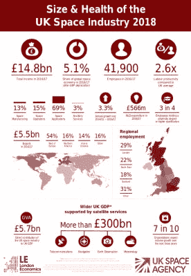

# 英国重新加入太空竞赛

> 原文：<https://hackaday.com/2019/04/01/britain-rejoins-the-space-race/>

Jubilant crowds at the gates of Downing Street. (Jenny List)

昨天，英国首相特里萨·梅在唐宁街 10 号外宣布，英国将恢复其太空发射计划，这是一个完全出人意料的举动。47 年前，普洛斯彼罗卫星(Prospero satellite)发射后，该计划被取消。她概述了一个大胆的计划，目标是最早在 2024 年将一名英国宇航员的 Doc Martens 放在月球表面。她说，由英国退出欧盟每周 3.5 亿英镑的横财资助，此举将使该国处于 21 世纪与朝鲜新一轮太空竞赛的前沿。

估计有 200 万喜气洋洋的支持者听到这一消息走上伦敦街头，当他们举着彩色横幅从海德公园游行到特拉法尔加广场，沿着白厅走过她在唐宁街的家时，首都陷入停顿。与此同时，受欢迎的英国高街面包店 Patisserie Gregoire 的股票价值上涨了 19%,因为有消息透露，他们的新素食香肠卷实际上是英国宇航员饮食的秘密试验。

## 等等……真的有英国太空计划吗？

[A glossy UK Government infographic](https://assets.publishing.service.gov.uk/government/uploads/system/uploads/attachment_data/file/774818/LE-SHUKSI_2018-INFOGRAPHIC-FINAL-Issue1-S2C090119sw.pdf) talking up the British space business.

正如你可能想象的那样，在 Hackaday，我们对太空探索充满热情，并竭诚欢迎这方面的任何新举措。但我们认识到，鉴于英国退出欧盟政治舞台的快速变化，这是一个动荡的时代，在这个时代，4 月 1 日的头条新闻很可能在 4 月 2 日就变成了薯片包装。因此，为了理解这个故事，给它一些背景，我们认为我们应该花一点时间来看看英国航天工业的现状。鉴于[在全球太空经济中占 5.1%的份额](https://assets.publishing.service.gov.uk/government/uploads/system/uploads/attachment_data/file/774818/LE-SHUKSI_2018-INFOGRAPHIC-FINAL-Issue1-S2C090119sw.pdf)，一个政府资助的[英国太空机构](https://www.gov.uk/government/organisations/uk-space-agency)和[太空港](https://www.bbc.co.uk/news/uk-scotland-highlands-islands-44839536)计划，大量来自私营部门的太空相关工作，以及一些世界上更前沿的研究，发现[到底有多少](https://www.gov.uk/government/publications/uk-space-industry-size-and-health-report-2018)可能会令人惊讶。

很难写出任何涉及 2019 年初英国的故事，尽管没有进一步提到英国退出欧盟，太空业务当然也不例外，行业人士对其影响表示担忧。去年流传的一个故事是，英国公司将被[排除在与伽利略卫星导航系统](https://www.bbc.co.uk/news/science-environment-44055475)相关的合同之外。由于[很大一部分伽利略使用英国技术](https://www.sstl.co.uk/space-portfolio/missions-in-build/2010-2019/galileo-navigation-payloads)和[他们的控制中心在英国](https://www.theguardian.com/politics/2018/jan/18/brexit-blow-as-satellite-monitoring-centre-moves-from-uk-to-spain)，政府宣布将委托研究创建他们自己的导航卫星星座。为此，他们已经投入了 9200 万英镑，这个数目看起来很受欢迎，但与最终系统的成本相比，即使以英国在该领域显而易见的专业知识，这也只是沧海一粟。简而言之:他们当然可以做到，但代价可能是未来的政府难以承受的。如果你读过上面链接的普洛斯彼罗，你会知道以前发生过。如果说英国人在这一切中还有一线希望的话，那就是英国仍然是欧洲航天局的一部分，但就伽利略而言，当涉及到欧盟资助的欧空局项目时，英国的任何参与都可能受到限制。

## 有一天，也许所有的航天飞机都会有英国的发动机

[![A model of an earlier SABRE engine design. Science Museum London / Science and Society Picture Library [CC BY-SA 2.0]](img/b2ca80189104434f6591a90bc582df01.png)](https://hackaday.com/wp-content/uploads/2019/03/sabre_engine_designed_for_skylon_spaceplane_1990s._9660572897.jpg) 

早期马刀发动机设计的模型。伦敦科学博物馆/科学与社会图片库[ [CC BY-SA 2.0](https://commons.wikimedia.org/wiki/File:SABRE_engine_designed_for_Skylon_spaceplane,_1990s._(9660572897).jpg) ]

让英国太空观察家高兴的是，英国的一项太空技术可能会让所有这些火箭过时。反应引擎公司是一家基于牛津附近科学园区的公司，他们是可重复使用太空飞机技术领域的先驱，其历史部分反映了 Prospero，因为该公司起源于另一个被取消的英国政府资助的太空项目的团队。

霍托尔是上世纪 80 年代的一项计划，旨在制造一架水平起飞的英国航空航天飞机，但由于当时的政府决定将其重点放在欧空局的常规火箭上，该计划被取消。三名霍托尔工程师在 1989 年组建了反应发动机，目的是开发一种混合发动机和飞机的霍托尔概念，这种混合发动机和飞机可以在接近地球的飞行阶段使用大气中的氧气燃烧，只有当大气压力降低到不支持燃烧的程度并且飞行器进入太空时，才切换到机载氧气罐。他们的工作在预冷的[军刀发动机](https://www.reactionengines.co.uk/sabre)中达到高潮，预计到 2020 年他们将拥有一个基于地面的工作原型，以及希望在未来十年飞行的“天空龙”太空飞机概念设计。对普洛斯彼罗故事的另一个肯定是，[公司的英国测试设施在白金汉郡的威斯特科特](https://www.reactionengines.co.uk/about/tf1)，这里曾经是 20 世纪 50 年代被取消的蓝色条纹火箭的测试台所在地。

所以你现在可能已经知道，虽然英国的靴子可能不会在五年后踏上月球表面，向他们的美国竞争对手和 T2 竞争对手挥手致意，但是英国的太空技术已经达到惊人的数量，而且未来还会有更多。所有国家的航天爱好者都应该为下一个登上月球的人欢呼，并热切希望他们安全着陆，毫发无损地返回家园。与此同时，英国人应该没有必要在未来几十年内重返月球，毕竟[在 20 世纪 80 年代就已经派出了一对勇敢的探险者。](https://en.wikipedia.org/wiki/A_Grand_Day_Out)

标题图片:首相，库尔曼[CC BY 3.0](https://commons.wikimedia.org/wiki/File:Theresa_May_MSC_2018.jpg)/唐宁街 10 号，汤姆·罗宾逊·RLC 中士/国防部[[OGL 1.0 版](https://commons.wikimedia.org/wiki/File:10_Downing_Street._MOD_45155532.jpg)