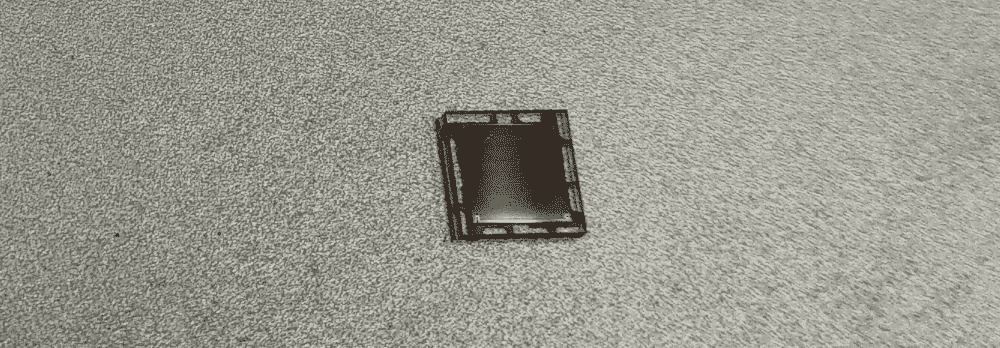
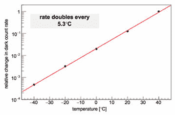

# 薛定谔量子滤壶制作了半杯像样的咖啡

> 原文：<https://hackaday.com/2019/04/01/schrodinger-quantum-percolator-makes-half-decent-coffee/>

我无法决定是喝普通咖啡还是不含咖啡因的咖啡。因此，为了消除我早上例行工作中的延迟和决策疲劳，我设计了薛定谔量子过滤器——使我的咖啡状态在我喝之前正式不可判定。

在其核心，量子过滤器包含一个新颖的量子事件检测器，使用电子隧道来确定是否使用含咖啡因或无咖啡因的咖啡。机械部件被封装在一个不透明的盒子里，所以我无法判断使用的是哪种咖啡。

结果是，咖啡同时含有和不含咖啡因——至少在你喝下它后咖啡因摄入概率波形崩溃之前是这样。正如表达的那样，你不能把你的量子叠加态也喝了！

## 将个人决定卸给量子理论

量子事件检测器是冷却到低温的雪崩二极管阵列，使得电子隧穿噪声取代热电子噪声成为主要噪声源。即使雪崩二极管的放大系数很高(大约一百万)，阵列也只能产生很小的电流。此外，当它捕捉到光线时看起来真的很酷。

Source: [“Hamamatsu Photonics](https://hub.hamamatsu.com/us/en/technical-note/sipm-temperature-performance/index.html)

下一级是围绕 [OPA656](http://www.ti.com/lit/ds/symlink/opa656.pdf) 构建的跨阻放大器，它使用高速运算放大器将这种小电流转换成可用电压。

到目前为止，整个器件构建在一个绝热法拉第笼内，使用耐低温元件(例如汽车或医疗级)，并采用航空级覆铜 Kapton PCB。水冷珀耳帖效应热泵将该组件的温度降低至大约 245 开尔文。这种 PCB 材料的一个明显优势是，由于非常薄，它的热质量非常低，因此冷却阶段不必处理大量的热质量。

然后，该系统的输出通过一个 [CD4069UBE](http://www.ti.com/lit/ds/symlink/cd4069ub.pdf) 施密特触发六角逆变器进行脉冲整形。利用 ATtiny2616 微控制器的 16 位定时器对这些脉冲之间的时间进行采样。对于任何给定的三个脉冲，如果前两个之间的时间大于后两个之间的时间，串行端口将输出‘1’。在相反的情况下，它将输出‘0’。在极少数情况下，时间相等，不会生成任何输出。

## 喝着我的咖啡…也喝着它

当咖啡机被激活时，它使用量子事件检测器作为输入来冲泡含咖啡因(1)或不含咖啡因(0)的咖啡。

我一直更喜欢量化的食物——如果我想吃一样东西，就吃一个馒头；如果我想吃 10 个，就吃饺子；如果我想吃 100 个，就吃面条；如果我想吃 1000 个，就吃米饭。饮料在这方面总是有问题，所以我很高兴在某种程度上终于有了量子咖啡——即使我仍然只能喝一半，尽管这在很大程度上仍然是理论上的，从未在自然界中观察到。