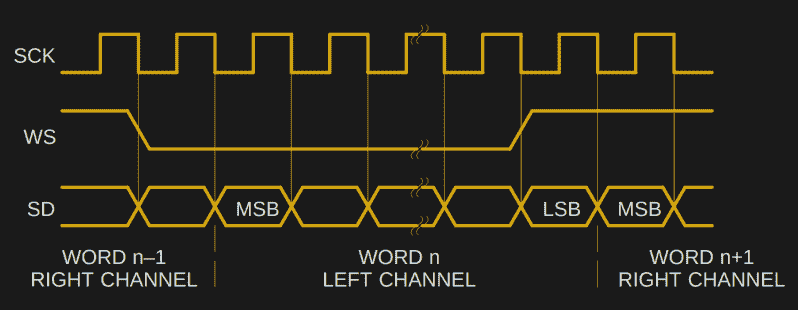
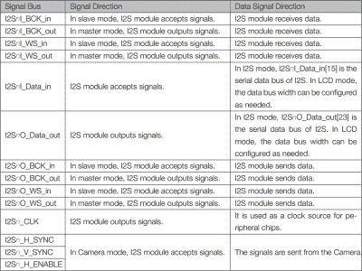

# 你需要知道的关于 I2S 的一切

> 原文：<https://hackaday.com/2019/04/18/all-you-need-to-know-about-i2s/>

上个月，我们庆祝了 CD 的 40 岁生日，这既是一个讣告，也是一个庆祝，因为那些聚碳酸酯光盘正迅速变得稀有。有一项来自 CD 时代的技术仍然存在，它成为了芯片间发送串行数字音频的标准。该协议被称为 I ² S，是许多微控制器的硬件外设。这是一个非常简单的界面，非常容易使用，因此非常容易破解，所以值得进一步研究。

## 这是一个足够简单的界面

不要把这个和其他飞利浦半导体协议混淆: [I ² C](https://hackaday.com/2016/07/19/what-could-go-wrong-i2c-edition/) 。内部集成电路协议的首字母缩写为 IIC，这个双字母被缩短以产生我们从 I ² C 开始就喜欢的“眼睛平方看”命名法。它于 1982 年诞生，比 I ² S 早了四年，这就解释了“内部集成电路声音”这个有点奇怪的缩写。

该协议一直沿用至今，因为它非常便于处理与高质量数字音频相关的串行数据。它非常方便，你可能听说过它被用于除音频以外的其他用途，我稍后会谈到这一点。但是首先，我实际上是做什么的？

Timing diagram for the I²S lines, from the Philips specification document.

数字音频源通常会创建两个数据字，一个用于左声道，一个用于右声道，每个采样间隔一次。例如，一个采样率为 44.1 kHz 的 CD 音频源每秒将传送两个 16 位字 44，100 次。在一条串行线上，这是一个巨大的数字每秒 1，411，200 比特 (44100 x 16 x 2)。

那可怜的串行数据线是怎么跟上的？单条串行数据线无法轻松传达左右样本的字边界。也很难(或不可能)可靠地从其中无抖动地检索时钟。因此，为了传输音频，我们真的需要一些其他方式来传递这些信息。

I ² S 通过额外的线路解决了这两个问题，提供了一个字选择线(有时也称为 L/R 时钟)来选择左或右样本，以及一个位时钟线来保持一切同步。I ² 就这些:一条数据线，一条字时钟线，一条位时钟线。

该规范由飞利浦在 1986 年的一份文件中正式确定，并通过该公司的半导体部门成为恩智浦，但遗憾的是，该规范已从恩智浦网站上消失。幸运的是，时光倒流机有它，所以它仍然可用。阅读该文档，很明显，即使在 20 世纪 80 年代，这也不是一个难以使用的接口，它甚至给出了发射机和接收机的基本框图。不难想象，给定一些 TTL 芯片和一个电阻阶梯，应该可以在您的工作台上根据基本原理构建一个 I ² S DAC，尽管这不是一个非常高性能的例子。

## 我们要去的地方，不需要声音

[![The seemingly impossible: [cnlohr]'s feat of making an ESP8266 do wired Ethernet.](img/1b7693e45a90a641547a2cda45a87016.png)](https://hackaday.com/wp-content/uploads/2016/04/10baset-on-esp8266-featured.jpg) 

看似不可能的事:【cnlohr】做出一个 ESP8266 做有线以太网的壮举。

这样你就有了:I ² S .所有你需要知道的芯片间音频互连，在四个方便的段落中。还有什么需要理解的？

从我们在 Hackaday 报道的工作来看，I ² 的数字音频起源仅仅是个开始。它是一个松散而简单的规范，易于实现，同样也容易被滥用。例如，它没有规定时钟速率的上限。自然，它作为非常快速的串行输出的潜力导致硬件黑客将它用于其他目的。我们已经看到它被用作 [AM 无线电发射机](https://hackaday.com/2018/01/28/esp32-makes-for-worlds-worst-radio-station/)、一个 [NTSC 视频输出](https://hackaday.com/2016/03/01/color-tv-broadcasts-are-esp8266s-newest-trick/)、一个 [VGA 输出](https://os.mbed.com/forum/mbed/topic/2459/)，甚至[一个以太网卡](https://hackaday.com/2016/04/01/ethernet-controller-discovered-in-the-esp8266/)。他们到底是怎么做到的！

答案在于 [*脉冲密度调制*](https://en.wikipedia.org/wiki/Pulse-density_modulation) ，这是一种模数转换的形式，在给定的时间段内逻辑 1 的位数取决于模拟信号的电平。这是一个 [delta-sigma](https://en.wikipedia.org/wiki/Delta-sigma_modulation) ADC 的原始输出，它有一个方便的特性，即只给定一个 PDM 数据流，数模转换步骤只需一个简单的低通滤波器即可完成。如果您尽可能提高 I ² S 接口的比特率，然后输入形成 PDM 数据流的字，您可以添加一个低通滤波器来创建一个最大带宽为其比特率一半的 ADC。

The ESP32 I2S table is a lot more complex than the basic standard.

上面使用 I ² S 的示例项目列表有一个附录，它涉及一些我们没有特别提到的项目。ESP32 有一个 I ² S 模块，通过它产生了一些令人印象深刻的项目，如[这款全彩色 VGA 发生器](https://hackaday.com/2019/02/05/back-to-video-basics-with-an-esp32-vga-display/)。尽管冒着避开争议的风险，这些项目并没有在最严格的意义上使用 I ² S。[ESP32 技术参考手册](https://www.espressif.com/sites/default/files/documentation/esp32_technical_reference_manual_en.pdf)第 303 页对此有所阐述，揭示了 Espressif 部分中的 I ² S 外设是多功能的。如上所述，除了处理音频 I ² 之外，它还处理相机和 LCD 显示器的接口，就好像你可以想象 Raspberry Pi 上的相机和 LCD 连接器连接到同一块硅片上。也许这种命名法源于 ESP8266 [具有一个 I ² S 片上外设](https://www.espressif.com/sites/default/files/documentation/esp8266-technical_reference_en.pdf)(第 71 页)，并且后来的设备中的共享外设继承了这一名称。无论哪种方式，它都可能是 I ² S ESP32 风格，但在其他两个接口中，它不是 I ² S 飞利浦串行 PCM 音频风格。

因为大多数 I2C 接口可以以几兆赫兹的时钟频率工作，所以它们的带宽可以高得惊人。这与任何软件定义的无线电发射机背后的原理相同:只需很少的额外硬件，就可以将创建 MHz 范围内任意频谱的任务从硬件转移到软件。即使是最普通的现代微控制器也有足够的计算能力来完成这项任务，为 I ² S 提供一些相对简单的应用，这超出了 20 世纪 80 年代飞利浦工程师的想象。突然之间，你只能连接一个音频 DAC 的一招小马变得更加有用，可能性是无穷的。

标题图像:CD 播放器中的飞利浦 TDA1541A 4x 过采样 I²S DAC。Cjp24 [ [CC BY-SA 3.0](https://commons.wikimedia.org/wiki/File:DAC_Philips_TDA1541A_S1.jpg) 。