# 拆除:数字哨兵的勇气

> 原文：<https://hackaday.com/2019/04/18/teardown-the-guts-of-a-digital-sentry/>

我有一个家庭警报系统，让我想知道我是否可以用我的造物功夫让它变得更好。最近，我们不得不更换我们的系统，所以我花时间剖析了主控制器，远程传感器，以及使家庭安全系统工作的所有部件。

准确的说，今天审问的对象是一个在十年前相当有名的 Zicom 牌家用报警器。它连接到有线电话线，从运动、门和气体传感器获取输入，如果系统跳闸(有时会意外发生)，会发出很大的噪音。尽管在这篇文章的制作过程中没有电路受到损害，但我向你保证，有一些有趣的事情会引起一两个人的注意。让我们来看看。

## Zicom 家庭报警系统的网关

 [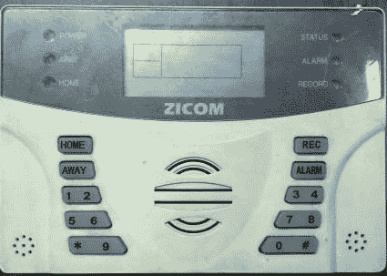](https://hackaday.com/2019/04/18/teardown-the-guts-of-a-digital-sentry/front01/)  [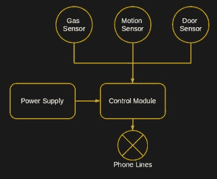](https://hackaday.com/2019/04/18/teardown-the-guts-of-a-digital-sentry/alarm_system-themed/) 

前面板很简单，有一个键盘和一个 LCD 显示屏，在全球速卖通上快速搜索仍可找到类似的设备。数字键盘和其他几个键是配置系统以添加传感器、设置警报、激活和停用警报的唯一方式。不幸的是，没有 USB 端口来允许基于 PC 的配置，并且使用该网关的复杂过程使得它对用户相当不友好。

[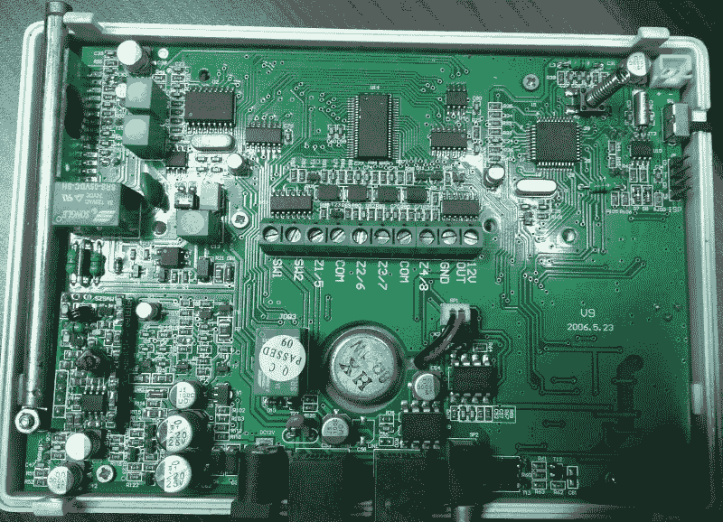](https://hackaday.com/wp-content/uploads/2019/04/control_pcb.jpg)

在引擎盖下，有很多经典的设计作品可以找到。这里列出了 PCB 内部最显眼的斑点。

1.  STC 89 c 54 rd+–【微控制器】[PDF】](http://www.stcmicro.com/datasheet/STC89C51RC-en.pdf)

2.  24C18 EEPROM【模糊】

3.  ht 1380–RTC[(PDF)](https://www.holtek.com.tw/documents/10179/11842/ht1380_1v130.pdf)

4.  lm 339–比较器

5.  ht 1621 b–液晶驱动 [(PDF](https://www.holtek.com/documents/10179/116711/HT1621v320.pdf) )

6.  74hc 164 b–SIPO

7.  ht 9170d–DTMF 接收器

8.  SMC 0100 PD 61 aa 266m–报警音发生器？ 

9.  lm 380–音频放大器 

10.  ST hcf 4052–模拟多路复用器/多路分解器[【PDF】](http://www.mantech.co.za/Datasheets/Products/HCF4052_ST.pdf)

11.  一些功率调节器和一个标准 433MHz 射频接收模块(AM)

 [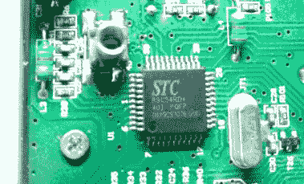](https://hackaday.com/2019/04/18/teardown-the-guts-of-a-digital-sentry/89c51/) 8051-based Processor [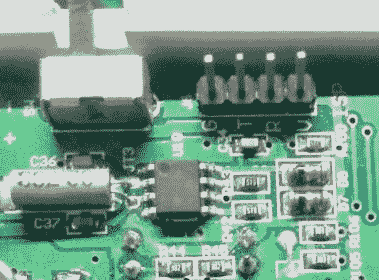](https://hackaday.com/2019/04/18/teardown-the-guts-of-a-digital-sentry/rtc/) Real Time Clock (RTC) [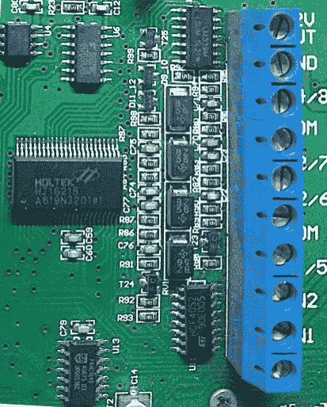](https://hackaday.com/2019/04/18/teardown-the-guts-of-a-digital-sentry/drivers-2/) 

让我们从头开始(猜测)。8051 变体(1)是显而易见的，我猜它处理系统的基本操作。EEPROM(2)很有意思，应该是系统存储配置的地方，例如要呼叫的电话号码和已与系统配对的传感器的 ID。

我们还看到一个 HT1380(3)串行 RTC，它暴露了一个串行接口，尽管 8051 变体确实有一个专用的 SPI 外设，但有一些固件技巧可以有效地实现 bit bang。

控制器还应该通过三线串行接口与专用的 Holtek LCD 控制器(5)通信。有人被咬了吗？我发现 LM339s 非常适合缓冲外部输入，74HC164s 串行-并行-输入芯片用于控制有线报警或控制外部继电器等。

ST HCF4052 是一款模拟多路复用器，在全数字系统中是一个惊喜。

 [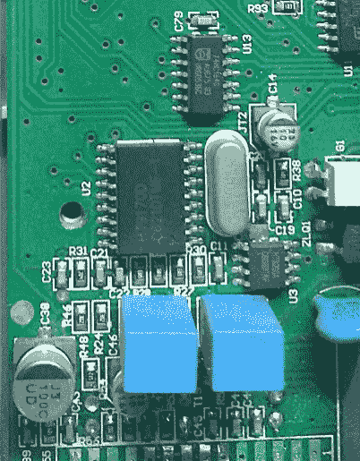](https://hackaday.com/2019/04/18/teardown-the-guts-of-a-digital-sentry/dtmf-3/) DTMF (touch tone) decoder chip [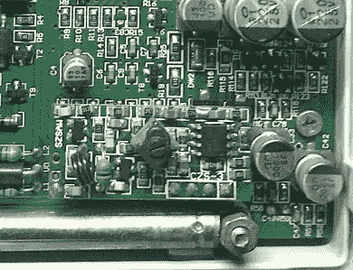](https://hackaday.com/2019/04/18/teardown-the-guts-of-a-digital-sentry/rf_module/) The 433 MHz RF module is same kind you’d use in hobby projects [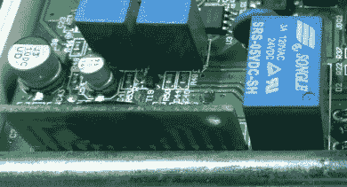](https://hackaday.com/2019/04/18/teardown-the-guts-of-a-digital-sentry/chip-21/) Mystery board with a potted chip on it

有一个 DTMF 解码器(7)，我假设它是用户如何通过输入一个代码，然后执行一些其他单个数字命令来远程解除警报的。你不希望你的邻居在你不在的时候扔石头来压制刺耳的警报。模拟 Mux-Demux 可用于将解码器和拨号系统切换到电话线，尽管传统上使用继电器来完成这项任务。

RF 部分很有趣，它使用了看起来像是业余爱好级的模块，这意味着为了窥探系统，你只需要一个 Arduino 和一个类似的模块。有趣的是，微控制器运行在 3 MHz 左右，具有 6T/12T 时钟机器周期。最坏的情况下，核心频率为 250kHz。固件必须非常紧密。我猜定时器/计数器外设用于计算来自 RF 模块的脉冲宽度，然后被推入一个公共缓冲区，由主程序等读取。

最后一部分是垂直焊接的 PCB，内部有一个定制芯片。有什么猜测吗？

## 探索车门传感器

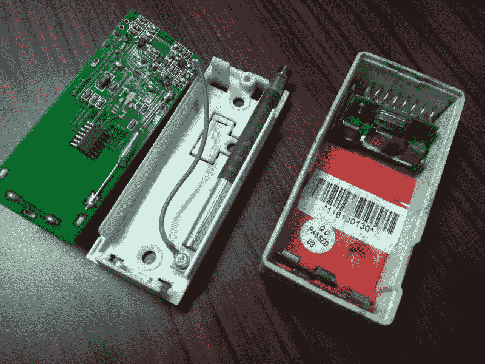

由于一切都是 433 兆赫，传感器节点是简单的小生物，我猜，不时啁啾。车门传感器上有一个小型 SOIC 微控制器，但零件号不可见。crystal 提出了一种更小的 8051 变体，它支持更低的功耗，等待触发传输的 GPIO 中断。没有接收模块，这意味着获得确认是不可能的，而且还会有一个发送低电量警报的代码。

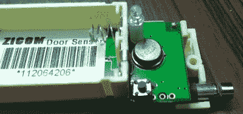

图中看到的 R433A 至 39[ [PDF](http://www.msilverman.me/wp-content/uploads/2014/01/K1037299581.pdf) ]金属罐是一种常见于 AM 发射器模块的 SAW 谐振器，传感器选择的是一种簧片开关，为微控制器提供必要的中断。上蜡，下蜡。有一篇关于[簧片开关](https://hackaday.com/2018/03/01/mechanisms-the-reed-switch/)的文章，你可能会觉得有用。

没有调节器，因此两个 AAA 电池提供 3.0V 及以下电压为系统供电。这很简单，而且能完成工作。

## 该运动传感器

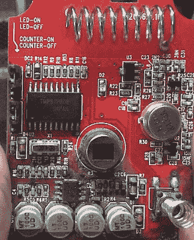

PIR motion sensor PCB

运动传感器更有趣，里面有一个东芝 TMP87P808 微控制器[ [PDF](https://4donline.ihs.cimg/VipMasterIC/IC/TOSC/TOSCS18349/TOSCS18349-1.pdf) 。就我个人而言，我从未使用过这一部分，但在谷歌上快速搜索就会发现，中国有很多公司在低功耗应用中使用它及其相关产品。酷！

感应元件是入侵检测系统中常见的热电 IR 传感器[ [PDF](http://www.farnell.com/datasheets/2199770.pdf) 。市场上有多种传感器元件和其他功能的变体。

我很惊讶这个模块的功率有多低，因为它依靠三节 AA 电池连续工作了大约 4 年。电池在一个模块中泄漏，杀死了 PCB，这增加了我个人的愚见。

R433 SAW 谐振器以与门传感器相同的方式为器件的 RF 端供电，通常它也是最耗电的部分。

## 气体传感器和电源

我们的气体传感器是壁式的，是所有传感器中最大的，这是可以理解的。大多数气体传感器传统上采用内部具有加热元件的传感器，并且大量的热量会带来大量的功率损耗。许多这种传感器可以以合理的价格在线购买，但特殊传感器如 O2 和特殊气体传感器仍然不常见。Mems 传感器已经取代了这些传感器，并且更加经济实惠，同时提供了准确性和效率，因此现代火灾报警器的尺寸较小。

在像印度这样经常断电的国家，拥有备用电源非常重要。该系统配备了一个相当大的壁式电源，带有一个 NiCd 电池和一个充电电路以及一个降压变压器。输出是一个标准的桶插孔，没有办法告诉主系统的备份功率水平。

## 该警报机制

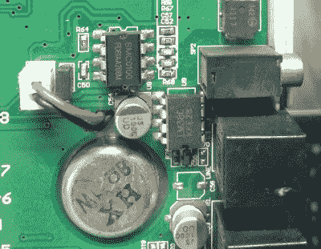

除了小扬声器之外，系统还可以与外部报警蜂鸣器对话，这表明控制模块上的某处有一个 AM 发射器模块。一旦被触发，该系统将通过有线电话线呼叫一个预定义的电话号码，然后等待用户通过 DTMF 输入代码。

这似乎是连接的程度，如果有人要削减强硬路线(矩阵电影有人吗？)系统会一直尖叫，直到有人手动关闭它或电源消失。我们有过一次有趣的经历，一场天气风暴在半夜错误地触发了系统，导致电话线中断，一些邻居很生气。但是没有石头。

## 嗅探无线通信

使用 SDR 加密狗，很容易窥探无线传输。电池和门传感器上的按钮导致了这些传输，我假设这些传输包含 ID 代码以及传感器的其他配对数据。

  Six transmissions per trigger [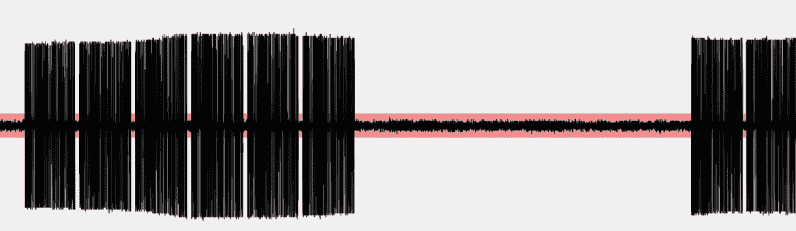](https://hackaday.com/2019/04/18/teardown-the-guts-of-a-digital-sentry/02-7/) Each Packet has 6 sub sections [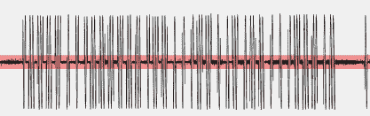](https://hackaday.com/2019/04/18/teardown-the-guts-of-a-digital-sentry/03-5/) A closer look at the Frame [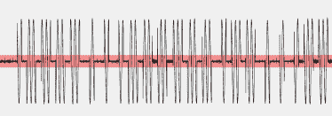](https://hackaday.com/2019/04/18/teardown-the-guts-of-a-digital-sentry/04-4/) A better look at the sequence

在我按下 PCB 上的按钮后，同样的传输发生了六次。通常，RF 433 MHz 传感器使用线路代码，如[开关键控](http://en.wikipedia.org/wiki/On-off_keying)、[曼彻斯特](http://en.wikipedia.org/wiki/Manchester_encoding)或[双相标记](http://en.wikipedia.org/wiki/Biphase_mark_code)。如果制造商遵循标准协议，也许可以使用软件，如 [rtl_433](https://github.com/merbanan/rtl_433) 或[通用无线电黑客](https://github.com/jopohl/urh)来自动处理。我们甚至已经看到了使用 [Matlab 对这个东西](https://hackaday.com/2015/02/16/using-matlab-and-sdr-to-reverse-engineer-433mhz-messages/)进行逆向工程。

这也是许多商业解决方案为传感器提供有线连接的原因之一。或者，也可以使用带有滚动码的芯片，但有线系统也有永远不必更换电池的好处。毕竟，繁忙办公室中的运动传感器会比家里的传感器更快耗尽电池。

## 结论

这个系统已经有十年的历史了，事情已经变得更好了，但是原则是一样的。该系统旨在提供一定水平的服务，同时具有成本效益。它有缺点，但却是一个很好的学习点。根据我们收集的信息，应该可以设计一个定制的解决方案，这正是我所做的，请继续关注。