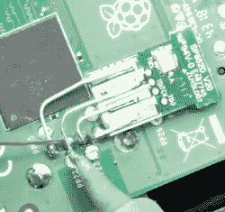

# 树莓 Pi 为比例模型 SEGA 注入活力

> 原文：<https://hackaday.com/2019/04/03/raspberry-pi-breathes-life-into-a-scale-model-sega/>

微型游戏机现在风靡一时。游戏界的许多大牌都在发布他们自己的经典机器的官方“迷你”版本，但自然地，我们也看到许多围绕这些部件的 DIY 构建。一般来说，它们被封装在一个 3D 打印模型中，无论它们想要模拟什么系统，但正如你所料，这需要大量的打磨和绘画才能达到专业的效果。

T2 但是对于 SEGA 创世纪(在美国之外被称为 Mega Drive)的粉丝来说，有了一个新的选择。一家名为 Retro Electro Models 的公司发布了 SEGA 经典游戏机[的高保真比例模型，因此自然有人将它黑成了一个树莓派](https://github.com/backofficeshow/retroMegaDrive)。想要做模型公正的比例细节，[安德鲁·阿姆斯特朗]做了额外的工作，让控制台前面的电源按钮工作，甚至增加了对通过 RFID 标签交换游戏的支持。

[Andrew]使用树莓 Pi 3 A+,它的大小非常适合放在模型中。拟合圆周率零点本来会更容易，但它缺乏比它更大的兄弟姐妹的马力。RFID 阅读器通过 SPI 连接到 Pi，用于检测电源开关何时移动的簧片开关直接连接到 GPIO 引脚。该系统由直接焊接到 Pi 的 PCB 上的 USB 电缆供电，并从机箱背面的一个小孔中穿出。

 在输入方面，[Andrew]正在使用一个小型无线键盘，其中包括一个触摸板和游戏控件。不幸的是，它有一个必须集成到系统中的专有接收器。在一个特别好的接触中，他使用剪断的元件引线将接收器的 PCB 直接“连接”到 Pi 的 USB 端口的引脚。它不仅看起来很酷，而且提供了足够刚性的连接，他甚至不需要用胶水将它粘住，以防止它在外壳内晃动。这绝对是你应该牢记在心的一条建议。

这个项目的软件方面是关于你对仿真控制台的期望，尽管增加了基于 RFID 标签加载游戏的诡计。此时,[Andrew]只有一个系统“盒式磁带”,所以他只需将标签放入控制台的盒式磁带插槽中，就可以加载新的标题。看起来 Retro Electro Models 并没有出售松散的墨盒(这是有道理的，从各方面考虑)，所以如果你想拥有一个与你的控制台配套的 scale 墨盒库，你的 3D 打印机可能仍然有工作要做。

对于那些在 20 世纪 90 年代加入任天堂团队的人来说，[我们已经看到了用 3D 打印外壳完成的类似构建](https://hackaday.com/2017/11/15/homebrew-snes-mini-aims-for-historical-accuracy/)。当然，如果这些控制台对你的口味来说有点太新了，[你可以建造一个微型的威格斯来代替](https://hackaday.com/2015/08/29/3d-printed-mini-vectrex/)。

 [https://www.youtube.com/embed/cAqT-5XCoWA?version=3&rel=1&showsearch=0&showinfo=1&iv_load_policy=1&fs=1&hl=en-US&autohide=2&wmode=transparent](https://www.youtube.com/embed/cAqT-5XCoWA?version=3&rel=1&showsearch=0&showinfo=1&iv_load_policy=1&fs=1&hl=en-US&autohide=2&wmode=transparent)

 [https://www.youtube.com/embed/5KTQK2agE38?version=3&rel=1&showsearch=0&showinfo=1&iv_load_policy=1&fs=1&hl=en-US&autohide=2&wmode=transparent](https://www.youtube.com/embed/5KTQK2agE38?version=3&rel=1&showsearch=0&showinfo=1&iv_load_policy=1&fs=1&hl=en-US&autohide=2&wmode=transparent)

