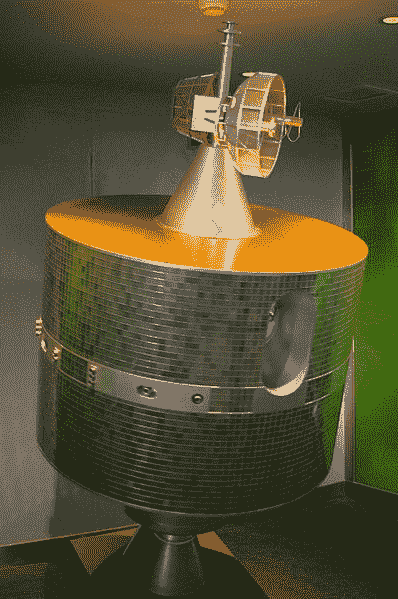
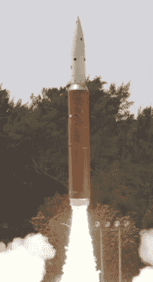

# 人类又一次制造了一团太空垃圾

> 原文：<https://hackaday.com/2019/04/09/humanity-creates-a-cloud-of-space-garbage-again/>

随着 3 月 27 日 Microsat-R 侦察卫星被摧毁，印度成为历史上第四个用地面发射武器成功击中轨道卫星的国家。虽然 Microsat-R 确实是一颗军事卫星，但没有任何敌对意图；该飞船是印度自己的，于今年早些时候发射。此前，美国、俄国和中国都进行了反卫星(ASAT)武器试验，所有这些试验都是针对国内航天器的。

然而，尽管在太空整流罩国家中 ASAT 武器发展历史悠久，印度最近的试验受到了相当多的关注。从历史上看，这种试验的高峰是在 20 世纪 70 年代，作为美国和当时的苏联之间冷战对抗的一部分。在那个时代，人类对空间的利用是有限的，目标航天器的毁灭所产生的碎片云的影响也是有限的。但是今天，随着近地轨道上永久载人的前哨站和快速的商业发射，太空实在是太拥挤了，不能冒险进行类似的实验。国际社会强烈谴责最近的试验是不负责任的。

就他们而言，印度认为他们有权像其他国家一样发展自己的防御能力，特别是考虑到他们日益活跃的太空计划。总理纳伦德拉·莫迪发表了一份声明，重申这次试验不是挑衅行为:

> 今天的反卫星导弹将在印度的安全和发达旅程的愿景方面赋予该国新的力量。今天，我要向世界保证，这不是针对任何人的。
> 
> 印度一贯反对太空军备竞赛，这一政策没有改变。今天的试验没有违反任何国际法或条约协定。我们希望利用现代技术来保护我国 1.3 亿[13 亿]公民的安全和福利。

此外，印度空间研究组织(ISRO)否认该试验对其他航天器造成任何严重危险的说法。他们坚持认为，试验是精心策划的，因此产生的任何碎片都会在几个月内进入地球大气层；这一主张遭到了美国国家航空航天局的批评。

那么，被称为 Shakti 任务的印度 ASAT 试验真的对国际空间利益构成威胁吗？它与其他国家进行的早期测试有何不同？也许最重要的是，为什么我们似乎如此着迷于在太空中炸毁东西？

## 从 2007 年中国反卫星试验中吸取教训

2007 年，中国在大约 865 公里的极地轨道上对他们自己的一颗气象卫星测试了一枚 ASAT 导弹。这是自 1985 年以来第一次有卫星在轨道上被摧毁，迄今为止是太空中产生的最大的碎片云。在撞击中产生了 2000 多个大到足以被地面雷达跟踪的物体，此外还有数十万个可能无法检测到的更小的粒子。

Model of satellite destroyed in 2007\. Image credit Jakub Hałun.

由于撞击高度较高，中国卫星的碎片在未来几年仍将对航行构成威胁。由于几乎没有大气阻力来减缓它们的速度，据估计，一些较小的碎片可能不会燃烧几个世纪。根据美国宇航局发布的一份报告，即使是相对较大的碎片，估计也将至少在 2035 年之前留在轨道上。就在 2011 年 4 月，2007 年 ASAT 试验的碎片在距离国际空间站 6 公里的地方经过。

那么这与最近的印度 ASAT 测试相比如何呢？这两种武器都使用了所谓的“动能拦截器”，也就是说导弹没有爆炸载荷。[很像目前正在开发的高超音速武器系统](http://hackaday.com/2019/01/07/the-age-of-hypersonic-weapons-has-begun/)，撞击时释放的能量本身足以摧毁或瘫痪目标。印度当局很快指出，这种武器理论上产生的碎片云比爆炸弹头产生的碎片云更小、更密集，尽管这在中国试验期间没有带来多少安慰。

两个事件最大的区别是目标被摧毁的高度。两周前，撞击发生时，Microsat-R 的飞行高度仅为 270 公里，碎片云位于地球热大气层的较低位置。在这一范围内运行的物体将开始减速，并迅速降低高度，一旦它们撞上大气层较厚的部分就会燃烧起来。根据单个碎片的大小，它们应该在几周到几个月内完全烧完。在碎片停留在轨道上的短暂时间和它们相对较低的高度(相比之下，国际空间站的平均轨道为 400 公里)之间，ISRO 官员表示，这种云应该不会对其他航天器造成什么风险。

## 高空飞行的碎片

美国宇航局同意 IRSOs 的评估，即摧毁 Microsat-R 产生的碎片比 2007 年中国的试验少得多。该机构目前的估计显示，撞击产生了大约 400 个可能对其他航天器构成威胁的物体，其中多达 60 个物体足够大，可以用雷达跟踪。他们还承认，这些碎片中的大多数都在足够低的轨道上，应该会在不久的将来烧毁。但是美国宇航局局长 Jim Bridenstine 最近的声明表明，该局认为这些事实并不能完全排除碎片被抛入更高轨道的可能性。

也许通过分析图形制作的动画可以更好地理解这个问题，该动画根据欧空局和美国航天局使用的标准碎裂模型模拟说明了撞击时刻和产生的碎片云:

 [https://www.youtube.com/embed/Pzhtc-rFbvM?version=3&rel=1&showsearch=0&showinfo=1&iv_load_policy=1&fs=1&hl=en-US&autohide=2&wmode=transparent](https://www.youtube.com/embed/Pzhtc-rFbvM?version=3&rel=1&showsearch=0&showinfo=1&iv_load_policy=1&fs=1&hl=en-US&autohide=2&wmode=transparent)

虽然大多数碎片或多或少留在 Microsat-R 的原始轨道上，但一些碎片被吹到了更远的太空中。这些碎片更高的轨道不仅意味着它们将在太空中停留更长时间，超过 ISRO 的估计，还意味着它们可能会对国际空间站造成冲击风险。管理员 Bridenstine 没有说空间站需要执行任何规避动作，只是说该机构确定在卫星摧毁后的两周内撞击的风险增加了。

## 低轨道剑拔弩张

India’s ASAT missile

通常情况下，这件事的真相可能介于两者之间。ISRO 声称摧毁 Microsat-R 不会对其他航天器造成危险，这可能是简单化的说法，但与此同时，管理员布里登斯汀将这次试验描述为“可怕的事情”显然是夸张的。如果这些碎片对国际空间站或空间站上的工作人员构成威胁的话，规避动作将会理所当然地被执行。

Shakti 任务不太可能对地球轨道上的其他飞行器产生任何长期影响，更不太可能会对印度实施这项任务采取任何惩罚措施。历史上有很多国家争相向对方展示他们在技术上处于平等地位，而 ASAT 武器的开发和成功部署是一个值得努力的里程碑。印度的试验没有违反任何国际法，而且比其他国家以前进行的试验更具侵略性。除了他们在发射武器前没有通知其他国家，印度以尽可能负责任的方式执行了 Shakti 任务。

最终，任何国家击落对手卫星的可能性都微乎其微。冷战期间，相互确保摧毁(MAD)的概念将核武器保存在各自的发射井中，同样的想法也适用于此。击落他们的卫星，你可能会危及自己人的安全。养成习惯，很快就没有安全轨道了。

诸如此类测试的真正目的是向世界证明，你们国家有能力摧毁在极端高度运行的快速移动物体。直接命中旧的气象或侦察卫星是最不具挑衅性的方式，表明如果需要的话，你的国家可以防御来袭的弹道导弹。这是所有国家都希望永远不必付诸实践的能力。