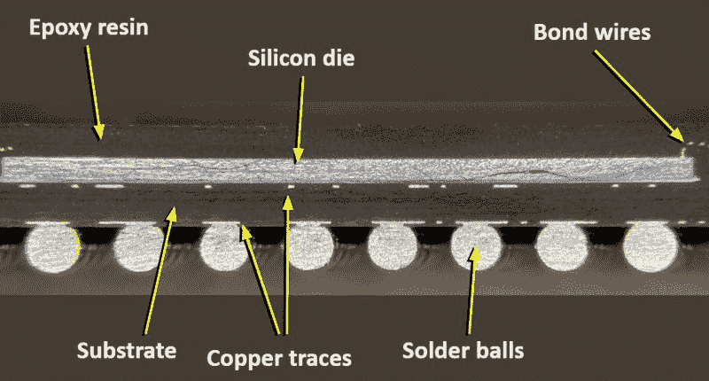
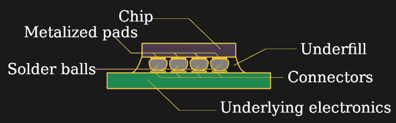
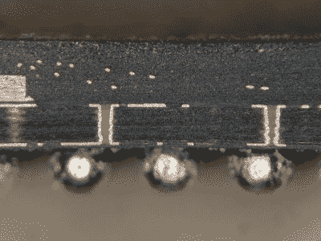
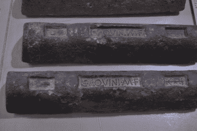

# 倒装芯片和沉船:更快、更小半导体的封装技巧

> 原文：<https://hackaday.com/2019/04/11/flip-chips-and-sunken-ships-packaging-trick-for-faster-smaller-semiconductors/>

你可能听说过“倒装芯片”这个词:这是一个广义的术语，指的是几种集成电路封装方法，其共同点是半导体芯片上下翻转，因此有源表面最靠近 PCB。与 IC 面朝上并通过焊线连接到封装的传统方法相反，这种方法可以实现最高的封装效率和令人印象深刻的性能增益。我们听到很多关于集成电路本身的进步，但是承载它们的封装以及它们解决的问题——有时是产生的问题——却很少被提及。

Cutaway view of traditional wire-bond BGA package. Image CC-BY-SA 4.0 [@TubeTimeUS](https://twitter.com/i/moments/1112130787694931968)

让我们看看为什么半导体制造商决定把事情颠倒过来，看看放射性焊料和古罗马沉船是如何适应的。

## 旧包装

UA741HC op-amp IC from 1986 with top removed

非常早期的集成电路像当时的晶体管一样封装在金属罐中。焊接的金线将芯片连接到外部引脚。像打开金枪鱼罐头一样打开这些旧的集成电路封装，电线清晰可见。当 DIP 封装出现时，他们继续使用焊线将芯片连接到 IC 引脚，即使它们被封装在塑料封装中。

这种趋势一直延续到 SOIC、SSOP 甚至 BGA 等表贴封装，因为它对那个时期的器件非常有效。但是，随着集成电路技术的进步，这些封装出现了问题。第一个障碍是芯片不断增长的尺寸和复杂性。随着他们的成长，需要的连接数量也在增加。不幸的是，虽然复杂性随着芯片面积的增加而增加，但是可能的引线键合连接的数量随着管芯和旧式封装的周长而增加。这是`X²`对`X`的比赛，在某些时候，周界上没有足够的空间，因此必须设计一种更密集的连接方法。第二个问题是引线键合本身的性能。像自由空间中的任何导体一样，这些小导线表现得像电感器。这种电感会对高速电路造成严重后果。随着 IC 速度的提高，焊线电感加上封装引脚电感开始成为一个严重的问题。

## 倒装芯片

解决这两个问题的好方法是将半导体芯片倒置。以这种方式翻转芯片，可以直接从芯片到下面的下一层进行连接，而无需任何接合线。这允许更多的连接，因为焊盘可以放置在任何地方；没有必要将它们限制在芯片的外围。对于具有许多 I/O 连接的焊盘受限设计，这实际上会导致芯片更小。此外，可以用短而厚的金属凸块进行连接，这种金属凸块比传统的接合线具有小得多的电感(大约小一个数量级)。

在某些情况下，倒装芯片使用焊球直接连接到印刷电路板。在其他情况下，芯片可能首先连接到基板上的走线，类似于中间 PCB，然后连接到电路板本身。中间层上的走线将芯片的焊料凸点连接到电路板连接。这允许管芯上的扇出连接，否则对于 PCB 连接来说，扇出连接的间距会过小。

Vias in a wire-bond BGA substrate. Similar substrate layers connect flip-chip BGAs. Image credit: CC-BY-SA-4.0 [@TubeTimeUS](https://twitter.com/i/moments/1112130787694931968) who have published [amazing images inside components](https://hackaday.com/2019/04/02/components-cut-in-half-reveal-their-inner-beauty/).

虽然我们可能会认为倒装芯片技术是新出现的，但它实际上已经存在很长时间了。IBM 在 20 世纪 60 年代的大型计算机中率先提出了分立二极管和晶体管的概念，后来在 20 世纪 70 年代被应用于汽车电子领域。今天，这种技术很常见，并被广泛应用。

并非所有无引脚 SMT 封装都有倒装芯片；IC 封装有很大的多样性。一些 BGA 封装使用引线键合，在最终终止于封装底部的焊球之前，将管芯焊盘连接到封装基板上的导电迹线。同样，QFN 封装中的管芯可以是任一方向的。有时候，出于好奇，知道真相的唯一方法就是看一看包裹里面。

## 晶圆级芯片尺寸封装

LMC555 timer in die-size ball-grid-array (DSBGA) package. This is a flip-chip.

因此，一旦决定将芯片直接连接到 PCB，一个有趣的机会就来了。你可以把芯片变成封装，当芯片还在晶片上的时候，你就可以构建整个组件。这正是在晶圆级芯片级封装(WLCSP)中所做的。在该工艺中，在晶片制造完成后，焊料凸块沉积在焊盘上，并且封装涂层施加到晶片的两侧。现在仍在晶片上的封装芯片，在被切割成单个单元之前，被测试和标记。这是封装器件的一种非常有效的方式，并且可以非常有效地利用电路板空间:因为封装与芯片尺寸相同，所以不能再小了。

虽然这些芯片是封装效率的奇迹，但它们可能会遭受一些奇怪的疾病。如果你有一台 Raspberry Pi 2，你可能会对其中一台很熟悉。发布后不久，[一个有趣的问题浮出水面](https://hackaday.com/2015/02/08/photonic-reset-of-the-raspberry-pi-2/),人们发现，明亮的闪光(或正确指向的激光指示器)会干扰 PCB 上电源调节器的操作，导致 Pi 复位。问题中的芯片在芯片大小的封装中，芯片暴露在下面，结果证明它是光敏的。哎呀。

不过，倒装芯片最有趣的问题可能与另一个敏感性有关，特别是对阿尔法辐射的敏感性。

## 沉船和软错误

Ancient Roman lead ingots, which emit very little alpha radiation.

IBM 在 1979 年首次注意到，他们的陶瓷 DIP 封装的 DRAMs 容易因为封装盖的α粒子发射而产生位错误。这些阿尔法粒子导致了软错误:一个或多个翻转的位，但没有损坏硬件。后来，当倒装芯片封装在复杂 IC 中变得普遍时，软错误率开始攀升。罪魁祸首:锡铅焊球发出的阿尔法粒子。

阿尔法粒子的穿透力很小；一张普通的纸就能阻止他们。在倒装芯片出现之前，封装甚至硅衬底本身都提供了足够的屏蔽，但当颠倒过来时，IC 的敏感面现在正对着焊料。由此产生的错误率可能高得惊人。例如，2004 年的一份 [Xilinx 白皮书描述了一个封装供应商不正确地使用高 alpha(即“正常”)焊料来组装他们的一些倒装芯片 FPGAs，导致每 230 个工作小时就出现一次位错误。](https://www.xilinx.com/support/documentation/white_papers/wp208.pdf)

虽然我们通常认为铅是一种辐射屏蔽材料，但事实上，新熔炼的铅具有轻微的放射性。铅矿通常含有微量铀-238，铀-238 会自然衰变(通过复杂的链)成铅的放射性同位素 Pb-210。而 Pb-210 最终衰变为 Po-210，半衰期为 22 年，在此过程中会短暂停留为铋。Po-210 最终衰变为稳定的 Pb-206，释放出一种α粒子，这就是问题的原因。

 分离同位素并不容易。这一事实使除了少数几个最强大的民族国家之外的所有国家都无法获得核武器，但也使人们很难将放射性铅与无害的 Pb-206 分开。然而，像大多数涉及放射性的问题一样，如果你能等待足够长的时间，这个问题会自行消失。一旦铅被提炼，Pb-210 的来源——U-238 的放射性子体——被移除，任何现有的放射性同位素开始慢慢冷却。几百年后，几乎没有阿尔法活动了。所以，所谓的低阿尔法铅的一个来源是古代提炼的金属。

我记得在世纪之交的时候，听说过一些公司从古代沉船中回收旧铅，用于制造易损部件的低α焊料，特别是当时先进的微处理器和 FPGAs。铅最初是压舱物或船体包层，或作为货物运输，因为它在古代有多种惊人的用途——包括饮用水管道。打捞公司将找到沉船和其他古代铅的来源，并将其用于敏感的电子组件。

这种做法后来变得相当有争议，因为考古学家越来越担心有价值的文物被熔化，抹去文化遗产。尽管 2013 年的[头条是关于物理学家使用古老的铅进行中微子实验，但那时很明显这不是电子组装的可持续解决方案。虽然一些矿床的放射性比其他矿床低，基于激光的同位素分离方法也有一些希望，但对于经济的低α铅来说，没有真正好的解决方案。对于仍然需要含铅焊料的特殊应用，α衰变仍然是一个昂贵的问题。](https://www.scientificamerican.com/article/ancient-roman-lead-physics-archaeology-controversy/)

## RoHS 来拯救？

RoHS 指令要求从焊料中去除铅，这似乎解决了 alpha 问题。不幸的是，即使在 RoHS 允许的污染物水平下，“无铅”焊料仍然会热到足以引起问题。在许多情况下，这些所谓的无铅焊料的活性令人惊讶地归功于我们的老朋友 Pb-210。铅是许多金属矿石中的天然污染物，锡源可能含有足够的 Pb-210，会给敏感电路带来问题，即使按照“无铅”焊料标准进行净化也是如此。因此，有一个围绕生产低α锡和符合 RoHS 的焊料的行业，但当然，它们并不便宜。

因此，下一次你在电路板上安装 IC 时，请考虑一下封装本身。此外，如果您看到裸露芯片部分出现一些奇怪的行为，请考虑您的焊料。你可能只是需要一些古老的铅。