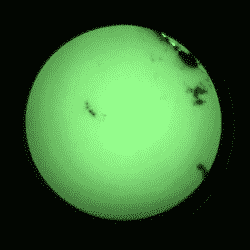

# 了解夜视功能，以及如何构建自己的夜视功能

> 原文：<https://hackaday.com/2019/04/10/see-whats-inside-night-vision-and-how-to-build-your-own/>

[Nick Chen]分享了一些关于[从零件](https://www.thefirearmblog.com/blog/2019/04/05/friday-night-lights-diy-build-your-own-night-vision-pvs-14)构建 AN/PVS-14 单目夜视设备的有趣且有用的细节。这并不便宜，但对于大多数黑客读者来说，至少对于那些美国居民来说，这是一个简单的构建。由于 PVS-14 受《国际武器交易条例》( ITAR)的出口管制，因此零件不在美国境外销售。尽管如此，[Nick]图文并茂的构建说明让我们很好地了解了这些加固设备的内部情况。

该构建包括购买 PVS-14 零件套件(或“外壳套件”)，该套件包括除图像增强器模块之外的几乎所有东西，图像增强器模块必须单独购买。一旦所有的部件都准备好了，[Nick]会解释如何将这些部件组装成一个工作单元。

The view through a blemished (or “blem”) image intensifier. Cheaper, and perfectly serviceable as long as the center is clear.

由于图像增强器是迄今为止最昂贵的组件，因此有机会通过购买[Nick]所谓的“问题”单元来节省资金。这些单元是功能性的，但是在视野内有瑕疵或死点。好消息是这使得它们更便宜，而且[尼克]指出，只要管子的中心区域是透明的，它们是完全可以使用的。

用零件组装能省多少钱？[Nick]说，购买一个完整的带有第三代电子管(对 450-950 纳米敏感)的 PVS-14 可能需要 2500 到 4000 美元。毫无疑问，这是一种昂贵的设备，但可以在零件上找到交易。房屋套件的价格不到 1000 美元，而[尼克]购买的可维修图像增强器的价格在 500 美元到 1000 美元之间。他说，搜索“问题管道”可以帮助锁定交易。

知道正确的搜索术语是成功的一半，有了他的构建说明(和一大笔钱)，一个好奇的黑客就有了他们自己需要的一切。见鬼，造两个吧，因为 PVS-14 的设计是这样的，两个单元可以组合成一个双目单元！不准备放弃那笔钱？查看 [OpenScope，开源数字夜视工具](https://hackaday.com/2017/02/23/own-the-night-with-this-open-source-night-vision-monocular/)。