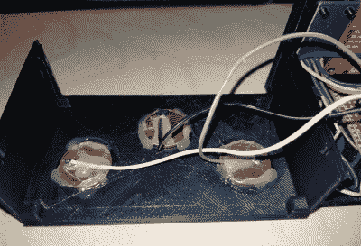

# ESP32 闹钟在功能上毫不吝啬

> 原文：<https://hackaday.com/2019/04/11/esp32-alarm-clock-doesnt-skimp-on-the-features/>

ESP 系列微控制器现在绝对火了，我们的许多项目都是基于一种极其便宜的支持 WiFi 的电路板。事实上，它们如此便宜和受欢迎，以至于我们已经开始看到一种有点出乎意料的趋势；尽管更现代的主板比要求的要强大得多，人们还是倾向于用它们来代替。最终结果是一堆项目中 ESP 根本没有得到充分利用。这没什么大不了的，但是看着有点失望。

 但我们可以向你保证[【pango dream】](https://github.com/pangodream/Claudio)创造的这款 ESP32 闹钟绝对不是其中之一。他在这个不起眼的小手表中加入了令人印象深刻的功能，这真是一个很好的例子，证明了这些电路板的能力。从 DIY 触摸传感器到用于配置网络时钟的 Android 应用程序，这个项目充满了值得仔细研究的整洁的硬件和软件技巧。

在 3D 打印的外壳内，该时钟具有 BH150 光传感器，非常受欢迎的用于检测温度和湿度的 DHT-11，以及用于显示的 ILI9341 2.8 英寸 LCD。以一种特别巧妙的手法(懂吗？)，[Pangodream]使用了三个连接到 ESP32 数字引脚的硬币作为电容传感器。这使得他只需点击外壳的顶部就可以与点击进行交互，省去了他添加传统开关或按钮的麻烦。我们可能在顶壳上做了一些缩进，以便识别你按的是三个“按钮”中的哪一个，但我们认为看不见的界面确实让事情看起来更有未来感。

但是，如果连这样的身体接触对你来说都太多，那么[Pangodream]已经提出了一个相当强大的系统，通过网络控制时钟并与之交互。这不仅仅是一种设置时间的便捷方式，时钟的许多功能都可以通过这种方式进行轮询和配置；从触摸传感器的灵敏度到闹钟响起时它会响多少次。为了让事情变得更简单，他甚至将这一切都打包在一个方便的 Android 应用程序中，用于移动配置。

如果这个时钟不能提供你所需要的过度工程化的水平，[看看这个使用了不少于五个 ESP32s 来完成工作的构建](https://hackaday.com/2017/11/27/over-engineered-clock-uses-no-less-than-five-esp32s/)。或者这个[连接到美国宇航局的深空网络](https://hackaday.com/2018/10/07/clock-monitors-deep-space-network-keeps-vigil-over-lost-mars-rover/)。

 [https://www.youtube.com/embed/KCV96Gy_5ys?version=3&rel=1&showsearch=0&showinfo=1&iv_load_policy=1&fs=1&hl=en-US&autohide=2&wmode=transparent](https://www.youtube.com/embed/KCV96Gy_5ys?version=3&rel=1&showsearch=0&showinfo=1&iv_load_policy=1&fs=1&hl=en-US&autohide=2&wmode=transparent)

