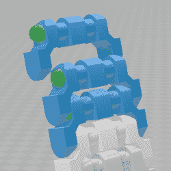

# 3D 打印坦克履带与塑料 BB 一起弹出铰链

> 原文：<https://hackaday.com/2019/04/20/3d-printed-tank-track-pops-together-with-plastic-bb-for-hinge/>

3D 打印非常适合生产坦克胎面设计，因为所需的大量相同的部分非常适合 3D 打印的优势。唯一的障碍是每个部分之间需要紧固件，但[AlwynxJones]有一个聪明的解决方案，使用大量的硬塑料球(以 6 mm 气枪 BBs 的形式)作为每个 3D 打印轨道部分之间的紧固件和铰链。

每个片段都有中空部分，可以紧贴 6 mm 的 BBs(在此图中显示为绿色),既可以作为紧固件，也可以作为支撑面。组装需要一点力来将所有的东西扣在一起，但[AlwynxJones]认为结果值得不要用螺栓、电线或其他临时紧固件。

螺栓或螺钉是连接分段的一种选择，但它们很重，而且会很贵。[打印机灯丝段已成功用于其他胎面设计](https://hackaday.com/2018/03/31/3d-printed-tank-tracks/)，尽管这种方法需要额外的工作，要么是销，要么是灯丝末端的热变形，以形成一种铆钉。这个设计可能是一个正在进行的工作，但它似乎是一个有前途的和聪明的方法。

[via [Reddit](https://www.reddit.com/r/3Dprinting/comments/bbfn6n/tank_tread_with_6mm_bb_hinges/)