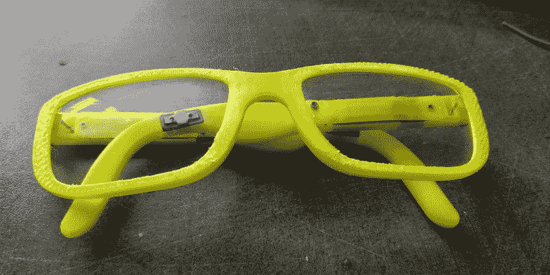

# 内置在眼镜中的骨传导耳机

> 原文：<https://hackaday.com/2019/04/18/bone-conducting-headphones-built-into-eye-glasses/>

有时候，被人看到戴着耳机听音乐可能会给你带来麻烦。对于这些时刻，伸手拿一个方便的解决方案:骨传导扬声器，它通过你的头骨小心翼翼地将音乐传输到你的耳膜。[塞缪尔]想要的就是这样一种隐蔽的音乐收听设备，所以[在一套 3D 打印眼镜中创造了他自己的设备](https://hackaday.io/project/164895-diy-bone-conduction-glasses)。

他首先尝试使用 Adafruit 骨导传感器，但发现它体积太大。你在这里看到的是一个更小的模块，是[Samuel]在全球速卖通上找到的(搜索骨传导模块)。GD-02 要小得多，因此更适合藏在一副眼镜的臂弯里。对于其余的电子产品，他使用了一套捐赠的坏蓝牙耳机的 PCB 和电池，他可以很容易地隐藏在 3D 打印的眼镜框架中。电池在一只手里，电路板在另一只手里，他说布线非常复杂。

其结果是一套令人惊讶的超薄规格，你可能不会立即想到隐藏了一些电子产品。他选择的亮黄色灯丝可能会泄露秘密，但总的来说他做得很好。这当然不是我们向你展示的第一个骨传导项目，[其他一些已经使用电机](https://hackaday.com/2018/06/02/bike-helmet-plays-music-via-tiny-motors-for-bone-conduction/)代替骨传导传感器。