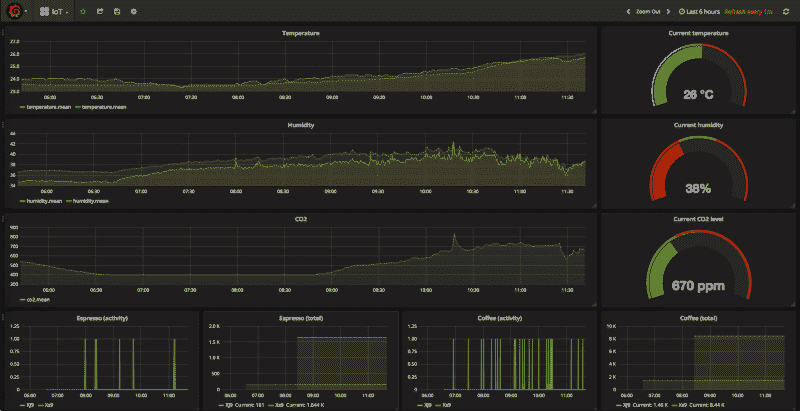
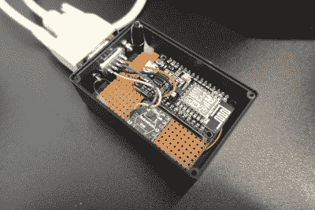
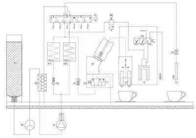
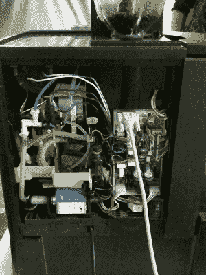

# 通过完全调整咖啡机来制作一杯特别的咖啡

> 原文：<https://hackaday.com/2019/04/26/make-that-special-cup-of-coffee-by-completely-tweaking-the-coffee-machine/>

在[建筑管理和控制](https://github.com/MayaPosch/BMaC) (BMaC)项目中，一个有趣的部分是逆向工程，最终获得对办公室咖啡机的完全控制，正如[之前在这个网站上报道过的](https://hackaday.com/2019/03/20/the-joy-of-properly-designed-embedded-systems/)。提醒你，不是无聊的过滤咖啡机，而是全自动的浓缩咖啡机，可以磨豆、煮咖啡、加牛奶等等。当然要看自己的预算了。

这些工程上的小奇迹包括几米长的管道、几十个传感器、阀门、陶瓷研磨机和加热元件。这种机器的复杂性让我们想到，也许我们可以用这些机器做更多的事情，超出它们现有的编程和预定义产品所允许的范围。当然有。

## 认识顶级电子硬件

办公室里的浓缩咖啡机都来自瑞士公司 Jura。具体来说，我们有 [Impressa XS90](https://us.jura.com/en/professional/machines/IMPRESSA-XS90-OT-UL-13429) 和它的旧版本，以及 [X3](https://www.juragastroworld.de/de/produkte-professional/kaffeevollautomaten/GIGA-X3-G2-Aluminium-EU-15229) 和 [XJ9](https://www.juragastroworld.de/de/produkte-professional/kaffeevollautomaten/IMPRESSA-XJ9-Professional-EU-13707) 。最初，我们只是对读出其 EEPROM 中的计数器感兴趣，这为我们提供了同事咖啡使用的概况:

信不信由你，这些计数器可以通过这些机器背面的 TTL 级串行端口读出，内部微控制器通过这个串行端口说出简单的二进制协议。几年前，Hackaday 报道的一个[类似项目](https://hackaday.com/2016/01/28/hacking-a-coffee-machine/)，在读取这些咖啡使用计数器方面具有类似的功能。

该协议本质上是普通的 ASCII 命令和响应，每个字节变成四个字节。只有位 2 和位 5 携带原始字节的数据，除位 0 外，其余载体字节均为 1。该编码和匹配解码程序在 BMaC 项目的“ [Jura](https://github.com/MayaPosch/BMaC/blob/master/esp8266/app/jura_module.cpp) 和“ [JuraTerm](https://github.com/MayaPosch/BMaC/blob/master/esp8266/app/juraterm_module.cpp) 固件模块中实现。

在这些机器里面，你会发现一个由[顶尖电子公司](http://top-tronic.com/)制造的控制板。它们中的大多数都具有我们称为“第 5 代”类型的主板，因为这些主板的三位数型号以“5”开头。它们都采用简单的处理器，并在屏蔽 ROM 的一部分中进行编程，这意味着它们不支持固件更新，只允许在同一 PCB 上的 EEPROM 中进行微小的配置更改。产品计数器也存储在该 EEPROM 中。

所有这些板都通过其串行端口进行通信，可能使用相同的填充串行协议来接收来自小型 LED 或基于 LCD 的前面板接口 PCB 的指令。XS9、XS90 和 XJ9 内部都有类似的第 5 代硬件，但 XJ9 是这三款产品中唯一一款拥有彩色 TFT LCD 和更多产品选择的产品。另一方面，X3 及其兄弟产品(X3c、W3)采用“第 7 代”硬件。他们用 ARM MCU (STM32F103ZE)取代了屏蔽 ROM 和简单的微处理器，不再使用 EEPROM (93LC86)来记录计数器。试图使用简单的“TOP-tronics”协议来读取 EEPROM 会导致机器返回几行零。这些机器还配备了蓝牙加密狗，可插入用户可访问的第三个 UART(“扩展端口”)，以便可以在智能手机或平板电脑上使用 Jura 应用程序。

由于我们的 X3 机器对通常的协议和命令几乎没有反应，我们决定在平板电脑上操作应用程序时，嗅一下这个加密狗和机器之间的 UART 线路，选择使用第一个 UART(“服务端口”)，因为它有一个粗短的 DE-9 (RS-232C 型)D-超小型连接器，并且创建适配器要容易得多。就我们所知，两个 UARTs 在功能上是相同的。

不幸的是，第一次嗅探尝试已经表明了为什么我们与机器的通信如此艰难:加密狗和机器没有坚持使用纯文本协议，而是在切换到加密连接之前，使用旧协议执行了似乎是握手的操作。

同样，加密狗和基于平板电脑的应用程序之间的蓝牙连接似乎也完全加密了。最初的逆向工程，解密，甚至简单的重放攻击的尝试被证明是徒劳的，我们不得不暂时放弃这台机器。我们不想损坏价值数千欧元的机器和办公室(咖啡)基础设施的一个关键部分，所以当涉及到这些较新的机器时，我们有点卡住了。

## 让机器为我们跳舞

 那就剩下三台我们可以与之交流的机器了。当我的雇主组织了一次黑客马拉松活动时，这是一个绝佳的机会来看看我们可以利用他们做些什么。我们开始将它们连接到本地 WiFi 网络。这些小黑盒包含一个 ESP8266 和一个电平转换器，运行包含我在本文前面提到的两个 Jura 模块的 BMaC 固件。

在浏览[可能的命令列表](http://protocoljura.wiki-site.com/index.php/Commands_for_coffeemaker)时，很明显，有了它，人们可以处理制造最终产品所涉及的机器的每一个部分，从研磨机到阀门，再到整个酿造组。我们可以不使用从 rom 中读取产品预置的“make product X”命令，而是向机器发送我们自己的命令串，以制作我们自己的定制产品。

该机器本质上是一系列预热器(d)、加热器(e)、泵(c)、流量传感器(b)、阀(f、I)，所有这些都服务于冲泡单元(g)，冲泡单元是机器的核心。这是研磨机(未图示)在研磨一定量的咖啡豆后将粉末投入其中的地方，然后用来自阀门和加热元件的热水淹没粉末。根据产品的类型，人们也可以在酿造过程中使用蒸汽，并且如果需要的话，将来自外部单元的牛奶添加到最终产品中。有趣的问题是应该以什么样的顺序使用它们，以及使用多长时间。弄清楚这一点是这次为期一天的黑客马拉松的目标。

## 斗争，和公斤的豆子

除了对自动咖啡机的所有这些部件应该如何协同工作的模糊想法之外，没有真正的指导，我们开始时的假设是，我们需要研磨一些咖啡豆几秒钟左右，然后加入热水，等待新鲜咖啡出现在我们事先放在输出端下方的杯子中。不幸的是，我们只能在杯子里得到一些热水，在废水容器里得到干咖啡渣。很明显，有些地方出了严重的问题。回到绘图板，我们开始仔细尝试各种方法和一系列命令。

到那天结束的时候，我们已经完成了两公斤重的新鲜咖啡豆，成功地生产出了至少闻起来像是咖啡的东西，所以我们首先让团队中喝咖啡的人尝试咖啡，直到他们开始反抗，我们必须让其他团队的人尝试我们的创作，当他们突然出现，看看这个房间里发生了什么，因为一些奇怪的原因，咖啡的味道非常强烈。

最后，我们发现 XS90 的正确事件顺序是:

1.  磨咖啡(1 秒)。
2.  将冲泡单元移动到冲泡位置。
3.  加热水(2 秒钟)。
4.  将热水泵入冲泡单元(> 10 秒)。
5.  把咖啡沥干。
6.  用淡水冲洗酿造装置。
7.  丢弃用过的咖啡渣。
8.  将冲泡组移回研磨位置。
9.  关闭排水阀。

据我那些喝咖啡的同事说，这种顺序使我们能够生产出相当接近有人可能称之为“像样的咖啡”的东西。还有许多细节需要我们去完善，但是我们觉得我们已经非常接近了。毫不奇怪，我们的团队赢得了黑客马拉松。

## 余波

令人沮丧的是，我们开始使用的 TOP-tronic 命令列表并不完整。在某个时候，我的一个同事认为他们应该尝试序列中未列出的命令，只是为了看看机器会做什么。我们把整个机器都拧开了，这样我们就能清楚地看到它的内部。

这里可以看到串行电缆插入机器的逻辑板，大部分管道、泵和一些阀门都可见。这通常工作得很好，让我们能够推断出什么有效，什么无效，除非有一个事件涉及到一个显然将多路阀设置为错误状态的命令，这样咖啡就会从右边的输出端而不是左边的输出端出来。

自黑客马拉松以来，我们还没有时间将这一概念证明转化为成熟的产品，让我们能够控制咖啡机制作出我们想要的精确咖啡或浓缩咖啡，更不用说校准添加到最接近毫升的液体量了。不过，这绝对是应该做的事情。

这里有点令人不快的是，显然 Jura 和 TOP-tronic 已经决定放弃在第 5 代板上发现的易于使用的协议。在某个时候，我甚至想过用第 7 代硬件替换 X3 和其他机器中的 TOP-tronic 板，使用基于 ARM 的定制板，该板可以根据通过 WiFi 或以太网链接获得的输入来驱动组件。

不幸的是，这将意味着决定性地使保修无效，这是人们最不希望对一台比二手车还贵的咖啡机做的事情。尽管如此，这些自动咖啡机的黑客潜力似乎是无限的。如果你能得到一台(二手)XS90 或 XS9，它会给你带来很多乐趣，甚至可能是你一生中最好的咖啡。