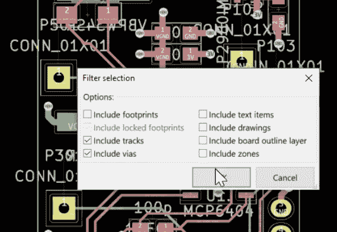

# 字节大小的块帮助 KiCad 下降

> 原文：<https://hackaday.com/2019/04/18/byte-sized-pieces-help-the-kicad-go-down/>

毫不奇怪，我们在 Hackaday 是 KiCad 的忠实粉丝。但是对于初学者(或者经验丰富的老手！)学习曲线的严重程度可能会像悬崖一样。2016 年，我们发表了一篇文章，链接到黑客之友[Chris Gammell]的项目，名为[上下文电子学](https://www.youtube.com/user/contextualelectronic)，他的项目是制作正式的 KiCad 培训。从那时起，总理“获得 Blinky”视频系列已成为一个简单的建议，任何人都希望开始与 Libre EDA。在一段时间的中断之后,[克里斯]带着探索 KiCad-o-verse 每个角落的小视频回来了。

快乐的【克里斯】免费提供每一个视频

[原版 Blinky 系列](https://hackaday.com/2016/06/04/its-time-to-finally-figure-out-how-to-use-kicad/)是一套 10 个长达 30 分钟的视频，从设置 KiCad 接口到焊接一些完美的紫色 PCB。它们覆盖面很广，是很好的学习资源，但是坐下来看几个小时的内容在精神上和逻辑上都很困难。最近[Chris]采取了新的策略，制作了 5 到 10 分钟的单个 KiCad 特性和功能的快照。从那以后，我们在 Youtube 的推荐中享受了随之而来的学习浪潮！

Selecting traces to rip up

有些视频看似简单，但非常有用。就像这个关于[在 ratsnest 中找到那些最终断开的连接](https://www.youtube.com/watch?v=mpiWt5Id3lY)的例子。不完全覆盖一个主要的新特性，但是一个任何布局工程师都非常关心的话题。这里有另一个关于将[参考图片拉进你的原理图](https://www.youtube.com/watch?v=VIlOduZLw_k)的好技巧，让生活变得更简单。一个精彩的三分钟视频。你认为有多少种方法可以在布局编辑器中[移动零件和测量距离](https://www.youtube.com/watch?v=UsmjaguPUrI)？克里斯涵盖了我们以前没有见过的一堆，甚至在使用 KiCad 多年后！在他对[的报道中，我们学到了同样多的如何撕掉已路由的轨道](https://www.youtube.com/watch?v=TXVUbun980Q)。你明白了。

我们可以总结 Youtube 频道，但我们不是按角色付费的。去频道找点东西学。确保向[Chris]发送关于您希望他制作的内容的提示！