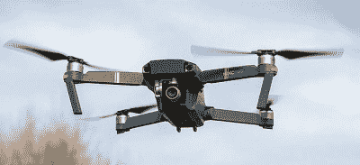
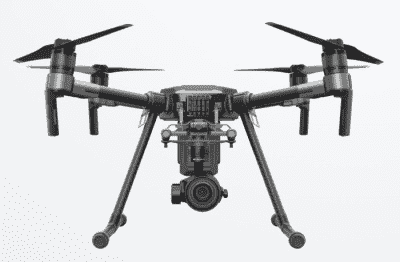
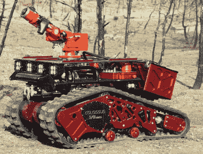

# 帮助拯救巴黎圣母院的无人驾驶飞机和机器人

> 原文：<https://hackaday.com/2019/04/17/the-drones-and-robots-that-helped-save-notre-dame/>

在社交媒体时代，像巴黎圣母院大火这样的事件是全球观众实时经历的。从纽约到东京，数百万人粘在他们的智能手机和电脑上，等待媒体甚至是在现场记录可怕大火的个人的最新消息。十二个小时的折磨，850 岁的巴黎图标的命运悬而未决，一时间，看起来最糟糕的是不可避免的。

大火已经被完全扑灭，烟雾已经散去，在白天，我们现在知道紧急反应小组的英雄行为设法避免了彻底的灾难。虽然大教堂的损坏很严重，但结构本身和里面的许多无价艺术品仍然存在。现在确切知道大教堂的清理和修复将花费多少还为时过早，但即使是最乐观的估计也已经有数亿美元了。对于这种古老的结构，重建很可能会因为这样一个事实而放缓，即在中间几个世纪已经过时的建筑技术需要由管理员重新审视。但是法国人民不会被吓倒，埃马纽埃尔·马克龙总统已经发誓他的国家将在五年内重建大教堂。

那些冒着生命危险拯救法国最受喜爱的古迹之一的人们的重要性怎么强调都不为过。他们应该得到一个充满感激的国家，甚至全世界的所有赞扬。但是与他们并肩作战的是尖端技术，其中一些一接到通知就投入使用。这些机器帮助指导消防队员与大火搏斗，并在对人类生命的威胁太大时挺身而出。归根结底，是人而不是机器战胜了大自然的愤怒；但是如果没有现代技术的帮助，死亡人数可能会高得多。

## 天空之眼

据法国媒体报道，紧急反应小组利用至少两架无人驾驶飞机在燃烧的大教堂上空进行侦察。通过这些平台提供的图像，消防队员能够实时看到火灾的强度和运动。这些无人机不仅比派遣直升机更快更便宜，而且它们的操作者能够更靠近火场，因为它们不容易受到高温和烟雾的影响，而高温和烟雾会使有人驾驶的飞机保持相当的距离。

Mavic Pro

但事实证明，巴黎消防队实际上并没有自己的无人机可以在这种情况下使用。相反，他们借用了内政部和文化部正在使用的两种市售型号。这两款四轴飞行器 Mavic Pro 和 Matrice M210 都是中国 DJI 公司的产品。作为一家几乎等同于“prosumer”航空摄影平台的制造商，他们还生产非常受欢迎的 Phantom 系列四轴飞行器。

Mavic Pro 是一款小型半自动四轴飞行器，DJI 称它是捕捉高质量视频的理想选择，因为它采用了折叠设计，比传统的四轴飞行器更容易运输。飞行时间将近半个小时，4K 相机用三轴机械万向架稳定，能够自动跟踪和环绕操作者选择的物体，这被证明是从上面监视火灾的理想方法。

Matrice M210

与 Mavic 相比，Matrice M210 是 DJI 专业四轴飞行器系列的一部分。这种无人机体积更大、功能更强，设计用于携带各种有效载荷包，如聚光灯、热感相机和光学变焦相机。关于巴黎消防队使用的 M210 是否安装了热感摄像机选项，有相互矛盾的报告，但无论如何，它至少给了他们另一个高分辨率视频来源。

有趣的是，一般来说，巴黎严格禁止无人机飞行，DJI 产品内置的地理围栏功能通常会阻止无人机飞越巴黎圣母院。但是 DJI 实际上已经有了一个系统，T2 的操作者可以要求暂时取消这些限制，这使得制造商能够迅速与法国当局合作，在情况严重的情况下让无人机升空。

## 站在巨人的肩膀上

 尽管消费产品可能已经胜任了天上的任务，但地面上的情况却不适合业余爱好者。为了真正进入圣母院并试图从内部灭火，巴黎消防队使用了巨像。[由鲨鱼机器人公司](https://www.shark-robotics.com/en/robot/colossus/)开发的这个 500 公斤重的履带式平台基本上不受火和水的影响，当与机动水炮结合时，它成为一种有效的消防资产。

巨像在巴黎圣母院大火中特别有用，因为它能够在屋顶被火焰吞没时留在建筑物内。随着燃烧的碎片从上面落下，大教堂标志性的铅木尖顶最终倒塌，内部对于人类消防员来说是一个特别危险的区域。巨像能够在教堂的中殿提供持续的洪水，即使机器人周围的结构实际上已经分崩离析，其冷却效果已经被认为有助于拯救无价的彩色玻璃艺术品。此外，它还为消防队员提供了另一个实时视频，以便他们可以确定何时足够安全，可以派遣更多的救援人员。

 [https://www.youtube.com/embed/JLRc_jBiZeY?version=3&rel=1&showsearch=0&showinfo=1&iv_load_policy=1&fs=1&hl=en-US&autohide=2&wmode=transparent](https://www.youtube.com/embed/JLRc_jBiZeY?version=3&rel=1&showsearch=0&showinfo=1&iv_load_policy=1&fs=1&hl=en-US&autohide=2&wmode=transparent)

## 高科技修复

尖端技术和机器人在拯救巴黎圣母院中发挥了作用，看起来他们的工作还没有完成。正如我们在以前的灾难中看到的那样，比如日本福岛第一核电站的核泄漏，机器人可以被召唤去调查对人类工人来说太危险的区域的结构完整性。从空中，带有高分辨率相机的无人机将能够快速拍摄整个现场，这可用于[通过摄影测量](https://hackaday.com/2019/04/07/get-great-3d-scans-with-open-photogrammetry/)创建结构的三维模型；有助于现代屋顶的最终设计，它与原始的石雕融为一体。

为了在马克龙总统提出的雄心勃勃的五年时间表内修复巴黎圣母院，同时为参与该项目的数千名工人维持一个安全的工作环境，没有任何选择可以放弃。法国人民被这一事件所激励，在这一切结束之前，我们可能会看到专门为这次重建的独特挑战而开发的新的尖端解决方案。巴黎圣母院的燃烧可能是一场历史性的悲剧，但它给我们的教训可能会以我们今天甚至无法想象的方式造福世界。

【主要图片来源:[法新社](https://www.afp.com/en/news/15/notre-dame-soul-french-nation-doc-1fo4i91)