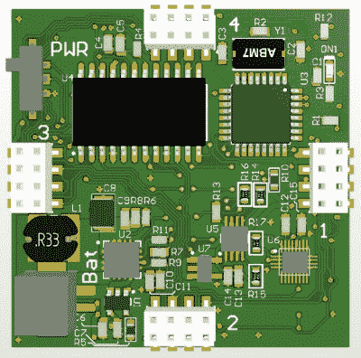

# 反抗是徒劳的，你想要这个 LED 立方体

> 原文：<https://hackaday.com/2019/04/26/resistance-is-futile-you-want-this-led-cube/>

在 Hackaday，我们喜欢好的桌面玩具，[所以来自[Jack Flynn]的 2019 年 Hackaday 奖参赛作品当然引起了我们的注意](https://hackaday.io/project/164202-led-cubular-led-desktop-cube)。这个想法是，通过使用专业制造的双层 PCB 和表面贴装元件，你可以创建一个立方体，每个面上都有一个 LED 矩阵，所有的电子器件隐藏在里面。我们不完全确定这种设备是否有任何实际应用，但我们知道无论如何我们肯定希望有一个疯狂闪烁的设备放在我们的货架上。

 在制造任何 PCB 之前，[杰克]在设计上花了相当多的心思，这样他就不会把自己画在角落里了(当然，当你在建造一个立方体时，这是八倍的糟糕)。通过将 PCB 文件导入 OnShape，他能够“组装”一个最终产品的虚拟表示，以更好地了解所有东西是如何装配在一起的。他希望限制立方体需要被拆开的次数，所以从如何将它放在 3D 打印的支架上，到放置分离式标签以确保内部电源开关可以接触到，一切都经过精心规划。

目前的设计将“大脑”放在底部的板上，每隔一个面板都有一个菊花链 MAX7219 来驱动它自己的 64 个 LED 矩阵。最初，ATmega328p 供电的立方体尺寸将为 42 x 42 x 42 毫米，共有 384 个发光二极管。最终，[杰克]希望这种设计的模块化特性可以增加立方体的尺寸，或者甚至呈现出完全不同的形状。

一般来说，我们看到的 [LED 立方体是更结实的种类](https://hackaday.com/2014/04/09/gaming-on-an-8x8x8-led-cube/)，所以当它们呈现像这样的固体形式时，就特别有趣了[。鉴于闪烁的 LED 小工具几乎普遍受欢迎，我们认为这个特定的项目非常适合从一次性黑客到商业产品的飞跃。](https://hackaday.com/2015/03/09/glowing-led-cubes-from-the-future/)

 [https://www.youtube.com/embed/d6ASvw7gp9M?version=3&rel=1&showsearch=0&showinfo=1&iv_load_policy=1&fs=1&hl=en-US&autohide=2&wmode=transparent](https://www.youtube.com/embed/d6ASvw7gp9M?version=3&rel=1&showsearch=0&showinfo=1&iv_load_policy=1&fs=1&hl=en-US&autohide=2&wmode=transparent)

The [HackadayPrize2019](https://prize.supplyframe.com) is Sponsored by:     