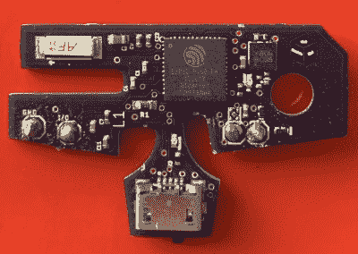

# ESP32 为 GameCube 控制器增加了蓝牙功能

> 原文：<https://hackaday.com/2019/04/29/esp32-adds-bluetooth-to-gamecube-controllers/>

虽然这可能不是最传统的设计，但毫无疑问，当任天堂在 2001 年向一个毫无防备的世界推出 GameCube 控制器时，它创造了一个真正特殊的东西。铁杆粉丝至今仍在使用当前一代任天堂游戏机的控制器，人们对在近 20 年的设计中添加 USB 支持等现代便利有相当大的兴趣。

一个特别有前途的项目是由 Nathan Reeves 创建的 BlueCubeMod。他开发了一种小型定制 PCB，可以安装到官方 GameCube 控制器中，将其变成蓝牙设备。你不得不为这个 mod 牺牲原来的电线和力反馈，但我们认为许多人会认为将这个标志性的控制器用于他们的电脑或手机是一个非常公平的交易。

PCB 上有一个 ESP32-PICO-D4，作为标准蓝牙 HID 控制器工作，最大限度地兼容现代系统。控制信号直接从控制器的原始 PCB 引出，只需两根导线，安装非常简单。想知道力量从何而来？由于隆隆电机无论如何都不支持，它被扔了，取而代之的是一块 700 毫安的电池，它可以为控制器供电长达 6 个小时。总的来说，这是一个非常干净的修改，[内森]相信即使是初学者也能做到，他最终计划将这个设计变成一个商业套件。

目前，如果你想将 BlueCubeMod 与任天堂 Switch 配合使用，你仍然需要一个接收器，但[Nathan]说他正在研究一种绕过这一要求的方法，可能会将 ESP32 替换为带有 CC256x 无线电的 STM32。他说，这将使他能够更直接地控制蓝牙通信，这将使他能够处理与开关直接对话的复杂问题。

当然， [GameCube 在](https://hackaday.com/2017/12/14/reverse-engineering-the-nintendo-wavebird/)的时候确实有一个官方的无线控制器。我们已经看到[对 WaveBird 进行了修改，使其能够与现代系统](https://hackaday.com/2019/04/13/mods-keep-the-wavebird-kicking-in-the-switch-era/)进行对话，但原始版本的外形更纤薄。

 [https://www.youtube.com/embed/VjbQIDX9GCQ?version=3&rel=1&showsearch=0&showinfo=1&iv_load_policy=1&fs=1&hl=en-US&autohide=2&wmode=transparent](https://www.youtube.com/embed/VjbQIDX9GCQ?version=3&rel=1&showsearch=0&showinfo=1&iv_load_policy=1&fs=1&hl=en-US&autohide=2&wmode=transparent)

The [HackadayPrize2019](https://prize.supplyframe.com) is Sponsored by:     