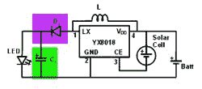

# 给你的太阳能花园灯一个变色 LED 升级

> 原文：<https://hackaday.com/2019/04/24/give-your-solar-garden-lights-a-color-changing-led-upgrade/>

白光 led 是改变照明世界的技术突破，现在它们无处不在。没有比一元店太阳能花园灯更好的迹象表明它们的成本效益无处不在:一个完整的单元集成了白色 LED 及其太阳能电池和电池存储。不满足于地面上无聊的白光，[Emily]决定用单色 led 和动态变色 led 的组合来改变它们的颜色，然后将它们挂在高处作为彩色的太阳能装饰品。

这些太阳能设备的核心是 YX8018 芯片(或其竞争对手之一。)当太阳照耀时，太阳能被引导给电池充电。一旦太阳能电池停止发电，大概是因为太阳下山了，芯片开始充当升压转换器(“焦耳窃贼”)，将单个电池的电压推高到足以驱动其白色 LED。将 LED 变为单色 LED 非常简单，但变色 LED 会增加一些挑战。升压转换器以脉冲形式提供电力，这种速度太快，人眼无法识别，但电力脉冲之间的时间足够长，可以使变色电路自行复位，永远不会超出其启动颜色。

 保持变色 LED 循环运行的方法是添加一个电容器来保留脉冲之间的一些电荷，并添加一个二极管来防止电荷回流到电路的其余部分。一个乒乓球充当光扩散器，整个东西用一个 [3D 打印的护套](https://www.thingiverse.com/thing:3553648)悬挂起来，增加了自己的色彩。

太阳能庭院灯是一个便宜又简单的电子黑客入门的好基础。我们已经看到它们[变成了 LED 投掷器](https://hackaday.com/2017/09/01/an-environmentally-conscious-solar-powered-throwie/)，变成了[可用的手电筒](https://hackaday.com/2013/10/12/hack-a-solar-garden-light-into-a-flashlight/)，甚至是[为 ATTiny 微控制器](https://hackaday.com/2019/04/20/dollar-store-garden-lights-as-attiny-power-supplies/)供电。

 [https://www.youtube.com/embed/7r94j3D5alQ?version=3&rel=1&showsearch=0&showinfo=1&iv_load_policy=1&fs=1&hl=en-US&autohide=2&wmode=transparent](https://www.youtube.com/embed/7r94j3D5alQ?version=3&rel=1&showsearch=0&showinfo=1&iv_load_policy=1&fs=1&hl=en-US&autohide=2&wmode=transparent)

