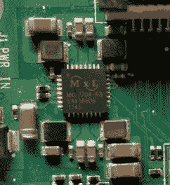

# 在树莓馅饼上短路不是个好主意；PMIC 故障正在调查中

> 原文：<https://hackaday.com/2019/06/12/shorting-pins-on-a-raspberry-pi-is-a-bad-idea-pmic-failures-under-investigation/>

你可能已经注意到了，我们是 Hackaday 的树莓派粉丝。几乎没有一天我们不在构建中的某个地方使用 Pi 的。尽管 pi 很有用，但它们也不是完全没有缺点。我们已经讨论了 PoE 帽子的问题，以及 T2 关于 T4 保持 SD 卡存活的文章。但一种新的故障模式已经出现，有时(但不总是)是由电路板上的两个电源轨短路引起的。

Pi 3 B+有[一个 MaxLinear 制造的新 PMIC](https://hackaday.com/2018/04/12/making-custom-silicon-for-the-latest-raspberry-pi/) (电源管理集成电路)。这款芯片 MxL7704 是 Raspberry Pi 基金会在不提高价格超过 35 美元的情况下成功升级 Pi 3 的重要因素。

快速浏览一下[Raspberry Pi 论坛](https://www.raspberrypi.org/forums/viewtopic.php?p=1438135)显示，一些用户在使用他们的新 Raspberry Pi 3 B+设备时遇到了一个特定的问题，电源 LED 将亮起，但设备无法启动。3v3 引脚上的电压为零。这是一个非常普遍的问题，甚至在[官方引导问题帖子](https://www.raspberrypi.org/forums/viewtopic.php?f=28&t=58151)中也有提及。

> 确保您正在测量的探针不会滑动，同时接触任何其他 GPIO 引脚，因为这可能会立即损坏您的 PI，特别是将 3V3 引脚短路到 5V 引脚将被证明是致命的。

## 来自高层的消息:我们正在努力

在亲身经历了这种故障模式后，我决定进行调查。我联系了 Raspberry Pi 基金会，得到了 Eben Upton 关于这个问题的直接回复。他证实，有一个已知的问题:短路树莓 Pi 3 B+的 5V 和 3V3 引脚将永久损坏 PMIC。当然，短路是一个用户错误，但由于我们中的许多人都遇到过这种错误，他们正在努力解决这个问题。

有趣的是，Eben 承认一些人在没有短路电源引脚的情况下经历过这种故障，但事实证明排除故障极其困难。他们正在寻找能够可靠地复制 3V3 故障而不仅仅是短路电源引脚的人。Eben 甚至说“我会让一个工程师飞到世界上任何地方去见一个能做这件事的人。”不难看出为什么这种故障模式如此难以追踪——你只能执行一次，然后损害就造成了。如果你碰巧有能帮上忙的信息，这是他们的联系方式。

## 此 PMIC 故障不可由用户维修

3V3 线路故障的官方解决方案是联系经销商并请求更换 Pi。MxL7704 被官方视为不可由用户自行维修的部件。这显然不足以阻止我们，所以我想我应该试着把坏芯片换成新的。

MxL7704 可以通过 Mouser 获得，所以我订购了一对，并尝试更换芯片。即使有一个热空气返工站，焊接 0.5 毫米间距的芯片对我来说太好了，我无法掌握这个项目。我与 Eben 讨论了这个问题，他提到 Mouser 的芯片实际上不是 Raspberry Pi 上的芯片的替代产品，并建议用一个正在工作的 Pi 3a+的芯片来替换该芯片。我不清楚是否有实际的芯片变化，或者差异是否都在 PMIC 的 i2c 编程中。

对于所有 Pi 3+用户，请小心不要不小心短路了新的 Raspberry Pis，因为它几乎肯定会损坏设备。如果你设法通过交换 PMIC 来恢复你的圆周率，一定要[让我们知道](https://hackaday.com/submit-a-tip/)！