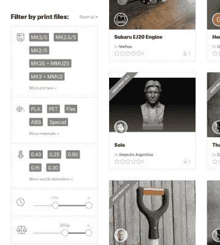

# Prusa 推出了他们自己的 3D 模型库

> 原文：<https://hackaday.com/2019/04/24/prusa-launches-their-own-3d-model-repository/>

如果你有一台 3D 打印机，你一定听说过 Thingiverse。自桌面 3D 打印出现以来，MakerBot 运营的网站一直是 3D 可打印模型的事实上的模型库，但多年来，它陷入了失修状态。由于过时和性能问题的困扰，社区中的许多人一直想知道 MakerBot 还会为保持正常运行支付多久的费用。替代品偶尔会出现，但迄今为止，没有一个能够积累足够大的用户群来提供任何形式的真正竞争。

Sorting models by print time and material required.

但这种情况可能很快会改变。[约瑟夫·průša]宣布为他的 3D 打印机拥有者建立一个全新的社区，其中包括一个全新的模型库。虽然很明显是面向普鲁萨 FDM 打印机的所有者的(对新的 SLA 打印机的支持将在以后推出)，但该存储库并不专属于他们。Prusa 的产品大受欢迎，加上知识库推出了由知名设计师创作的精选模型，这可能足以最终让 Thingiverse 物有所值。即使它只是说服 MakerBot 对他们自己的服务进行一些改进，这对社区来说也是一个胜利。

悲观主义者会说，Prusa 运行的模型数据库最终离 MakerBot 幕后操纵的数据库不远了；事实上，不依赖于特定 3D 打印机制造商的模型库将是理想的。但是考虑到[Josef]和他的同名公司所表现出的对开放开发的热情，我们愿意打赌，这个网站永远不会阻止其他打印机的所有者加入进来。

也就是说，知道你的存储库的用户和那些提供设计的用户有相同的打印机(或者至少是不同的)确实有它的好处。它允许一些巧妙的技巧，比如能够根据设计的估计打印时间对设计进行排序，甚至提供上传和下载预先切片的 GCode 文件来代替传统的 STL。事实上，[Josef]吹嘘说这是世界上唯一一个可以直接打印的 GCode 库，你可以把它放在 SD 卡上打印出来。

定期的 Hackaday [读者会知道，我们对 MakerBot 在过去几年](https://hackaday.com/2017/10/23/makerbot-really-wants-you-to-like-them-again/)所做的[决策相当不满](https://hackaday.com/2018/12/11/makerbot-moves-away-from-makers-with-new-printer/)，但是公平地说，在这方面我们并不孤单。社区迫切需要一个掌握在别人手中的可打印模型的存储库，坦白地说，我们对由(约瑟夫·průša)带头的想法感到兴奋。[他的打印机可能并不完美，当然也不便宜](https://hackaday.com/2018/10/22/a-close-look-at-the-prusa-i3-mk3/)，但它们肯定会给人留下深刻印象。希望这次最新的冒险也是如此。

 [https://www.youtube.com/embed/BoUcjSsE1Hw?version=3&rel=1&showsearch=0&showinfo=1&iv_load_policy=1&fs=1&hl=en-US&autohide=2&wmode=transparent](https://www.youtube.com/embed/BoUcjSsE1Hw?version=3&rel=1&showsearch=0&showinfo=1&iv_load_policy=1&fs=1&hl=en-US&autohide=2&wmode=transparent)

