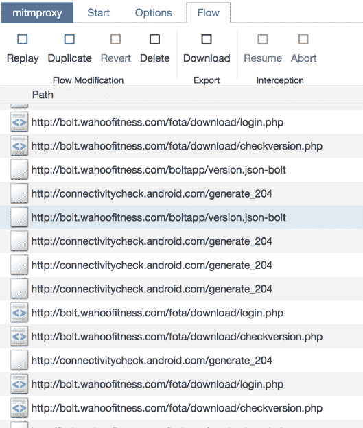

# 自行车电脑探索发现一个隐藏的机器人

> 原文：<https://hackaday.com/2019/04/29/bike-computer-exploration-uncovers-a-hidden-android/>

作为智能手机革命的一个令人高兴的副作用，世界上现在充斥着微型计算机，由于其组件的产量几乎深不可测，它们的价格低得令人难以置信。如果在它之前生产的数十亿部智能手机没有将单个组件的成本降低到几分钱，就不会有 10 美元的树莓派零度。这也意味着智能手机硬件，或者至少是非常接近它的系统，已经开始在一些意想不到的地方出现。

当[【约书亚·怀斯】最近拥有一台 Wahoo ELEMNT BOLT 自行车电脑](https://joshua0.dreamwidth.org/65779.html)时，他想知道它是如何工作的。凭借一系列令人印象深刻的功能，如互联网连接、GPS 地图和蓝牙低能耗支持，他推断这个口袋大小的设备必须有一些相当不错的硬件。经过一番戳戳，他发现这款设备由联发科 SoC 驱动，并且令人难以置信地在后台运行了完整的 Android 安装。

 那么，一个人如何发现他们低贱的自行车电脑本质上是一部巧妙伪装的智能手机呢？如果你是[约书亚]，当你在互联网上更新固件时，你会听它在和谁说话。他使用`mitmproxy`在他的互联网连接和专为 BOLT 设置的 WiFi 接入点之间运行，从那里，他能够看到它连接到的所有服务器。看到设备从联发科的服务器上下载一些数据，这是一个很好的迹象，表明设备内部实际上是谁的硬件，以及它最终何时下载了一些 Android。从 Wahoo 网站的 apk 文件中，可以清楚地看到在定制的用户界面下运行的是什么操作系统。

对 Bolt 软件的进一步检查暴露了一些令人困扰的问题。结果是固件大量使用了 Apache 许可的代码，但没有给出其归属。[Joshua]联系了该公司，最终被转给了火树公司的首席执行官 Chip Hawkins。令人耳目一新的是，Chip 不仅对解决许可问题非常感兴趣，甚至有一些关于入侵和修改设备的技巧，包括如何启用 ADB。

在这篇文章发表之前，我们联系了 Chip Hawkins(是的，他真的会回复邮件)征求意见，他告诉我们，他不仅确保了所有使用的开源包现在都正确地归属于它们的原作者，而且他的团队一直在向那些需要的人提供源代码和信息。他说，他很自豪地看到他的产品的所有者根据他们的特定需求对产品进行修改，并且他很高兴以任何方式尽可能地促进这一点。

开源许可合规性在黑客社区是一件大事，[我们已经看到站在 GPL 的错误一边会导致销售的损失](https://hackaday.com/2018/08/27/gpl-violations-cost-creality-a-us-distributor/)。很高兴看到 Wahoo 采取措施，确保他们遵守所有适用的许可证，但我们更深刻的印象是他们对客户探索和修改他们的产品的积极态度。如果更多的公司采取这种开明的方法来对付黑客攻击，我们都会过得更好。

【感谢罗曼的提示。]