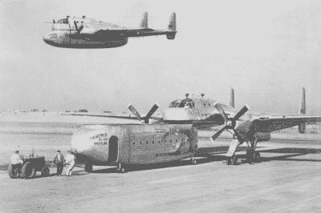

# Stratolaunch 在飞，但它能载货吗？

> 原文：<https://hackaday.com/2019/05/01/the-stratolaunch-is-flying-but-can-it-do-cargo/>

世界上最大的飞机正在飞行。Stratolaunch 升空进行测试飞行，其主要任务是在飞往太空的第一阶段将火箭带到 20，000 英尺的高空。但是 Stratolaunch 是一架非凡的飞机，独一无二，不同于以往建造的任何飞机。它可以把 250 吨重的重物举到空中，也可以把它再拉下来。

从最重要的角度来看，Stratolaunch 是有史以来最大的飞机。它的翼展是所有飞机中最大的，载货量也是所有飞机中最大的。在一个抓住有趣和新颖的航天方法的行业，如 rockoons 和一家公司的小型卫星发射器，该公司的首席技术官仍是大学三年级学生，Stratolaunch 具有意想不到的意义；这是一个位于云层之上的发射平台，可以准时将火箭送入轨道。

但是 Stratolaunch 远不止这些。这是一架简单存在就值得尊重的飞机。而且，像其他同类的安东诺夫安-225，云杉鹅，只有一个。即使它永远不会发射火箭，Stratolaunch 也将凭借其独特能力的简单本质而继续存在。但是这些能力是什么呢？Stratolaunch 有没有可能充当货机？答案比你想象的更有趣。

货运一直是航空业的支柱。第一批航空公司对乘客不感兴趣，航空邮件占据了大部分的清单。备受尊敬的“天空女王”747 飞机原本不是用来做客运的，而是用来运货的。货运是航空业最有趣的成就，历史证明了这一点。

## 货物集装箱

飞兆 C-119 是一种军用运输机，设计于战后时期，有一个有趣的任务。这架飞机的唯一目的是运送货物和现代战争中的机械化装备。建造了一千个左右，它们很好地发挥了作用。然而，在 C-119 生产后的几年里，航运业发生了翻天覆地的变化。集装箱化的兴起。码头工人不再把装满木箱的船卸下来，集装箱船开始驶进港口。这些船，今天仍然在造船厂看到，被设计成适合一个标准的 40 英尺集装箱。在工厂装上一个箱子，放在卡车上，开到港口，装上一艘船，几个星期后再反过来重复这个过程。这是现代航运的现实，但除了货机甲板上的标准托盘之外，这从未在航空业真正发生过。

The XC-120 Packplane featured a removable, standard cargo pod

XC-120 运输机是航空集装箱化的答案。这是一架标准的 C-119，经过高度改装，将整个货舱变成了一个很容易装上卡车的大集装箱。这个想法是可靠的，并且制造了一架飞机。这东西飞了起来，但它并不实用。XC-120 的货舱没有向前或向后打开的门，所以不可能把吉普车推进去。然而，这是一个每隔几年左右就会在航空界出现的想法。

## 诀窍不在于运送大量货物，而在于运送奇怪的货物

目前，全球最大的运营货机是安东诺夫 AN-225。它非常巨大，货舱甲板比莱特兄弟的第一次飞行还要长。如果你曾经想看看这架巨大飞机的内部，[积分的家伙有一份比我好得多的工作](https://thepointsguy.com/news/photo-tour-antonov-an-225-largest-aircraft/)。

安-225 建于 80 年代，有一个特定的目的:运载航天飞机。苏联的 Buran 宇宙飞船是对美国宇航局航天飞机轨道器的改进，如果你建造一架航天飞机，你将不得不移动它。NASA 通过改装一架 747 解决了这个问题。苏联人通过建造有史以来最大的飞机解决了这个问题。

“布伦计划”和苏联霸权的观念消失了，但是这架巨大的飞机继续存在。安东诺夫航空公司继承了这架飞机，他们做了任何人都会对一架不可思议的独一无二的飞机做的事情:他们把它租了出去。现在，如果你需要移动大的东西，你可以联系安东诺夫航空公司。他们随叫随到，可以搬运任何用船运需要很长时间的东西。

有了正确的货舱设计，Stratolaunch 可以做得很好。如果货物被简单地推入一个吊舱，就像 XC-120 Packplane 一样，Stratolaunch 可以携带沉重，难以运输，时间敏感的货物到全球各地的目的地。这不是一架明确设计用来发射火箭的飞机，它只是一架用来运载巨大货物的飞机。即使没有一次发射，Stratolaunch 在超大货运市场仍然是一种可行的飞机。

## 当然，运送货物到太空也算

Stratolaunch 的整个目的就是运载货物。在未来一年左右的时间里，将从空中发射几枚飞马座火箭，携带 370 公斤的重量到近地轨道。B-52 和 L-1011 运载飞机已经证明了这一点，飞马座火箭可能是从这种巨型飞机上发射的第一枚火箭。

之后，仍在设计阶段的更大的火箭将从平流层发射升空。有一种中型运载火箭将能够携带几乎十倍于此的东西到飞马座上空的近地轨道。一个有三个核心重型运载火箭将能够运载六吨重的物质进入轨道。最终将会有一架太空飞机，总有一天宇航员可以乘坐同温层发射装置首先跳跃到 20，000 英尺的高度到达国际空间站。

但是像 Stratolaunch 这样独特的飞机需要尊重。它可以做其他飞机做不到的事情，坐在地上也不赚钱。我们是否会看到一个绑在 Stratolaunch 上的集装箱装满奇怪和奇妙的货物是一个开放的问题，但无论如何，Stratolaunch 将很快升空，准备携带一些东西到某个地方。