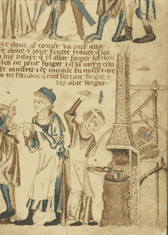
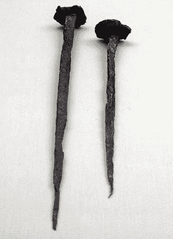
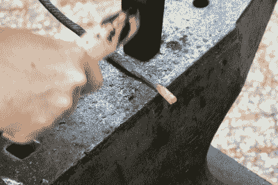
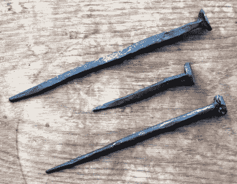

# 制作一枚中世纪的钉子

> 原文：<https://hackaday.com/2019/06/19/making-a-mediaeval-nail/>

如果出于某种原因，我承认中年的到来是不可避免的，并放弃硬件黑客社区，转而投身于更为平静的历史娱乐世界，我确切地知道我会加入哪一群狂热分子，以及我会专注于哪个时期。对我来说，尽管服装很酷，但不是摄政时期英格兰的豪宅或伦敦都铎王朝的皇家法庭的诱惑，而是我会直接前往 14 世纪和国王爱德华三世统治时期，扮演铁匠的妻子制作钉子。选择 1337 年似乎很合适，不是吗？

The woman blacksmith forging a nail depicted in the Holkham Bible. [British Library](https://www.bl.uk/learniimg/medieval/year/large2163.html) ([Public domain](https://www.bl.uk/collection-items/~/link.aspx?_id=ECD55B95AD4C4306809EAD127933643C&_z=z))

为什么我这么肯定？要回答这个问题，我必须带你去大英图书馆，翻开霍尔卡姆圣经。这是一本关于 1330 年前后的圣经故事的插图书籍，以其插图的广度和质量而闻名。所有中世纪的生活都在那里，用美丽的颜色清晰地观察，因为在圣经的场景中有当代人的图像，他们将居住在任何僧侣创造的世界里。其中最著名的一页引起了我的注意，因为它描绘了一个女人在经营一家铁匠铺的时候，在她的衣服外面穿着一件铁匠的围裙。她是一个铁匠的妻子，她正在锻造一个中世纪的木匠的钉子。历史学家告诉我们，这是一项被视为女性工作的活动，因为钉十字架所用的钉子被认为是由一个女人锻造的，因此她被描绘成一个丑陋的老太婆。谢了，无名中古僧，你*真的*不想知道这个女铁匠会怎么画*你*！

这张照片及其背后的历史多年来一直吸引着我，以至于直到最近我还看过不少七个世纪前的金属紧固件，尽管我从未尝试过自己制作，但在 Hack42 度过周末并有一个便携式铁匠铺来玩它似乎是做指甲的合适时机。

## 钉子的简史

第一批钉子完全由一块熟铁棒手工锻造成约 6 英寸(150 毫米)长的尖头，钉头由手工锤平一块未加工的原材制成。这些是霍尔卡姆铁匠制作的钉子，也是我感兴趣的。有特殊的模具来形成钉头，钉尖插入其中，这样钉头可以被锤平，但是也可以用一点技巧将钉头锤平在铁砧的边缘上。

A pair of Roman nails, part of an exhibit in the British Museum.

从罗马时代到 17 世纪第一台制钉机器出现，钉子的形状几乎没有变化。即使在那时，第一台机器的设计只是为了加快这些传统钉子的生产，成品与其前身非常相似。大约在 18 世纪末，第一个明显不同的钉子出现了，这就是切割钉子，之所以这样叫是因为它是从一片金属上切割下来的锥形片。这些保留了手工锻造的老式钉子的四面锥形，但看起来更加统一。现代的圆形铁丝钉出现在 19 世纪下半叶，因为它可以由自动化机器制造，所以它很快取代了切割钉。

从某种意义上来说，很难在 21 世纪正确地复制古老的手工锻造钉子，因为缺少制作它们的熟铁，但是我可以制作的钢钉在功能上是等同的，即使它需要更多的努力来锻造。锻造一枚中世纪的钉子毫无意义，但如果这是唯一的标准，我怀疑我们在 Hackaday 上展示的一半令人敬畏的东西将永远不会被公之于众。因此，拿起一块钢筋，是时候走向铁砧，让这个意想不到的项目一试身手了。

## 制作钉子

Forming against the edge of the anvil the “slug” of metal that will become the head of the nail. Photo: © [Martina Short](https://twitter.com/martina_photos), used here with permission.

想法是拿一块钢筋，将其锻造成直径约为其一半的锥形点，然后在锥形部分开始处上方约 10 mm 至 20 mm 处将其切断。由此产生的金属“块”可以被锤平形成钉头，结果应该是一个可用的钉子。

画出锥形点是一个非常简单的过程，在所有方面锤平等，不应该扣留任何史密斯很长时间。我试了一个圆尖的和两个方尖的，有人告诉我方尖的更好。相比之下，头部没有那么直截了当，在我制作的三个中，我没有成功地完全形成任何我最初希望独自在铁砧边缘形成的方式。

My three nails, of varying competence.

这个想法是，我应该能够把我的“金属块”放在我的圆锥的厚端，把它靠在铁砧的边缘，以一定的角度锤击它，同时不断转动它，使它变平。在实践中，我要么没有破解的方法举行对砧或我打在错误的角度，我不得不完成它在腿虎钳，我可以直接锤下来。中世纪的女士没有腿副，所以我失败了。另一种制作头部的尝试是将金属块展平成抹刀状，然后弯成直角，再前后折叠成头部。成功了，但不是真正的中世纪的钉子是怎么做的。

因此，我以前从未做过钉子，所以我能够学习一些技术，并相对容易地敲出一些来。这不是真正的钉子，但我越来越接近了。如果有一个地方我做错了，那就是霍尔卡姆圣经中的女士会轻而易举地击败我。这些钉子中的每一个都花了我 15 分钟到 20 分钟来制作，而她一分钟就能敲出一个。也许我终究没有达到历史娱乐的标准。

标题图片:Martina Short，经允许在此使用。