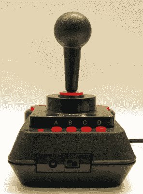

# 自准将时代结束以来的 25 年

> 原文：<https://hackaday.com/2019/05/02/twenty-five-years-since-the-end-of-commodore/>

本周是国际准将公司倒闭 25 周年纪念日。这个周末，为我们逝去的兄弟倒一杯。

1954 年，准将作为一个公司实体成立，由杰克·特拉梅尔领导。特拉米尔是大屠杀的幸存者，战后他搬到了纽约，在那里他成了一名出租车司机。这份工作让他在布朗克斯创建了一家打字机修理店。想要为他的事业取一个“军事风格”的名字，而“海军上将”和“将军”这两个名字已经有人取了，再加上“上尉”只是一个糟糕的名字，特拉梅尔选择了准将军衔。

后来，与捷克斯洛伐克的一家打字机制造商签订了协议，为北美市场组装打字机，于是 Commodore 商用机器公司诞生了。当然，没有人会关心 Commodore 的这段历史，就像很少有人会关心一家制造文件柜的公司一样。在电子业务方面，准将制造数字计算器。1975 年，Commodore 收购了生产这些计算器芯片的 MOS 公司。这次对 MOS 的收购让查克·佩德尔成为了准将的工程主管。计算器变成了电脑，我们熟知并热爱的准将诞生了。

## 我们记得的准将

正如我们今天所知，Commodore 始于 1977 年，当时推出了个人电子交易机 PET，有人认为这是第一台公开的个人电脑。这是佩德尔的发明，特拉梅尔相信，从现在开始，Commodore 将成为一家电脑公司。PET 的发布紧接着 VIC-20 的发布，接着 Commodore 64 的发布。C64 发布后，Commodore 售出的电脑数量超过了业内其他公司的总和。尽管苹果现在获得了所有的尊重——就市值、市场份额和垂直整合的物流而言是合理的尊重——但 Commodore 是第一个。准将*应该是*有史以来最有影响力的科技公司。尽管如此，人就是人，[所以这里是我对那个](https://www.youtube.com/watch?v=4zx3huaqrm4)的想法。

The resurgence of Commodore, in the C64 Direct-to-TV

到了 20 世纪 80 年代末，鲨鱼开始蠢蠢欲动，Commodore 的 Amiga 如今被视为当今图形处理能力最强的计算机，却被消费者视为玩具。IBM 兼容的个人电脑占领了市场，1994 年 4 月 29 日，Commodore 不复存在。死去的可能永远不会死去，而 Commodore 商标(最终)被卖给了 [Escom](https://en.wikipedia.org/wiki/Escom_(computer_company)) ，后者后来倒闭了，然后又被卖给了郁金香电脑，后者后来倒闭了。

《准将的最后一天》的决定性文件是戴夫·海尼在 1994 年 4 月 30 日拍摄的工厂录像。这段视频拍摄于宾夕法尼亚州西切斯特的 Commodore Amiga 工厂，就在机场附近。几年后，这座建筑将成为 QVC 的工作室，这个家庭购物网不是家庭购物网。

历史充满了奇怪的巧合，多年以后，准将会在同一栋建筑里看到某种现代的重生。Jeri Ellsworth 创造的 C64 Direct-to-TV 将成为当前“复古仿真”游戏机潮流中最畅销的设备之一，如 NES 经典、PS1 迷你和其他迎合渴望购买的公众怀旧情绪的消费设备。C64 Direct-to-TV 的存在归功于 QVC，他买下了整个第一次生产运行，并在曾经容纳 Amiga 装配线的建筑中向世界广播。历史充满了奇怪的巧合。

鸡嘴唇本周流了一滴眼泪，但死去的可能永远不会死去。