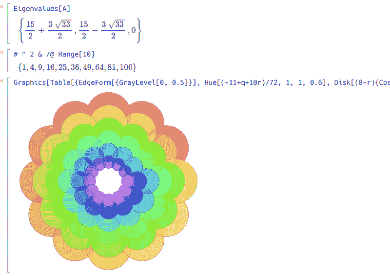

# 当你不是麻省理工学院的看门人时，如何做难的数学

> 原文：<https://hackaday.com/2019/05/11/mathics-how-to-do-hard-math-when-youre-not-an-mit-janitor/>

代数是许多学生的克星，但当涉及到电子学时，它却出奇地有用。当然，你可以记住所有的排列，比如欧姆定律。但是，如果你能记住一种形式，并快速推断出其他形式，那就更好了。

正如我们的老代数老师过去常说的那样，在很多情况下，你需要用你知道的东西去获得你不知道的东西。黄金标准当然是一个叫做 Mathematica 的计算机程序。对于家庭和学生使用，该软件“仅”约 160-600 美元，但商业版本从约 1000 美元到近 8000 美元不等。当然，也有免费的替代品，我们今天看到的是 [Mathics](https://mathics.github.io/) 。它可以在你的浏览器中运行，也可以作为 Python 支持的桌面应用程序运行，而且是免费的。

这个程序在显示数学公式方面做得很好，你可以通过访问在线版本来了解它的威力。如果你点击右上角的问号并向下寻找第四个项目，就会有例子。还有一个独立版本的[在线帮助](https://mathics.angusgriffith.com/doc/)。

[](https://hackaday.com/wp-content/uploads/2019/05/math.png)

我们确实遇到了一些画廊示例超时的小麻烦，以及站点证书过期的问题。我们也很难记住很久以前上过的线性代数课！如果你想要简单的玩法，试试这个:

```
Solve[4x+3==20,x]
```

不要忘记在浏览器中按 Shift+Enter 来获取解决方案。

在引擎盖下，MathJax 和 SymPy 做了许多繁重的工作。事实上，我们想象这个项目的很多目标用户最终会使用内置 Python 的 Jupyter 笔记本。当然，库存树莓 Pi 的上也有 [Wolfram 软件的拷贝。](https://hackaday.com/2013/11/24/mathematica-and-wolfram-on-the-raspberry-pi/)