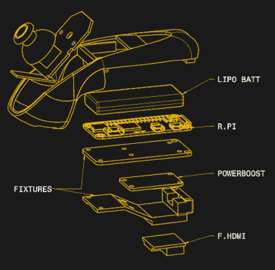

# Wii 双截棍得到一个内置的树莓派零

> 原文：<https://hackaday.com/2019/05/13/wii-nunchuk-gets-a-built-in-raspberry-pi-zero/>

Wii 控制器很可能会作为黑客最喜欢的再利用输入设备而被载入史册，毫无疑问，就 Linux 单板计算机而言，Raspberry Pi 是社区的首选。因此，有人最终给我们提供了黑客社区应得的交叉插曲，这一点也不奇怪:任天堂的动作感应“双节棍”中的[皮丘克，一个 Pi Zero *。*](https://www.thingiverse.com/thing:3597240)

 圆周率零点很小，但不是*那么小。诀窍在于，双节棍的外壳通过新的 3D 打印下半部分得到了扩展。*

也不仅仅是一个 Pi 零点。[键帽]已经设法偷偷放入了 750 mAh 的 LiPo 和 Adafruit Powerboost，使该设备成为一个完全独立的系统。有趣的是，最初的 nunchuk PCB 或多或少保持原样，只有几根电线连接到 Pi 的 GPIO 端口，因此它可以读取 I2C 的按钮和操纵杆状态。

我们知道你想知道为什么[键帽]要费这么大的劲在底部打开 HDMI 端口。事实证明，PiChuk 正被用于驱动 Vufine 可穿戴显示器；想想谷歌眼镜，但没有内置的计算能力。就可穿戴计算机而言，控制器的模拟操纵杆和运动感应能力应该是一种非常自然的输入方案。

因此，PiChuk 不仅可以为你的下一个项目提供一个令人敬畏的无线输入设备，它实际上是进入基于 Pi 的可穿戴计算设备长系列的一个非常强大的入口。通常这些包括[一个独特的谷歌眼镜显示屏](https://hackaday.com/2017/08/03/hackaday-prize-entry-pi-driven-google-glass/)的 DIY 版本，但是卸载到一个商业版本肯定容易得多。