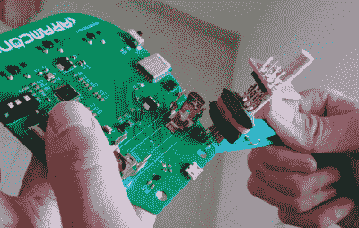

# 以下是制作会议徽章的难度

> 原文：<https://hackaday.com/2019/05/18/heres-how-hard-it-is-to-produce-a-conference-badge/>

制作活动徽章是一项艰巨的工作。制作一个原型徽章已经够难的了，但在预算紧张、活动截止日期和预期参与者日益逼近的情况下，采购组件和协调数百个徽章的制造的整个过程是一项艰巨的任务。

[Uri Shaked]是一个带着制作活动徽章的伤疤的人，他写了一篇关于他经历的精彩描述。该会议是在以色列举行的私人技术活动 Aramcon 2019，该徽章有一个 nRF52840 驱动电子墨水显示器、多色 LED 和音频编解码器，以及一组全尺寸键盘按键作为用户输入。由于 nRF 芯片支持网状网络，这个想法是为了生产一个能够在整个活动中传输音频的徽章。

A clothes-pin as a programming jig, we like it!

我们跟随团队经历了几个月令人焦虑的原型板、最后一刻电缆接头的反向连接器、原来不太兼容的兼容部件以及错误的足迹，并看到他们到达一个工作正常的徽章，但没有他们希望的音频。在这个过程中，他们提出了一个基于衣服别针的编程夹具，如果他们自己报道的话，它肯定值得自己的 Hackaday 撰写。通过将整个礼堂的徽章 led 变成黄色来展示网状网络是他们的奖励，我们可以看到他们制作了一个非常值得称赞的徽章。我们特别喜欢键盘按键开关的使用，我们赞扬他们在活动结束后为徽章规划生活。

我们的 Hackaday 同事[Brian Benchoff]是徽章制作的资深人士，请阅读他撰写的关于[我们的 Superconference 2017 徽章](https://hackaday.com/2017/11/15/the-perils-of-developing-the-hackaday-superconference-badge/)和[Tindie dog 徽章](https://hackaday.com/2017/07/27/building-a-def-con-badge-in-two-weeks/)的起源的文章。与此同时，眼尖的人可能会认为 nRF52840 是最新一代碎料板的核心[。](https://hackaday.com/2018/02/13/particle-introduces-new-hardware-adds-mesh-support/)