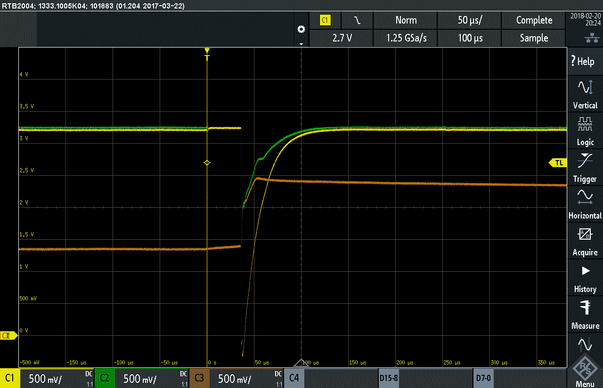

# 射频产品的模拟故障导致生产意外

> 原文：<https://hackaday.com/2019/05/13/analog-failures-on-rf-product-cause-production-surprise/>

工厂是一台机器。它需要一组固定的输入——电路板、塑料外壳、乐观主义——并以组装产品的形式产生一组固定的输出。有时它是由真实的机器组成的(见任何特斯拉装配线的最新视频)，但更多时候它是机械机器和多肉人类一起工作的混合物。不管精确的平衡如何，工厂机器是由生产工程师构思的，并且与产品的其余部分一样经历相同的设计、迭代、抛光周期(从这个意义上说，产品开发有点分形)。去年[【迈克尔·奥斯曼】遇到了一个令人惊讶的生产问题](https://greatscottgadgets.com/2018/02-28-we-fixed-the-glitch/)，这既是一个令人毛骨悚然的关于讨厌的硬件缺陷的故事，也是一个对制造业是多么脆弱的巨大提醒。这与[今年的投产主题](https://hackaday.com/2019/04/03/2019-hackaday-prize-begins-right-now/)非常契合。

Surprise VCC glitching causing CPU reset

故事从[迈克尔]收到工厂的紧急消息开始，说一种已经生产多年的现有产品故障率很高，他们已经停止了生产线。很少有比这更糟糕的消息了！问题显然是“编程失败”, Great Scott Gadgets 立即向制造商索取样品进行调试。接下来是一个精心描述的非常有教育意义的地狱调试会议，包括逆向工程 rom，探测错误的电压轨和大样本量。[Michael]我们不知道隔离需要多长时间，但考虑到根本原因是多么微小，我们敢打赌这需要很长很长的时间。

这篇文章是调试令人讨厌的硬件故障的典范，但我们想提醒大家注意隐藏在文章末尾的第二个根本原因。让制造商停下脚步的与其说是硬件问题，不如说是已经暴露出来的工艺问题。事实证明，*漏洞总是在大约 3%的设备中*重现，但工厂从未提及。为什么？我们怀疑[迈克尔]的猜测是正确的。碰巧执行失败步骤的操作员在几年前就发现了一个变通办法，并透明地消除了故障。然后是人员变动，新的操作员开始标记故障，而不是修复它。可以说这是一直以来都应该发生的事情，但是在这个过程中的一个小角落，制造过程出现了轻微的偏差。更多色彩，请查看《安培小时》 第 440.2 集，听听【克里斯·甘梅尔】和【迈克尔】谈论它。这是一个很好的提醒，一个产品的可靠性取决于构建它的过程，而这个过程并不总是像它看起来那样可靠。