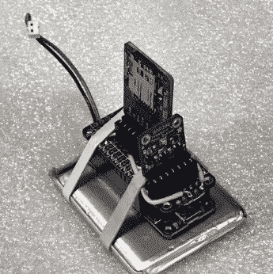

# 经典水火箭的现代演变

> 原文：<https://hackaday.com/2019/05/22/modern-evolution-of-the-classic-water-rocket/>

无论它是从碎片中自制的，还是多年来涌现的各种商业版本之一，普通黑客读者都有很大的机会至少花几个更具形成性的夏天来飞行水火箭。当时你可能没有意识到这一点，但是衬衫湿透了，头伸向天空，你上了一堂实用的物理课，比教科书上的任何东西都更有关联。对于年轻人来说，水火箭是一个很棒的 STEM 工具，但是在后堡垒之夜时代，这个想法可以用一点现代化来帮助孩子们保持参与。

 随着他进入 2019 年 Hackaday 奖，[【Darian Johnson】希望给这个经典的物理玩具](https://hackaday.io/project/165324-water-bottle-rocket-science-kit)注入一些新的生命。他的开源工具包将提供一个模块化的水火箭，由于各种有效载荷和升级选项，适用于各种年龄。年轻的玩家将满足于简单地看到它起飞，但高中生可以给飞行器配备电子有效载荷来捕捉性能数据或自动降落伞。

[Darian]多年来一直和他自己的孩子以及社区里的其他年轻人一起制造和飞行火箭，并发现它们非常成功。它们变得如此受欢迎，以至于他开始想办法不大量生产它们，而是让它们变得更强，这样它们就能经受更多的飞行。

当然，机身很简单；你可以回收的一公升的瓶子并不缺乏。但是对于鼻锥，鳍，最终甚至是发射台，[Darian]转向了 3D 打印。这使他能够不断优化设计，同时提供可重复的性能。当他手上有一个半可打印的水火箭时，他开始想知道是否可以通过在组合中添加一些电子设备来引起大孩子的兴趣。

他目前的概念验证是一个飞行数据记录器，使用 ada fruit NRF 52 blue fruit LE Feather、BMP280 传感器通过气压确定高度，以及用于本地数据存储的 SD 卡突破。从长远来看，[Darian]希望能够通过蓝牙将飞行数据传输到学生的手机上，SD 卡提供本地副本，可以在飞行后进行分析。

[Darian]非常依赖开源社区来获得他的水火箭工具包的各种组件，并致力于回馈社会。他希望他的最终工具包将允许社区以很少甚至没有成本的方式创建引人入胜的 STEM 活动。这包括创建一个教案和其他实验水火箭的人贡献的设计的储存库。这是一个崇高的目标，我们很高兴看到项目的进展。

The [HackadayPrize2019](https://prize.supplyframe.com) is Sponsored by:     