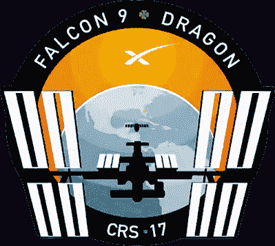
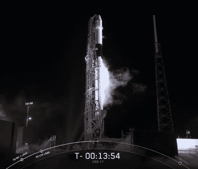
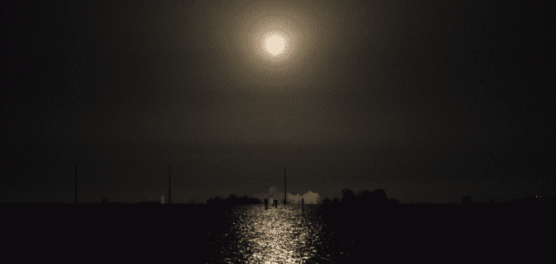
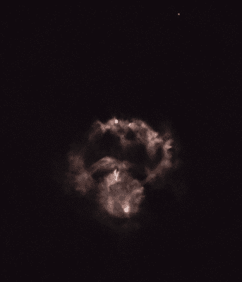
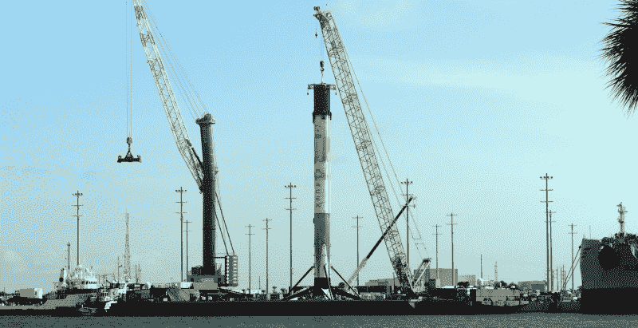

# 往返:猎鹰 9 号发射故事

> 原文：<https://hackaday.com/2019/05/28/there-and-back-again-a-falcon-9-launch-story/>

诚然，我并不以保持特别规律的时间而闻名，但即使是我也对这个计划有所怀疑。我们会在午夜睡觉，凌晨 3 点醒来，漫无目的地沿着海岸行驶，然后转身参加一整天的活动，在活动中我们必须保持至少一些专业的外表。这是一个坏主意，甚至是可怕的。但在晚上 11:30，我和供应帧摄像师托马斯(Thomas)坐在一个华夫饼屋中，非常危险地接近签字同意。

 官方消息，我们是去那里报道在肯尼迪航天中心举行的[康乃尔杯决赛的，但碰巧的是，我们到达佛罗里达州的时间正好与太空探索技术公司最新的国际空间站补给任务 CRS-17 的发射时间吻合。严格来说这不属于我们的任务。但是说真的，我们有什么选择呢？](https://hackaday.com/2019/05/15/2019-cornell-cup-winners-include-autonomous-boat-flapping-uav-and-leaping-rover/)

即使我们各自的老板不认为这是一个浪费的机会，我们也必须考虑当地人。我们在这里的几个小时里，似乎所有人都想谈论这次发射。从机场班车司机到给我们端来土豆煎饼的女服务员，每个人都提醒我们，火箭很快就要起飞了。如果我们不去，那么到了周五下午，我们将是卡纳维拉尔角唯一没有个人经历的人。种种迹象表明，这是佛罗里达州中部不可原谅的文化失礼。

当然，事情的真相是，我们实际上不需要任何令人信服的理由来进行这次冒险。我们非常幸运地在肯尼迪航天中心附近发现了自己，就在几个小时前，他们将发射一枚火箭，轰隆隆地进入黑暗中，我们不可能就这么睡着了。不，在这件事上没有任何选择。我们要走了。

## 星期五凌晨 2:30

当床边的警报响起时，我确信这是一个错误。几分钟后，我的电话响了，事情开始变得清晰起来。职业精神，土豆煎饼，火箭。发射定在凌晨 3 点 11 分，时间不多了。

在完全投入意识之前，我查看了手机上的天气。据我们所知，只有 40%的机会可以在天气足够晴朗的情况下飞行；我承认，我内心有一部分希望，在我们睡觉的时候，威胁卡纳维拉尔角的离岸风暴已经决定向内陆移动。相反，[SpaceX 的侦探在 reddit 上报告说](https://www.reddit.com/r/spacex/comments/bkie6w/rspacex_crs17_official_launch_discussion_updates/)天气不再是一个问题，发射准备工作已经开始。那就裤子吧。

当我下去的时候，托马斯已经拿着他的视频设备在大厅里等着了，消除了我对他对这次探险的承诺的任何怀疑。他很兴奋，因为一个当地人告诉了他去一个地方的方向，这个地方可以让我们清楚地看到发射台。那些方向是模糊的；我们只需要在这条路上开一会儿，直到我们看到其他车，然后在沙滩上停下来。对我来说，这听起来很像《拯救世界》的开场，但我没有更好的主意，所以我们钻进车里开始开车。

事后看来，我不得不承认方向是正确的。正如我所承诺的，当我们到达香蕉河上的桥顶后，就不会错过聚集在一小片沼泽地上的刹车灯。我们把车停在路边，托马斯开始安装他的相机，为已经点缀在海岸线上的柔和发光的液晶显示器添加了一条线。

Game Over.

离发射还有大约 15 分钟，我拿出手机，开始播放 SpaceX 的 YouTube 直播。我的眼睛在我自己柔和发光的液晶显示器和地平线上的发射台之间交替，当我看到屏幕上的计时器停在 13:54，然后跳回到 15:00 时，我的心沉了下来。

在正常情况下，延迟几分钟没什么大不了的。但是当猎鹰向国际空间站前进时，实际的发射时刻必须精确到秒，这样龙飞船才能赶上它。

顺便提一下，我记得有人(可能是埃隆·马斯克本人)曾经评论说，这并不完全准确，因为猎鹰 9 号和龙号之间有足够的推进剂储备，可以补偿非最佳的发射。但这将涉及到在最后一刻绘制新的路线，这是美国宇航局出于过度谨慎不想做的事情之一。因为他们是买单的人，所以我们只剩下这个所谓的“瞬时”发射窗口。

离 YouTube 上的评论员正式宣布发射取消还有一两分钟，但当我看到倒计时器出现故障时，我已经告诉托马斯收拾好他的装备。大约在观看发射的大多数人意识到发生了什么的同时，我们正在往回行驶。下一个即时发布窗口离现在不到 24 小时，在此期间，我们有采访要进行。

## 星期六凌晨 2 点

在熬夜和早起之间有一条界限，很明显是在凌晨三点左右。轨道力学的细微差别意味着第二次发射尝试将发生在凌晨 2 点 48 分，这似乎是一个足够合理的时间，我们没有试图事先睡觉。再加上我们已经确切知道去哪里，我们到达海滩时还有很多时间。

随着 YouTube 流再次在背景中运行，我们的眼睛和取景器牢牢地盯着远处的聚光灯。我预计视频流和实际事件之间会有一定程度的延迟，所以我提醒托马斯在倒计时到达 T-10 秒之前开始录制。事实证明，延迟接近只有一两秒，并在我们观看时为我们提供了近乎实时的评论。

在离发射台几乎 12 英里的地方，看到火箭本身基本上是不可能的。但显然不难看出发生了什么。当九个梅林引擎点火时，从火焰沟中排出的废气创造了一个沿着地平线扩展的发光云。几秒钟后，起初移动缓慢的火箭升到了排气云上方，缓缓升入天空。夜晚突然看起来更像黄昏，因为快速加速的火球投下了难以置信的明亮光芒，反射到我们面前的水面上。

在这之前，一切都是在沉默中发生的。在这个范围内，声音到达我们的位置需要整整一分钟。我听说航天飞机的轰鸣声即使在这个距离也相当大，但这肯定不是我在猎鹰 9 号上的经历。这声音更像是远处隆隆的雷声，只持续了 30 秒左右，我们又一次静静地看着。

火箭正在快速爬升，离我们远去。穿过大气层时，它短暂地留下了一条发光的轨迹。随着周围的大气压力迅速下降，发动机的排气羽流开始膨胀，变得更加透明。我从观看我的发射视频中知道这一点，但在那里，我被飞船后面巨大的闪闪发光的云所震惊。从我的角度来看，这个纤细的气体球似乎和月亮一样大。

Moments after stage separation.

突然，云破裂并分离，我们可以清楚地看到单独的发光物体相互远离。我担心最坏的情况，我的脑海里立刻回想起挑战者号航天飞机在起飞后不久爆炸的画面。但几秒钟后，直播画面上的解说就清楚了:我们刚刚目睹了舞台分离。以前是一个飞行器穿越高层大气，现在是两个独立的飞行器，有各自的轨道和任务。

第一级的飞行路线显然发生了根本性的变化，因为它翻转过来，逆着飞行方向启动引擎，以降低一些速度。从地面上看，它似乎在垂直移动，而第二级继续远离我们。尽管现场直播显示此时的高度超过 150 公里，第二级仍然可以清楚地看到天空中一颗炽热的恒星。

现在，所有的注意力都转向了即将返回地球的第一阶段。它已经有几分钟没有发动引擎了，我们都不知道该往哪里看。当它咆哮着起死回生时，我们措手不及；它似乎比我们预期的要近得多，也低得多。当火箭下降到佛罗里达海岸附近的驳船上时，就像在反向观看发射一样。

从我们的有利位置，我们看不到着陆的时刻，但我们确实获得了安慰奖。在直播宣布成功降落在无人驾驶飞船上的几秒钟后*当然，我仍然爱你*在雷鸣般的掌声中，我们体验了在 YouTube 上观看发射时从未有过的东西:双重音爆的雷鸣般的破裂声，预示着一个大型物体撕裂大气层。猎鹰回家了。

 [https://www.youtube.com/embed/XcT4SJYMgw0?version=3&rel=1&showsearch=0&showinfo=1&iv_load_policy=1&fs=1&hl=en-US&autohide=2&wmode=transparent](https://www.youtube.com/embed/XcT4SJYMgw0?version=3&rel=1&showsearch=0&showinfo=1&iv_load_policy=1&fs=1&hl=en-US&autohide=2&wmode=transparent)

## 周日上午 9 点

由于要进行一次越野旅行，托马斯周日一早就出发了。但是，由于我和家之间沿东海岸向上飞行只有两个小时，我决定在太空海岸多探索一会儿；你很快就会在这几页看到它的成果。当我急于回到肯尼迪航天中心时，我需要先停一下。昨晚，“猎鹰 9 号”着陆后的第一级已经登上*当然，我仍然爱你*进入卡纳维拉尔港，现在在白天，它胜利地耸立在过往的拖船和货船上。

站在我面前的正是我花了 48 小时在佛罗里达沼泽地追逐的那枚火箭。在一个周末的时间里，我经历了一次失败的发射带来的极度失望，以及一次成功发射带来的愤怒和愤怒，但这两种感觉都比不上这次。看到工人们在它的着陆腿上飞来飞去，我真正理解了我从远处看到的巨大规模。这辆车，像高层建筑一样高，刚刚飞向太空并返回；经过一番翻新后，它还会再来一次。

在你的生活中，很少有时刻你可以诚实地说你正在看着历史的形成，对我来说，这就是其中之一。在看了它的运行后，我不再怀疑这是未来事物的形状；我迫不及待地想知道接下来会发生什么。