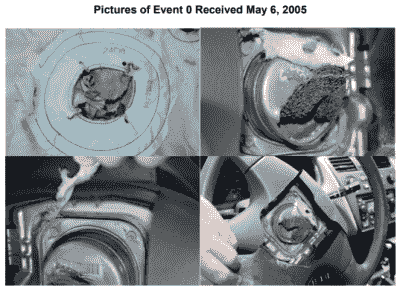
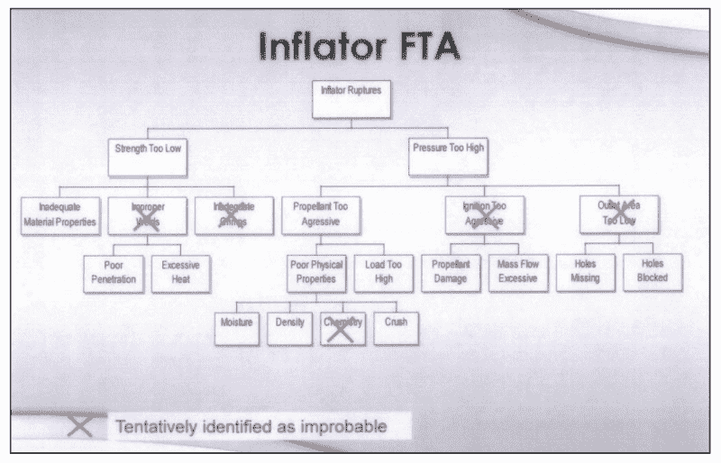
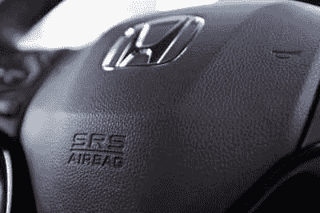

# 高田的致命安全气囊:一个工程杂品

> 原文：<https://hackaday.com/2019/06/10/takatas-deadly-airbags-an-engineering-omnishambles/>

工程师暂时只是人。这更适用于高管，以及构成现代组织的所有其他人。自然，错误是会犯的。有些是次要的，有些则不那么重要。众所周知，问题最好尽早得到解决，然而，人们常常希望问题会自动消失而忽视它们。

你可能在过去几年的新闻中听说过 Takata 这个名字。如果这个名字听起来没什么印象，你可能听说过最近有一次安全气囊汽车的大规模召回。这背后的故事是一个导致多人死亡、数十人受伤、10 亿美元罚款和一家大型汽车供应商倒闭的决定。

## 成本节约导致气囊故障、伤害和人员伤亡

高田公司于 1988 年开始制造安全气囊，最初使用叠氮化钠作为推进剂。这很难安全处理，因此在 20 世纪 90 年代，生产转向四唑，一种更安全的替代品。然而，这样做的代价很高，所以人们开始研究寻找替代方案。

高田公司决定改用硝酸铵作为推进剂。在炎热和潮湿的条件下容易发生故障，它会变得不稳定，导致安全气囊模块爆炸，而不是在碰撞中安全充气。在这些情况下，安全气囊点火器外壳可能会破裂，金属碎片会喷向整个车辆。这可能导致车内乘客严重受伤甚至死亡。

硝酸铵的性质是众所周知的；由于其稳定性问题，其他安全气囊制造商早就排除了它的使用。[20 世纪 90 年代末，工程师警告说，这种材料的应用是不安全的，](https://www.9news.com.au/national/takata-airbag-recall-whistleblowers-knew-about-deadly-scandal-decades-ago/15075f8a-1bd3-4cd9-a71f-06666238ae10)早在相关部件被安装到汽车上之前。尽管如此，高田公司还是稳步前进，赢得了主要汽车制造商的合同。随着时间的推移，数百万个装有硝酸铵推进剂的安全气囊被安装在世界各地的汽车上，定时炸弹开始滴答作响。

## 零号事件仅仅是个开始

高田安全气囊第一次破裂是在 2004 年 5 月，发生在阿拉巴马州的一辆 2002 年款汽车上。[根据 2016 年 NHTSA 报道](https://www.nhtsa.gov/sites/nhtsa.dot.gov/files/documents/takata_report_internal_investigation.pdf)，高田在 2005 年首次被告知此事。一个月后，高田公司的一名工程师根据有限的数据给出了他们的结论。

Photos from Event 0, the first noted case of a Takata airbag rupture. Source: NHTSA report

根据事后的照片，充气机内部有明显的锈迹，这似乎是在安全气囊点火之前就存在的。问题的原因似乎是由于推进剂引起的过压，而不是充气机外壳材料的强度低于标准。经过进一步研究，Takata 得出结论，问题可能是由于安全气囊组件密封不当造成的，因此没有采取进一步措施。

直到 2007 年，高田才得知更多危险的安全气囊故障。到这个时候，全世界已经有数百万个安全气囊安装在汽车上，其中包括危险的充气机。高田公司加大了对缺陷的研究，寻找问题的根源。这包括重点调查推进剂密度，以及探索是否存在安全气囊组件密封不良的问题。2009 年 8 月，该公司仍然没有找到故障的具体原因，并寻求两家独立的外部公司 Fraunhofer 和 BakerRisk 的帮助来调查问题。

A Fault Tree Analysis document from within Takata shows that the investigation ruled out a fundamental chemistry issue early in the investigation. Source: NHTSA report

多年来，调查一直在原地打转。新的故障事件不断出现，最初批次之外的生产批次的安全气囊被发现存在问题。调查的关键是“斯托克斯”新闻，这是涉嫌生产低密度的充气材料，更有可能导致破裂。工程师们穷追不舍，试图确定哪个安全气囊是在哪个压机上生产的。生产批号被证明是一个不可靠的记录，即哪些安全气囊是在哪些设备上生产的，这阻碍了确定问题原因的努力。

几年过去了，团队调查了各种线索。2013 年，高田公司被告知在最初的 2000-2002 年关注期之外生产的一个批次出现第一例充气机故障。这些被称为“测试版”失败，并开始凸显更广泛的问题。弗劳恩霍夫的持续研究开始表明，这个问题最有可能是由湿度和温度循环引起的，而不是制造问题。在这一点上，受影响的汽车数量开始失控，因为很明显，从长期来看，高田公司的硝酸铵打气筒很少甚至没有一个是安全的。

Takata 的早期故障树分析表明，工程师们很快排除了他们产品的化学问题。取而代之的是，他们非常注重发现制造可变性问题。在调查进行的同时，高田工厂继续生产数以百万计的硝酸铵充气机。这使问题变得更加复杂，因为每辆出售的带有缺陷安全气囊的新车后来都会被召回，需要更换零部件。

## 双管齐下的问题

Honda are the most closely associated manufacturer with the problem, however cars across over 10 manufacturers are now subject to recall.

确定问题的根本原因只是该过程的第一步，也是最容易的一步。为了彻底解决这个问题，来自大量制造商的数百万辆汽车需要更换安全气囊。实现这一目标所需要的努力在范围上确实是艰巨的，而且迄今为止远非一帆风顺。

对于 new 单一车主的汽车，经销商联系车主并发出召回通知是一项相对简单的任务。然而，对于在二手市场上出售的汽车，记录很差甚至不存在。试图教育所有拥有汽车的公众他们的汽车可能装有危险的爆炸装置是一项困难和昂贵的任务。汽车公司在报纸上、体育馆里做广告，甚至雇佣私家侦探来追踪车主。许多国家已经建立了网站和其他服务，以允许驾车者对照召回车辆的数据库来检查他们的车辆识别号。尽管做了这种努力，而且事实上召回自 2008 年以来一直在进行，但这一信息并不总是被理解。这只是问题的一半。

## 零件迟迟未能实现召回服务

知道你的车可能安装了有缺陷的危险气囊是一回事。把问题整改好完全是另一回事。在召回过程中，零件供应一直是个问题。车主们被告知，他们将被通知“当零件可用时”把车开进来，并被告知在此期间避免使用前排座椅。显然，这对那些每天依赖汽车运输的司机来说是一种冰冷的安慰。

> 全行业高田气囊充气机召回的数量和范围前所未有，给所有汽车制造商和全球零件供应商带来了独特的更换零件挑战。在 NHTSA 的要求下，福特对装有某些高田打气筒的车辆进行了安全召回，尽管装有不同推进剂的替换打气筒在几个月甚至几年内都不会上市；与此同时，新的充气机正在重新设计和制造。
> 
> -福特汽车公司的声明，2018 年

鉴于十多年来汽车都是用有缺陷的充气机生产的，这不是一个容易解决的问题。安全气囊制造是一个利基行业，生产能力的存在是为了满足每年新车生产的需求，并维持备件库存。要在一夜之间为老式汽车生产出几年的新安全气囊是不可能的。这让许多司机面临一个艰难的决定——是希望他们的安全气囊是安全的，还是购买另一辆车，通常是自费购买。

## 这不是一个小问题

不幸的是，对高田公司和全世界数百万司机来说，这个问题不是一个短暂的制造错误。选择使用硝酸铵是一个根本性的设计缺陷，这意味着整个生产线都会受到影响。这意味着问题不仅仅是纠正生产线错误和生产更多零件那么简单。数百种不同型号的安全气囊需要重新设计、测试并投入生产。

> 福特目前正在参与从替代供应商那里开发替代的非硝酸铵基安全气囊充气机的复杂而漫长的过程。安全气囊充气机是高度工程化的，每个型号和年款都是独一无二的。除了漫长的设计和重新验证过程之外，全球充气机供应商生产能力的匮乏也导致了全球替换零件供应的延迟。
> 
> -福特汽车公司的声明，2018 年

不出所料，这给全球的汽车公司带来了头痛，如果不是偏头痛的话。重点是首先在高温高湿地区更换旧汽车的零件。安全气囊行业是高度集中的，然而奥托立夫、TRW 和 Daicel 已经开始行动，投入他们自己的资源努力在该领域获得替换零件。

A statement from Ford’s website. Manufacturers are taking the recall seriously, but are struggling to effectively reach the public.

对许多人来说，修复仍然来得不够快。就在 2016 年，[辆汽车仍在销售有缺陷的充气装置](http://fortune.com/2016/06/01/takata-airbags-carmakers/)，汽车制造商承认这些将在 2018 年前被召回。随着时间的推移，高田安全气囊变得越来越危险，人们认为这些汽车可能足够安全，而资源则用于修复风险更大的老款汽车。某些制造商的车主很幸运地得到了贷款车，而其他人则继续开着车到处跑，希望不出什么差错。

## 余波

[2016 年，彭博报告称](https://www.bloomberg.com/news/features/2016-06-02/sixty-million-car-bombs-inside-takata-s-air-bag-crisis)由于高田充气机存在缺陷，超过 13 人死亡，100 人受伤。到 2017 年，[高田已经申请破产](https://www.reuters.com/article/us-takata-bankruptcy-japan/japanese-airbag-maker-takata-files-for-bankruptcy-gets-chinese-backing-idUSKBN19G0ZG)，召回成本和相关负债超过 100 亿美元。该公司被 Key Safety Systems 收购，目的是让工厂继续运营，并在尽可能少的干扰下大量生产替换安全气囊。

美国仍有数百万辆汽车没有维修，其他地方也有类似令人担忧的数字。零件短缺继续阻碍维修工作，许多车主仍然没有意识到隐藏在仪表板后面的危险。死亡人数继续增加，最近的一个案例是 2018 年 6 月一辆 2002 款本田思域夺走了一名亚利桑那州男子的生命。[问题车辆已经被召回超过 3 年](https://www.kgun9.com/news/region-west-valley/buckeye/wife-of-man-killed-by-takata-airbag-in-buckeye-crash-speaks-out)，在此期间没有进行任何维修。

## 马后炮是一件奇妙的事情

用危险的推进剂生产安全气囊充气机是一个错误，而且会带来可怕的后果。然而，更大的错误是当问题出现时，总是忽略它。由于高田公司致力于避免在早期面临这个问题，数百万辆汽车将带着有缺陷的零件运输，更多的司机和乘客将处于危险之中。这使得解决这一问题所需的努力更加复杂。

行业机构和汽车制造商继续发现自己陷入了进退两难的境地——试图向客户传达信息，同时告诉他们必须等到更换零件可用。这是一个痛苦的沟通问题，没有简单的解决方法。未来的主要教训将是在火势变得无法控制，无法控制，威胁到全世界人民生命之前，扑灭现场火灾。[由于高田公司在 2017 年才认罪](https://www.cnbc.com/2017/02/27/takata-pleads-guilty-in-air-bag-scandal-agrees-to-pay-1b.html)，很明显，如果早期警告得到重视，这个问题本可以完全避免。很少一个工程决策会导致如此痛苦的泥潭，但在供应商很少的集中行业，风险可能会高得多。

## 前进

高田安全气囊事件将成为未来几十年商业和工程课程中教授的一个案例。最早的警告被忽视了，当 15 年后真正的问题变得明显时，损害已经造成了。历史上规模最大的汽车召回仍在进行中，后续影响可能还会持续一段时间。同时，检查你自己的车辆，并建议你的朋友和家人也这样做。而且，和以往一样，如果你被一个工程师警告说你正在做出错误的决定，听他的话可能会有回报，无论是金钱还是生命。