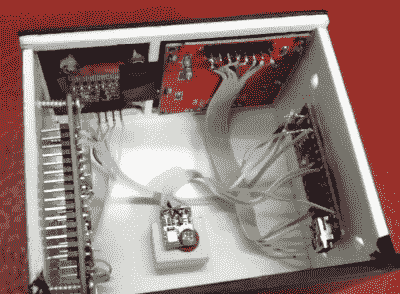

# 桌面天气监视器不留任何机会

> 原文：<https://hackaday.com/2019/05/19/desktop-weather-monitor-leaves-nothing-to-chance/>

[Mirko Pavleski]为自己搭建了一个小型气象站，将互联网上的天气预报与物理传感器数据结合起来，让他能够全面了解当地的情况。我们的智能手机和电脑上并不缺少天气应用程序，它们会向我们显示当前的当地情况和未来几天的天气预报。从各种 API 中提取天气数据是如此容易，以至于现在你甚至可以看到不同小工具的“内置”功能。当然，你可以翻遍世界上每一个天气 API，也找不到你办公室内部的温度和湿度；为此，你需要自己的传感器。

[Mirko]采取了一种有点非传统的方法，从本质上构建了两个完全独立的天气设备，并将它们包装在一个外壳中，由于使用了对比显示技术，这使最终设备具有相当独特的外观。

连接到 BMP180 传感器的 Arduino Nano 会检测到本地情况，并显示在诺基亚 5110 LCD 上。屏幕上不仅显示实时温度和大气压力，还显示过去几个小时的压力变化。另一方面，三天预报由 NodeMCU ESP8266 开发板提供，该开发板连接到越来越普遍的 0.96 英寸有机发光二极管。

如果你对整个二元事物不感兴趣，并且[更愿意在同一个设备](https://hackaday.com/2016/03/27/beautiful-weather-station-uses-acrylic-rgb-led-and-and-esp8266/)上做这一切，你可能会对我们过去见过的 [ESP8266 天气监测器之一](https://hackaday.com/2018/11/05/esp8266-monitor-keeps-an-eye-on-octoprint/)感兴趣。